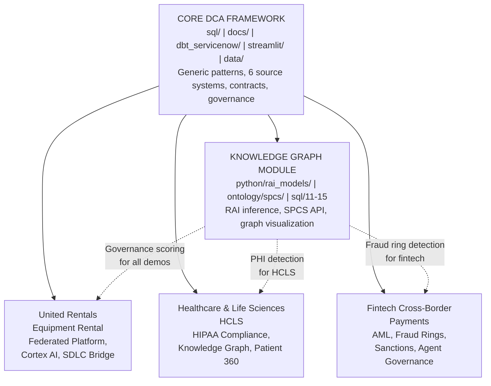

# Focused Demos

> **Customer-specific applications of Data Cloud Architecture patterns** — Each focused demo takes the core DCA framework and maps it to a real engagement, showing how the architecture solves specific industry challenges.

## What Are Focused Demos?

The core DCA demo (`/sql`, `/docs`, `/dbt_servicenow`, `/python`, `/ontology/spcs`) presents a **generic enterprise data platform** with six source systems, data contracts, governance, and federated sharing. Focused demos build on that foundation by:

- **Mapping DCA patterns to a specific customer's pain points** — showing which components matter most and why
- **Providing workshop-ready materials** — facilitation guides, talk tracks, and exercises tailored to the engagement
- **Documenting discovery findings** — current-state architecture, gaps, and strategic recommendations
- **Defining execution roadmaps** — phased plans with accountability tied to the customer's context

## Demo Index

| Demo | Industry | Key Themes | Status |
|------|----------|------------|--------|
| [United Rentals](united-rentals/) | Equipment Rental | Federated Data Platform, Account Consolidation, Cortex AI Pipeline, SDLC Bridge | Active |
| [Healthcare & Life Sciences](hcls/) | HCLS | HIPAA Compliance, PHI Lineage, Patient Entity Resolution, Knowledge Graph Governance, Care Pathways | Active |
| [Fintech Cross-Border Payments](fintech/) | Fintech/Payments | AML/KYC, Fraud Ring Detection, Sanctions Screening, Payment Corridor Risk, Agent Governance | Active |

## Structure Convention

Each focused demo follows a consistent structure:

```
demos/<customer>/
  README.md                    — Overview, challenge-to-pattern mapping, quick reference
  DISCOVERY.md                 — Current state, pain points, gap analysis
  ARCHITECTURE_STRATEGY.md     — Target architecture, comparison scorecards, recommendations
  WORKSHOP_GUIDE.md            — Facilitation guide for on-site sessions
  ROADMAP.md                   — Phased execution plan with milestones
```

## How Focused Demos Relate to Core DCA



Each focused demo references core DCA documentation rather than duplicating it. When the core demo shows "how Dynamic Tables work," the focused demo shows "why Dynamic Tables solve *this customer's* fleet availability problem."
