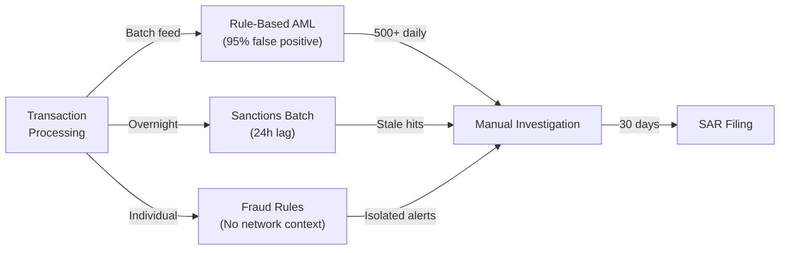
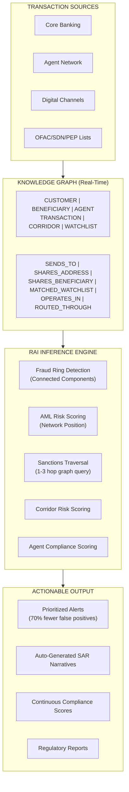
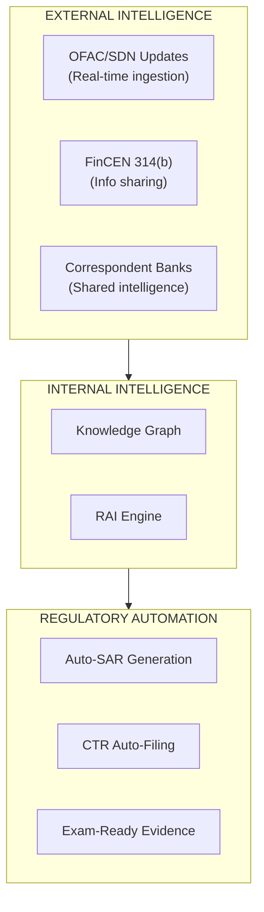

# Fintech Cross-Border Payments — Architecture Strategy

> Target architecture using the Ontology Knowledge Graph for real-time financial crime detection, graph-based AML scoring, sanctions traversal, and agent compliance monitoring.

## Strategic Thesis

Financial crime detection fails at scale because it evaluates transactions and customers in isolation. AML rules ask "Is this transaction suspicious?" — but the real question is "Is this customer's NETWORK suspicious?" The Knowledge Graph shifts compliance from isolated rule-matching to network-based intelligence, where fraud rings become visible graph structures, sanctions screening becomes graph traversal, and compliance scoring becomes continuous and automated.

## Architecture Principles

| Principle | Fintech Application |
|-----------|-------------------|
| Network-First Detection | Graph topology (connections, clusters, paths) reveals what individual transactions cannot |
| Real-Time Traversal | Sanctions screening happens via graph query, not overnight batch matching |
| Continuous Scoring | Every customer, agent, and corridor has a live compliance score — not point-in-time |
| Automated Intelligence | RAI inference produces actionable recommendations, not just alerts |
| Regulatory Transparency | Graph provides auditable evidence trail for every detection and score |

## Architecture Evolution — Three Stages

### Stage 1: Current State (Siloed Rule-Based Compliance)

### Stage 2: Knowledge Graph-Powered Compliance

### Stage 3: Federated Financial Intelligence Network

## BSA/AML Compliance Mapping

| BSA/AML Requirement | Knowledge Graph Implementation |
|--------------------|-----------------------------|
| §5318(h) — AML Program | Graph-based risk assessment replaces rule-based monitoring |
| §5318(g) — SAR Filing | RAI recommendations auto-generate SAR narratives with graph evidence |
| §5318(j) — Correspondent Banking | AGENT→CORRIDOR edges with compliance scores per relationship |
| §5312 — CTR Reporting | TRANSACTION aggregation via graph: all txns > $10K per customer/day |
| OFAC — Sanctions Screening | Graph traversal: CUSTOMER → (N hops) → WATCHLIST_ENTITY |
| FATF Rec 16 — Wire Transfer Rules | TRANSACTION → BENEFICIARY edges with full originator/beneficiary data |
| FinCEN CDD Rule — Beneficial Ownership | Ownership edges traversal: ENTITY → OWNS → ENTITY → CONTROLS → ENTITY |

## Compliance Scoring Model

### Customer AML Risk Score (0.0 - 1.0)

| Component | Weight | Factors |
|-----------|--------|---------|
| Transaction Behavior | 25% | Velocity deviation, amount deviation, structuring patterns |
| Network Position | 30% | Proximity to known bad actors (graph distance), cluster membership, degree centrality |
| KYC Freshness | 20% | Days since last verification, EDD completion, adverse media |
| Corridor Risk | 15% | Corridor risk score of primary corridors used |
| Watchlist Proximity | 10% | Hops to nearest watchlist entity (inverse: fewer hops = higher risk) |

### Agent Compliance Score (0.0 - 1.0)

| Component | Weight | Factors |
|-----------|--------|---------|
| Volume Anomaly | 25% | Current volume vs. 90-day baseline (z-score) |
| SAR Filing Rate | 25% | SAR filings / suspicious patterns detected (should be > 0) |
| KYC Completion | 20% | % of agent's customers with current KYC |
| Structuring Detection | 20% | Count of sub-threshold structuring patterns at this agent |
| Regulatory History | 10% | Prior violations, remediation status |

### Corridor Risk Score (0.0 - 1.0)

| Component | Weight | Factors |
|-----------|--------|---------|
| Sanctioned-Country Adjacency | 30% | Does corridor touch or transit sanctioned jurisdictions |
| Volume Deviation | 25% | Current period vs baseline (anomaly detection) |
| Concentration (HHI) | 20% | Is corridor dominated by few agents/customers (Herfindahl index) |
| SAR Density | 15% | SARs filed per $M volume on this corridor |
| Regulatory Designation | 10% | Is corridor flagged by FinCEN Geographic Targeting Orders |

## Architecture Comparison Scorecard

| Capability | Current (Rule-Based) | Stage 2 (Knowledge Graph) | Stage 3 (Federated Intel) | Impact |
|-----------|---------------------|--------------------------|--------------------------|--------|
| AML Detection | Rules: $X in Y hours | Network topology + behavior + proximity | Cross-institution graph intel | 70%+ FP reduction |
| Fraud Rings | Invisible (isolated evaluation) | Connected components in seconds | Multi-institution ring detection | $10M+ loss prevention |
| Sanctions | Overnight batch (24h lag) | Real-time graph traversal (ms) | Live OFAC feed + beneficial ownership | Zero-lag compliance |
| Corridor Risk | Quarterly manual reports | Continuous automated scoring | Cross-border regulatory sharing | Proactive risk mgmt |
| Agent Oversight | 2-3 year audit cycle | Continuous per-agent scoring | Industry-wide agent reputation | Instant risk visibility |
| Regulatory Reporting | Manual SAR (30 days) | Auto-narrative generation | Cross-filing intelligence | 80% SAR time reduction |

## References

- [Bank Secrecy Act (BSA)](https://www.fincen.gov/resources/statutes-regulations/bank-secrecy-act)
- [FinCEN AML Requirements](https://www.fincen.gov/resources/statutes-regulations)
- [OFAC Sanctions Programs](https://ofac.treasury.gov/sanctions-programs-and-country-information)
- [FATF Recommendations](https://www.fatf-gafi.org/recommendations.html)
- [DCA Knowledge Graph Documentation](../../docs/KNOWLEDGE_GRAPH.md)
