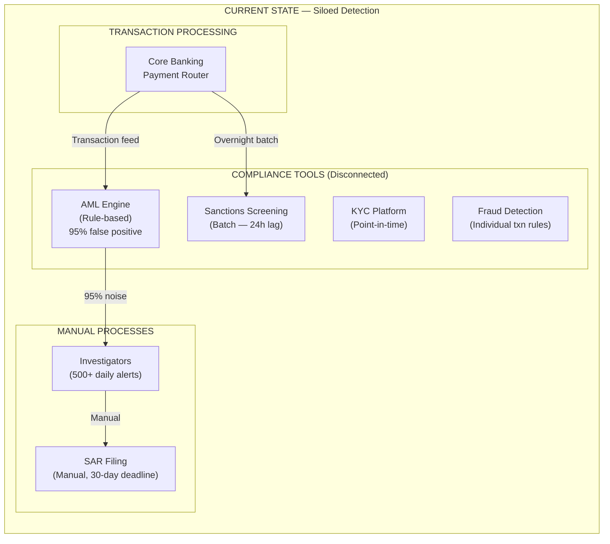

# Fintech Cross-Border Payments — Discovery & Current State

> Synthesized from: Financial Crime Compliance Assessment, AML Program Gap Analysis, Payment Network Architecture Review

## Executive Summary

Global money transfer companies face an escalating compliance challenge: transaction volumes grow 15-20% YoY while rule-based AML systems produce 95%+ false positive rates, sanctions screening runs in overnight batch (missing real-time threats), and fraud rings exploit the gap between siloed systems. Regulators (FinCEN, OFAC, state MTLs) demand faster detection, better SAR quality, and provable compliance — while simultaneously reducing the $50M+ annual compliance operations cost.

The primary objective is to **deploy a Knowledge Graph-powered financial crime detection platform** that reduces AML false positives by 70%+, enables real-time sanctions screening via graph traversal, and automates fraud ring detection using connected component analysis.

## Current State Architecture

### Siloed Compliance Systems

### System Details

| System | Function | Gap |
|--------|----------|-----|
| Core Banking/Payment Router | Transaction processing, corridor routing | No graph context — each txn evaluated in isolation |
| AML Engine (Actimize/NICE) | Rule-based suspicious activity detection | 95% false positive rate; rules catch patterns, not networks |
| Sanctions Screening (Fircosoft) | Name matching against OFAC/EU/UN lists | Batch overnight; misses real-time threats; no beneficial ownership traversal |
| KYC Platform | Customer identity verification | Point-in-time; no continuous monitoring; KYC refresh cycle 12-36 months |
| Fraud Detection | Individual transaction velocity/amount rules | No network analysis; can't detect coordinated fraud rings |
| Case Management | Investigation workflow | Disconnected from graph; investigators rebuild context manually |

## Key Challenges — "The Compliance Gaps"

### 1. AML False Positive Rate > 95%

**Problem**: Rule-based AML flags transactions exceeding simple thresholds ($3,000 in 24h, $10,000 cumulative, velocity > 5 txn/day). Without network context, legitimate high-frequency customers (remittance workers sending weekly) generate 95% of alerts.

**Impact**: 500+ daily alerts requiring manual review. Investigators waste 80% of time closing false positives. Real suspicious activity hides in the noise. Regulatory criticism for "alert fatigue."

**DCA Solution**: Knowledge Graph network analysis. Graph-based AML scores customers by their network position (unusual connections, proximity to known bad actors) — not just individual transaction behavior.

### 2. Fraud Rings Invisible Without Graph Analysis

**Problem**: Organized fraud rings use multiple customer accounts that share beneficiaries, addresses, phone numbers, or device fingerprints. Rule-based systems evaluate each customer in isolation — they cannot detect the shared infrastructure connecting them.

**Impact**: $10M+ annual fraud losses from coordinated structuring rings. Each individual transaction is below thresholds, but the aggregate pattern (20 customers, same beneficiary, structured amounts) is clearly suspicious.

**DCA Solution**: RAI connected component analysis on SHARES_BENEFICIARY, SHARES_ADDRESS, SHARES_DEVICE edges. Fraud rings become visible as graph clusters.

### 3. Sanctions Screening Latency (Batch, Not Real-Time)

**Problem**: OFAC/SDN list screening runs as overnight batch against customer base. New sanctions designations (e.g., emergency OFAC additions after geopolitical events) are not reflected until the next morning's batch run. Beneficial ownership chains (Entity A owns 51% of Entity B which transacts as Entity C) are not traversed.

**Impact**: 12-24 hour window where sanctioned entities can still transact. Beneficial ownership obscures true sanctioned parties. $1M+ potential OFAC violation per incident.

**DCA Solution**: Graph traversal: CUSTOMER → BENEFICIARY → (1-3 hops) → WATCHLIST_ENTITY. Real-time on every transaction. Traverses ownership/control chains automatically.

### 4. Payment Corridor Risk Opacity

**Problem**: The company operates 15,000+ corridors (country pairs). Corridor-level risk (volume anomalies, concentration in few agents, sudden flow changes after geopolitical events) is assessed quarterly via manual reports — not continuously.

**Impact**: Regulatory findings for inadequate corridor risk management. Inability to quickly restrict high-risk corridors during emerging threats (e.g., new sanctions regime).

**DCA Solution**: CORRIDOR nodes with aggregate scoring: volume deviation from baseline, Herfindahl concentration index, sanctioned-country adjacency, SAR filing rate.

### 5. Agent Compliance Scoring is Manual

**Problem**: 500K+ agent locations are audited on a rotating schedule (each agent visited once per 2-3 years). Between audits, there's no continuous compliance signal. High-risk agents (sudden volume spikes, structuring patterns, customer complaints) operate undetected.

**Impact**: Regulatory action for inadequate agent oversight. Agent-facilitated money laundering undetected until next audit cycle. DOJ/FinCEN consent orders specifically cite agent monitoring failures.

**DCA Solution**: AGENT nodes with continuous graph-based scoring: transaction velocity vs. historical baseline, SAR filing rate, KYC completion rate, customer complaint edges, structuring pattern detection.

## Discovery Questions (Fintech-Specific)

| # | Question | What It Diagnoses |
|---|----------|------------------|
| 1 | "What is your AML alert-to-SAR conversion rate? (Industry avg: 2-5%)" | AML program effectiveness |
| 2 | "Can you detect that 15 customers sharing the same beneficiary address are structuring?" | Graph analysis capability |
| 3 | "If OFAC adds a new SDN entry at 2 PM, when can that entity no longer transact?" | Sanctions screening latency |
| 4 | "Which corridors saw >50% volume change in the last 30 days, and why?" | Corridor risk monitoring |
| 5 | "How many of your 500K agents have been assessed for compliance risk in the last 90 days?" | Agent oversight |

## Gap Summary

| Gap | Type | Regulatory Risk | Annual Cost | Graph Solution |
|-----|------|----------------|-------------|----------------|
| 1 | AML false positives | FinCEN criticism, consent order | $30M+ ops cost | Network-based scoring (70% FP reduction) |
| 2 | Invisible fraud rings | BSA violation, fraud losses | $10M+ losses | Connected components detection |
| 3 | Sanctions screening lag | OFAC violation ($1M+ per incident) | Potential fines | Real-time graph traversal |
| 4 | Corridor risk opacity | Regulatory findings | Manual reporting cost | Continuous corridor scoring |
| 5 | Agent compliance manual | DOJ/FinCEN consent orders | Audit cost + remediation | Continuous agent scoring |
