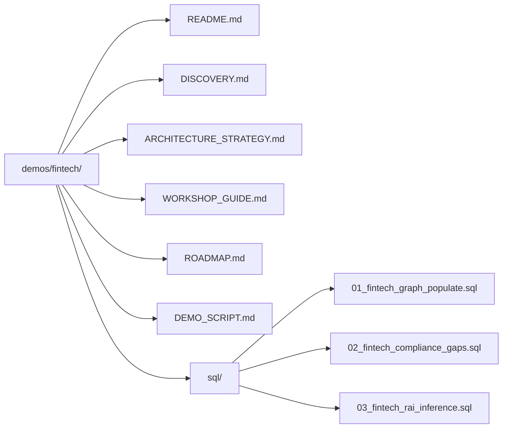

# Fintech Cross-Border Payments — Focused Demo

> **From Rule-Based Compliance to Knowledge Graph-Powered Financial Crime Detection** — Applying DCA patterns with RAI-powered graph analytics to solve AML, fraud ring detection, sanctions screening, and agent governance challenges for a global money transfer platform.

## Company Context

**Global Money Transfer Company** (Western Union-style) operating in 200+ countries with 500K+ agent locations. Processes $80B+ in annual cross-border transfers. Must comply with BSA/AML (Bank Secrecy Act), FinCEN reporting, OFAC sanctions, FATF recommendations, and local regulators in each operating jurisdiction.

**Snowflake Engagement**: Architecture engagement to replace rule-based AML detection (95% false positive rate) with Knowledge Graph-powered financial crime detection, real-time sanctions screening via graph traversal, and automated regulatory reporting.

## The Challenge → Pattern Mapping

| Fintech Challenge | DCA Pattern | Core Demo Reference |
|------------------|-------------|---------------------|
| **AML false positives > 95%** — rule-based detection lacks network context | Knowledge Graph connected component analysis + RAI scoring | [KNOWLEDGE_GRAPH.md](../../docs/KNOWLEDGE_GRAPH.md) |
| **Fraud rings invisible** — shared beneficiary/address/device not linked across customers | RAI graph algorithms (connected components, community detection) | [KNOWLEDGE_GRAPH.md](../../docs/KNOWLEDGE_GRAPH.md) |
| **Sanctions screening latency** — batch overnight, not real-time | Graph traversal: CUSTOMER→BENEFICIARY→WATCHLIST (1-3 hops) | [KNOWLEDGE_GRAPH.md](../../docs/KNOWLEDGE_GRAPH.md) |
| **Payment corridor opacity** — no aggregate risk view per corridor | Corridor-level RAI scoring (volume anomalies, concentration) | [GOVERNANCE.md](../../docs/GOVERNANCE.md) |
| **Agent compliance manual** — paper-based audits, no continuous scoring | Agent node scoring (volume vs capacity, SAR rate, KYC completion) | [ARCHITECTURE.md](../../docs/ARCHITECTURE.md) |

## Key Stakeholders

| Role | Responsibility |
|------|---------------|
| Chief Compliance Officer (CCO) | BSA/AML program, regulatory relationships, SAR oversight |
| VP Financial Intelligence Unit (FIU) | Investigation, SAR filing, law enforcement coordination |
| Head of Fraud Operations | Transaction monitoring, fraud ring investigations |
| Director of Agent Compliance | Agent onboarding, compliance scoring, termination |
| Data Engineering Lead | Platform architecture, pipeline development |

## Payment Network Data Model

The Knowledge Graph extends the core DCA data with fintech-specific nodes:

| Node Type | Layer | Source | Example |
|-----------|-------|--------|---------|
| CUSTOMER (Sender) | BUSINESS | SAP/Salesforce DIM_CUSTOMER | "Maria Garcia" (KYC verified 2024-01-15) |
| BENEFICIARY | BUSINESS | Transaction beneficiary data | "Carlos Garcia" (Monterrey, MX) |
| TRANSACTION | BUSINESS | SAP FACT_SALES_ORDERS | $500 USD→MXN, corridor US→MX |
| AGENT | BUSINESS | Agent management system | "QuickSend #4521" (Los Angeles, CA) |
| CORRIDOR | BUSINESS | Reference data | US→MX (high volume, medium risk) |
| WATCHLIST_ENTITY | BUSINESS | OFAC/PEP lists | "SINALOA CARTEL" (SDN List) |
| DEVICE | BUSINESS | Digital channel data | Device fingerprint "fp_abc123" |

## Knowledge Graph — Fintech Extension

Edge types for financial crime detection:

| Edge Type | From → To | Detection Purpose |
|-----------|-----------|-------------------|
| SENDS_TO | CUSTOMER → BENEFICIARY | Money flow direction |
| TRANSACTS_VIA | TRANSACTION → AGENT | Agent involvement |
| OPERATES_IN | AGENT → CORRIDOR | Agent corridor coverage |
| SHARES_ADDRESS | CUSTOMER ↔ CUSTOMER | Fraud ring indicator |
| SHARES_DEVICE | CUSTOMER ↔ CUSTOMER | Fraud ring indicator |
| SHARES_BENEFICIARY | CUSTOMER ↔ CUSTOMER | Structuring indicator |
| MATCHED_WATCHLIST | CUSTOMER/BENEFICIARY → WATCHLIST_ENTITY | Sanctions hit |
| KYC_VERIFIED | CUSTOMER → VERIFICATION_EVENT | Due diligence status |
| SAR_FILED | CUSTOMER → SAR_RECORD | Regulatory filing |
| ROUTED_THROUGH | TRANSACTION → CORRIDOR | Payment path |

## Demo Documents

| Document | Purpose |
|----------|---------|
| [DISCOVERY.md](DISCOVERY.md) | Current state, 5 compliance gaps, discovery framework |
| [ARCHITECTURE_STRATEGY.md](ARCHITECTURE_STRATEGY.md) | Target architecture, BSA/AML mapping, scoring model |
| [WORKSHOP_GUIDE.md](WORKSHOP_GUIDE.md) | 3-hour facilitation guide |
| [ROADMAP.md](ROADMAP.md) | 30/60/90 phased execution |
| [DEMO_SCRIPT.md](DEMO_SCRIPT.md) | 15-minute live demo walkthrough |

## Data Generation

Generate ~100MB of realistic synthetic cross-border payment data with embedded fraud patterns:

```bash
cd demos/fintech/tools
pip install faker    # One-time dependency

# Full dataset (~100MB, 8 tables, 355K+ records)
python generate_fintech_data.py --output ../data

# Quick test (~10MB)
python generate_fintech_data.py --output ../data --quick

# Scaled (2x for load testing)
python generate_fintech_data.py --output ../data --scale 2.0
```

### Generated Tables

| Table | Records | Key Compliance Fields | ~Size |
|-------|---------|----------------------|-------|
| customers | 50,000 | KYC status, risk level, SSN (last4) | 20MB |
| beneficiaries | 30,000 | Country, bank, relationship | 10MB |
| transactions | 200,000 | Amount, corridor, compliance hold | 45MB |
| agents | 5,000 | Volume, compliance score, SAR count | 2MB |
| corridors | 100 | Risk level, sanctioned adjacency | 0.05MB |
| watchlist_entities | 200 | SDN/PEP/sanctions list entries | 0.1MB |
| devices | 20,000 | Fingerprint, shared device patterns | 5MB |
| sars | 500 | Filing type, amounts, narratives | 0.5MB |

### Embedded Fraud Patterns (for Knowledge Graph Detection)

The generator intentionally creates detectable patterns:
- **5 structuring rings**: 10-15 customers each sharing the same beneficiary, all txns $2,800-$2,999
- **3 shared-device clusters**: 8-12 customers using the same physical device
- **Agent anomalies**: 2% of agents with 5-10x volume spikes
- **Stale KYC**: 10% of customers with verification > 3 years old
- **Sanctioned corridor transactions**: 2% of transactions to high-risk corridors

### Loading to Snowflake

```sql
-- Upload to stage
PUT file:///path/to/demos/fintech/data/*.csv @RAW_DEV.STAGING.DATA_STAGE/fintech/ AUTO_COMPRESS=TRUE;

-- Load using dynamic schema inference
CALL RAW_DEV.STAGING.LOAD_SOURCE_SYSTEM('FINTECH_PAYMENTS', 'CSV');
```

## Setup Instructions

```bash
# Prerequisites: Core DCA demo deployed (scripts 01-15)
# Transaction data generated and loaded

# 0. Generate and load fintech payment data
cd demos/fintech/tools && python generate_fintech_data.py --output ../data
# Upload CSVs to Snowflake stage (see Data Generation section)

# 1. Populate fintech-specific graph nodes and edges
@demos/fintech/sql/01_fintech_graph_populate.sql

# 2. Create intentional compliance gaps (for demo)
@demos/fintech/sql/02_fintech_compliance_gaps.sql

# 3. Run fintech-specific RAI inference
@demos/fintech/sql/03_fintech_rai_inference.sql
```

## File Structure


