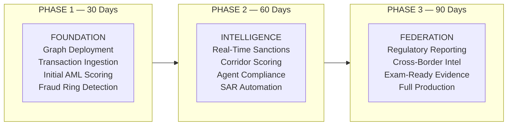

# Fintech Cross-Border Payments — 30/60/90 Execution Roadmap

> Phased deployment of Knowledge Graph-powered financial crime detection for cross-border payments.

## Roadmap Overview

---

## Phase 1: Foundation (30 Days)

**Theme**: Deploy Knowledge Graph with transaction and customer data, demonstrate fraud ring detection and initial AML scoring.

### Workstreams

#### 1.1 Knowledge Graph Deployment

| Task | Detail | Owner | Status |
|------|--------|-------|--------|
| Deploy scripts 11-15 | Base ontology infrastructure | Data Engineering | ☐ |
| Run SP_REFRESH_GRAPH() | Populate metadata + business nodes | Data Engineering | ☐ |
| Deploy fintech extensions | Run 01_fintech_graph_populate.sql | Data Engineering | ☐ |
| Validate graph structure | Verify node/edge counts match expected | Data Engineering + Compliance | ☐ |

#### 1.2 Transaction Data Ingestion

| Task | Detail | Owner | Status |
|------|--------|-------|--------|
| Map core banking txn feed to graph schema | TRANSACTION nodes with corridor, amount, currency | Data Engineering | ☐ |
| Load customer-beneficiary relationships | SENDS_TO edges from historical transactions | Data Engineering | ☐ |
| Load agent network | AGENT nodes with location, volume, compliance data | Agent Compliance | ☐ |
| Ingest OFAC/SDN watchlist | WATCHLIST_ENTITY nodes (refresh daily) | Compliance Ops | ☐ |

#### 1.3 Initial Detection

| Task | Detail | Owner | Status |
|------|--------|-------|--------|
| Run fraud ring detection | SP_FINTECH_FRAUD_RINGS() — connected components | Data Engineering | ☐ |
| Generate AML scores | SP_FINTECH_AML_SCORING() — all customers | Data Engineering | ☐ |
| Review results with FIU | Compare graph detections vs. current alerts | FIU + Snowflake | ☐ |
| Calibrate scoring thresholds | Adjust weights based on known-good/known-bad cases | Joint | ☐ |

### Phase 1 Success Criteria

- [ ] Graph populated with 100K+ transaction nodes, 50K+ customer nodes
- [ ] At least 3 fraud ring clusters detected (previously unknown)
- [ ] AML scores correlate with known SAR-filed customers (validation)
- [ ] False positive rate improvement demonstrated on historical data

---

## Phase 2: Intelligence (60 Days)

**Theme**: Enable real-time sanctions screening, deploy corridor and agent scoring, begin SAR automation.

### Workstreams

#### 2.1 Real-Time Sanctions Screening

| Task | Detail | Owner | Status |
|------|--------|-------|--------|
| Implement OFAC feed integration | Daily WATCHLIST_ENTITY node refresh | Compliance Ops | ☐ |
| Deploy graph traversal API | SPCS endpoint: /edges/path/{customer}/{watchlist} | Data Engineering | ☐ |
| Integrate with payment router | Pre-transaction sanctions check via API | Payment Ops | ☐ |
| Validate against current screening results | Ensure no false negatives vs. batch system | Compliance | ☐ |

#### 2.2 Corridor and Agent Scoring

| Task | Detail | Owner | Status |
|------|--------|-------|--------|
| Deploy corridor scoring | SP_FINTECH_CORRIDOR_RISK() — all corridors | Data Engineering | ☐ |
| Deploy agent scoring | SP_FINTECH_AGENT_COMPLIANCE() — all agents | Data Engineering | ☐ |
| Build compliance dashboard | Streamlit: corridor heatmap + agent risk list | Data Engineering | ☐ |
| Present scores to Agent Compliance team | Validate agent scores against known issues | Agent Compliance | ☐ |

#### 2.3 SAR Automation

| Task | Detail | Owner | Status |
|------|--------|-------|--------|
| Design SAR narrative template | Graph evidence → structured SAR narrative | FIU + Legal | ☐ |
| Implement auto-narrative generation | SP generates SAR text from graph paths/clusters | Data Engineering | ☐ |
| FIU review and approval workflow | Human-in-the-loop before filing | FIU | ☐ |
| Measure time-to-SAR improvement | Target: 30 days → 5 days | FIU | ☐ |

### Phase 2 Success Criteria

- [ ] Real-time sanctions screening operational (< 1 second per check)
- [ ] Corridor risk scores for top 100 corridors validated
- [ ] Agent compliance scores for top 500 agents by volume
- [ ] SAR preparation time reduced by 50%+

---

## Phase 3: Federation (90 Days)

**Theme**: Full production deployment, regulatory automation, cross-border intelligence.

### Workstreams

#### 3.1 Regulatory Reporting Automation

| Task | Detail | Owner | Status |
|------|--------|-------|--------|
| CTR auto-generation | Graph aggregates all customer txns > $10K/day | Data Engineering | ☐ |
| SAR full automation | Auto-draft + human review + FinCEN filing | FIU + Legal | ☐ |
| Exam-ready evidence packages | Generate graph-based evidence for regulators | Compliance | ☐ |
| Audit trail completeness | Every score/recommendation has provenance | Data Engineering | ☐ |

#### 3.2 Full Production Deployment

| Task | Detail | Owner | Status |
|------|--------|-------|--------|
| Retire batch sanctions screening | Graph traversal replaces overnight batch | Compliance Ops | ☐ |
| Redirect AML alerts to graph scores | Prioritized list replaces rule-based alerts | FIU | ☐ |
| Agent compliance continuous monitoring | Replace 2-year audit cycle with continuous scoring | Agent Compliance | ☐ |
| Production SLA monitoring | Graph refresh frequency, API latency, score freshness | Platform | ☐ |

#### 3.3 Cross-Border Intelligence

| Task | Detail | Owner | Status |
|------|--------|-------|--------|
| FinCEN 314(b) integration | Share intelligence with partner institutions | Compliance + Legal | ☐ |
| Correspondent bank risk sharing | ONTOLOGY_GRAPH_DATA_SHARE for partner banks | Compliance | ☐ |
| External watchlist expansion | Add EU/UN sanctions, PEP lists, adverse media | Compliance Ops | ☐ |
| Cross-border SAR coordination | Multi-jurisdiction filing for shared fraud rings | FIU + International | ☐ |

### Phase 3 Success Criteria

- [ ] AML false positive rate reduced 70%+ from baseline
- [ ] Sanctions screening fully real-time (batch retired)
- [ ] SAR filing time < 5 days (from 30)
- [ ] Agent compliance scoring covers 100% of network
- [ ] Exam-ready evidence available on demand

---

## Pilot Recommendation

**Recommended Pilot**: Fraud ring detection on top 3 corridors

**Rationale**: Highest immediate ROI — detects previously invisible rings, quantifiable fraud loss prevention, smallest implementation footprint, most compelling exam evidence.

| Aspect | Detail |
|--------|--------|
| Scope | US→MX, US→PH, US→IN corridors (highest volume) |
| Data | 6 months historical transactions (~500K txns) |
| Success Metric | Detect 3+ previously unknown fraud rings |
| Timeline | 30 days to initial results |
| Owner | FIU Lead + Data Engineering Lead |

---

## Accountability Matrix

| Role | Phase 1 Responsibility | Phase 2 Responsibility | Phase 3 Responsibility |
|------|----------------------|----------------------|----------------------|
| **CCO** | Approve scoring thresholds, review initial findings | Approve SAR automation workflow, validate corridor scores | Sign-off on production deployment, regulatory relationships |
| **VP FIU** | Review fraud ring detections, validate AML scores | Own SAR automation, approve narrative templates | Own regulatory reporting automation, FinCEN coordination |
| **Head of Fraud Ops** | Validate fraud ring results vs. known cases | Extend detection to new patterns | Production fraud ring monitoring |
| **Director Agent Compliance** | Provide agent data, validate initial scores | Own agent scoring validation | Continuous agent monitoring in production |
| **Data Engineering Lead** | Deploy scripts, populate graph, run inference | Build API, extend scoring, build dashboard | Production deployment, SLA monitoring |
| **Snowflake EA** | Architecture guidance, DCA demo support | SPCS API design review, scoring model review | Federation and sharing governance review |

## References

- [Discovery & Current State](DISCOVERY.md)
- [Architecture Strategy](ARCHITECTURE_STRATEGY.md)
- [Workshop Facilitation Guide](WORKSHOP_GUIDE.md)
- [Knowledge Graph Documentation](../../docs/KNOWLEDGE_GRAPH.md)
- [Governance Framework](../../docs/GOVERNANCE.md)
