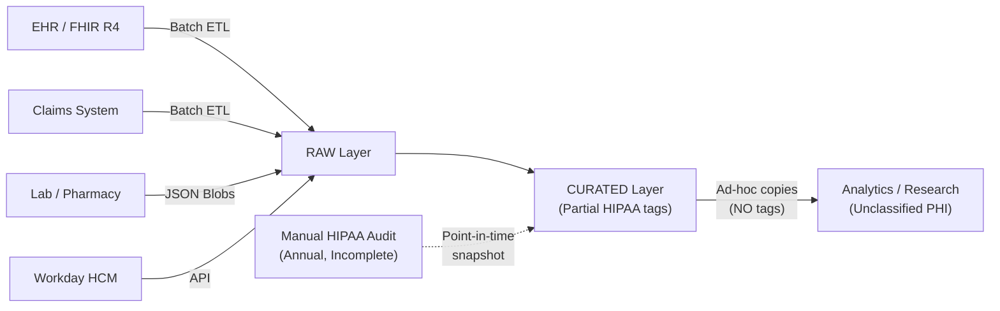
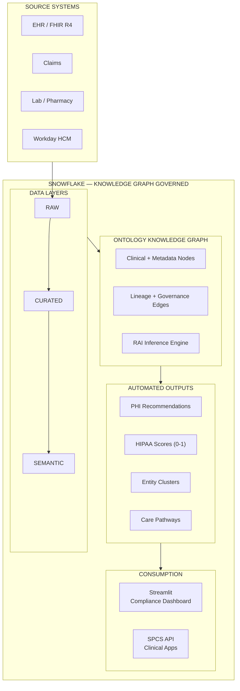
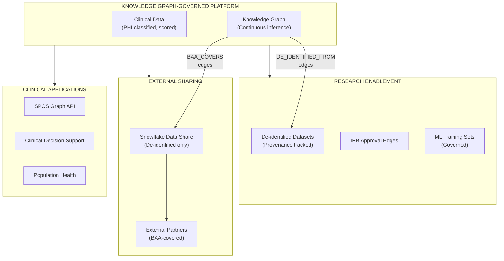

# Healthcare & Life Sciences — Architecture Strategy

> Target architecture using the Ontology Knowledge Graph for automated HIPAA compliance, PHI governance, patient entity resolution, and clinical pathway analytics.

## Strategic Thesis

Most HCLS compliance friction comes from **manual governance processes that cannot scale with data growth**. HIPAA violations occur not from malicious intent but from PHI propagating to unclassified locations faster than manual audits can detect. The solution is a Knowledge Graph that automatically traces PHI lineage, scores compliance, and recommends remediation.

## Architecture Principles

| Principle | HCLS Application |
|-----------|-----------------|
| **Automated PHI Detection** | RAI inference traces PHI lineage — no manual column-by-column review |
| **Continuous Compliance** | Governance scores update with every graph refresh — not annual audits |
| **Patient-Centric Integration** | Entity resolution creates a unified patient graph across all systems |
| **Research Enablement** | De-identification provenance tracked as graph edges — provable HIPAA research compliance |
| **Minimum Necessary Access** | Graph-based access analysis proves each role only reaches required PHI |

## Architecture Evolution — Three Stages

### Stage 1: Current State (Fragmented Clinical Systems)



### Stage 2: Knowledge Graph-Governed (Automated Compliance)



### Stage 3: Federated HCLS Platform (Research + External Sharing)



## HIPAA Compliance Mapping

| HIPAA Requirement | Knowledge Graph Implementation |
|-------------------|-------------------------------|
| §164.312(a) — Access Controls | ROLE→TABLE→COLUMN edges show who can access what PHI |
| §164.312(b) — Audit Controls | ACCESS_HISTORY linked to graph nodes; anomaly detection via RAI |
| §164.312(c) — Integrity | Data contract edges prove schema/quality validation |
| §164.312(d) — Authentication | ROLE nodes with GRANTED_TO edges map authentication paths |
| §164.502(b) — Minimum Necessary | Graph analysis proves each role accesses only required data |
| §164.514 — De-identification | DE_IDENTIFIED_FROM edges link research sets to source with method |
| §164.502(e) — Business Associates | BAA_COVERS edges link external roles to covered data |

## Architecture Comparison Scorecard

| Capability | Current State (Manual) | Stage 2 (Knowledge Graph) | Stage 3 (Federated) | Impact |
|-----------|----------------------|--------------------------|---------------------|--------|
| **PHI Detection** | Manual column review; months to audit | Automated RAI inference; detects in minutes | Continuous + cross-org detection via shares | Eliminates PHI blind spots |
| **Patient Matching** | Manual MPI maintenance; 60-70% match rate | Graph entity resolution; 95%+ confidence | Federated matching across partner systems | Complete patient 360 |
| **HIPAA Scoring** | Annual manual assessment | Continuous per-object scoring (0-1) | Score propagation across shared data | Real-time compliance posture |
| **Research Compliance** | Manual IRB tracking in spreadsheets | Graph edges link datasets to IRB + de-id method | Provenance travels with shared data | Provable research compliance |
| **Care Pathways** | Ad-hoc SQL joins across fact tables | Graph traversal with temporal ordering | Cross-org pathways via federation | Clinical decision support |

## Clinical Knowledge Graph Design

### Node Types

| Node Type | Layer | Source | Example |
|-----------|-------|--------|---------|
| PATIENT | BUSINESS | FHIR DIM_PATIENT | Patient "John Smith" (MRN: 12345) |
| ENCOUNTER | BUSINESS | FHIR FACT_ENCOUNTERS | ED Visit 2024-03-15 |
| CONDITION | BUSINESS | FHIR FACT_CONDITIONS | Type 2 Diabetes (E11.9) |
| MEDICATION | BUSINESS | FHIR FACT_MEDICATION_REQUESTS | Metformin 500mg |
| PROCEDURE | BUSINESS | FHIR FACT_PROCEDURES | HbA1c Test |
| PRACTITIONER | BUSINESS | FHIR DIM_PRACTITIONER | Dr. Sarah Chen (NPI: 1234567890) |
| ORGANIZATION | BUSINESS | FHIR DIM_ORGANIZATION | Metro Health System |
| TABLE | METADATA | INFORMATION_SCHEMA | CURATED_DEV.FHIR.DIM_PATIENT |
| COLUMN | METADATA | INFORMATION_SCHEMA | DIM_PATIENT.BIRTH_DATE |
| TAG | METADATA | TAG_REFERENCES | HIPAA_CATEGORY = 'PHI' |

### Edge Types (Clinical)

| Edge Type | From → To | Meaning |
|-----------|-----------|---------|
| DIAGNOSED_WITH | PATIENT → CONDITION | Patient has diagnosis |
| PRESCRIBED | PRACTITIONER → MEDICATION (for PATIENT) | Prescription written |
| PERFORMED_BY | PROCEDURE → PRACTITIONER | Who performed the procedure |
| RESULTED_IN | ENCOUNTER → CONDITION | Encounter produced diagnosis |
| BILLED_FOR | ENCOUNTER → CLAIM | Billing for services |
| REFERRED_TO | PRACTITIONER → PRACTITIONER | Referral chain |
| TREATED_AT | PATIENT → ORGANIZATION | Where patient receives care |
| NEXT_ENCOUNTER | ENCOUNTER → ENCOUNTER | Temporal care pathway |

### Edge Types (Governance)

| Edge Type | From → To | Meaning |
|-----------|-----------|---------|
| PHI_CONTAINS | TABLE/COLUMN → TAG | Object contains PHI |
| HIPAA_CLASSIFIED | COLUMN → TAG | Column has HIPAA classification |
| BAA_COVERS | ROLE → TABLE | Business Associate Agreement scope |
| DE_IDENTIFIED_FROM | TABLE → TABLE | De-identification provenance |
| IRB_APPROVED | TABLE → PROTOCOL | Research dataset linked to IRB protocol |
| STORED_IN | Clinical Node → TABLE | Business entity stored in technical object |
| TAGGED_WITH | COLUMN → TAG | Column classified with governance tag |

## RAI Inference Rules — HCLS Specific

| Rule | Detection Logic | Output |
|------|----------------|--------|
| **PHI Propagation** | Column receives data from PHI-tagged source via LINEAGE_FROM edge but has no HIPAA tag | HIGH severity recommendation |
| **Untagged PHI Pattern** | Column name matches PHI patterns (%SSN%, %MRN%, %DOB%) without classification | MEDIUM severity recommendation |
| **BAA Gap** | External role has GRANTED_TO edge to PHI table without BAA_COVERS edge | HIGH severity recommendation |
| **Orphaned Research** | Table in research schema has no DATA_CONTRACT_OWNER tag and no IRB_APPROVED edge | HIGH severity recommendation |
| **Entity Match** | PATIENT nodes across systems share name similarity (Jaccard > 0.7) + DOB match | Entity cluster with confidence score |
| **Care Pathway** | Sequential encounters for same patient ordered by period_start | NEXT_ENCOUNTER temporal edges |

## Governance Scoring Formula — HIPAA Specific

For each FHIR-sourced or clinical object, the HIPAA governance score is:

```
hipaa_score = (
    0.30 * hipaa_classification +    -- Does it have HIPAA_CATEGORY tag?
    0.25 * access_controls +          -- Is access restricted to healthcare roles?
    0.20 * baa_coverage +             -- If external access, is BAA in place?
    0.15 * audit_trail +              -- Does ACCESS_HISTORY show queries? (auditable)
    0.10 * de_identification          -- If shared externally, is de-id provenance recorded?
)
```

| Score Range | Interpretation | Action |
|-------------|---------------|--------|
| 0.8 - 1.0 | Compliant | Monitor — no action needed |
| 0.5 - 0.79 | At Risk | Review — remediation recommended within 30 days |
| 0.0 - 0.49 | Non-Compliant | Immediate Action — potential HIPAA violation |

## References

- [HIPAA Administrative Simplification](https://www.hhs.gov/hipaa/for-professionals/index.html)
- [21st Century Cures Act](https://www.healthit.gov/curesrule/)
- [HL7 FHIR R4](https://hl7.org/fhir/R4/)
- [HITRUST CSF](https://hitrustalliance.net/csf/)
- [DCA Knowledge Graph Documentation](../../docs/KNOWLEDGE_GRAPH.md)
- [Core DCA Architecture](../../docs/ARCHITECTURE.md)
- [Governance Framework](../../docs/GOVERNANCE.md)
