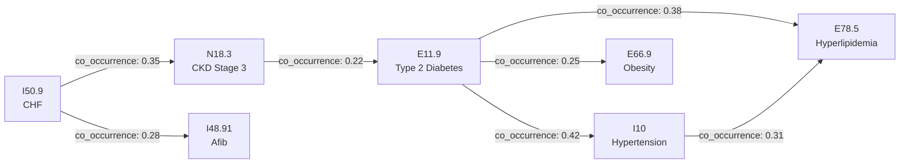

# Comorbidity Indexing & Payer Response Analytics

> Deep-dive execution document for Charlson Comorbidity Index calculation, comorbidity clustering, and payer adjudication analytics stratified by patient risk. This powers the "Comorbidity-Payer" analytical pathway in the HCLS demo.

## 1. Clinical Context

### What Is Comorbidity?

Comorbidity refers to the presence of two or more chronic conditions in the same patient. In healthcare analytics, comorbidity burden is the single strongest predictor of resource utilization, clinical complexity, and payer behavior. A patient admitted for pneumonia who also has CHF, diabetes, and CKD consumes 3-5x the resources of a patient with pneumonia alone.

### Why It Matters for HCLS Analytics

- **Length of Stay**: Each additional comorbid condition adds 0.5-2.0 days average LOS
- **Cost**: High-comorbidity patients account for ~30% of the population but ~70% of costs
- **Readmissions**: CCI score is the strongest single predictor of 30-day readmission risk
- **Payer Behavior**: Denial rates, prior auth requirements, and adjudication timelines all increase with comorbidity burden
- **Quality Measures**: CMS risk adjustment (HCC) and value-based care models depend on accurate comorbidity measurement

### The Charlson Comorbidity Index (CCI)

The CCI is the gold standard for quantifying comorbidity burden. Developed by Mary Charlson in 1987, validated across thousands of studies, and mapped to ICD-10 by Quan et al. (2005). It assigns weights (1, 2, 3, or 6) to 17 disease categories based on their independent contribution to mortality risk.

**Interpretation**:
- CCI 0: No significant comorbidities
- CCI 1-2: Mild comorbidity burden
- CCI 3-4: Moderate burden (significant clinical complexity)
- CCI 5-6: Severe burden (high resource utilization)
- CCI 7+: Very severe (highest mortality risk, most complex care coordination)

## 2. Charlson Comorbidity Index — ICD-10 Mapping

Complete mapping used in our data model. Each category is counted once per patient even if multiple codes match.

| CCI Category | Weight | ICD-10 Code Prefixes |
|---|---|---|
| Myocardial Infarction | 1 | I21.x, I22.x, I25.2 |
| Congestive Heart Failure | 1 | I50.x, I11.0, I13.0, I13.2 |
| Peripheral Vascular Disease | 1 | I70.x, I71.x, I73.x, I77.1 |
| Cerebrovascular Disease | 1 | I60-I69, G45.x, G46.x |
| Dementia | 1 | F00-F03, G30.x, G31.1 |
| Chronic Pulmonary Disease | 1 | J40-J47, J60-J67 |
| Rheumatic Disease | 1 | M05.x, M06.x, M32-M34, M35.1, M35.3 |
| Peptic Ulcer Disease | 1 | K25-K28 |
| Mild Liver Disease | 1 | B18.x, K70.0-K70.3, K73.x, K74.x, K76.0 |
| Diabetes without Complications | 1 | E10.0-E10.1, E10.9, E11.0-E11.1, E11.9, E13.0-E13.1, E13.9 |
| Diabetes with Complications | 2 | E10.2-E10.8, E11.2-E11.8, E13.2-E13.8 |
| Hemiplegia / Paraplegia | 2 | G04.1, G11.4, G80.x, G81.x, G82.x |
| Renal Disease | 2 | N18.x, N19.x, N05.x, I12.0, I13.1 |
| Malignancy (any) | 2 | C00-C26, C30-C34, C37-C41, C43, C45-C58, C60-C76, C81-C85, C88, C90-C97 |
| Moderate / Severe Liver Disease | 3 | K70.4, K71.1, K72.x, K76.5-K76.7, I85.x |
| Metastatic Solid Tumor | 6 | C77-C80 |
| AIDS / HIV | 6 | B20-B22, B24 |

**Hierarchy rule**: If a patient has both "Diabetes without Complications" (weight 1) and "Diabetes with Complications" (weight 2), only the higher-weighted category counts. Same for Mild vs. Moderate/Severe Liver Disease, and Malignancy vs. Metastatic Tumor.

## 3. Comorbidity Clustering

Common co-occurrence patterns in our generated data. These clusters represent clinically realistic disease groupings that drive payer behavior.

### Metabolic Syndrome Cluster

```
Conditions: E11.9 (Type 2 Diabetes) + I10 (Hypertension) + E78.5 (Hyperlipidemia) + E66.9 (Obesity)
CCI Contribution: 1 (Diabetes uncomplicated)
Prevalence: ~15% of adult patients
Payer Impact: High pharmacy spend, frequent PCP visits, escalating prior auth for GLP-1 agonists
```

### Cardiorenal Cluster

```
Conditions: I50.9 (CHF) + N18.3 (CKD Stage 3) + I48.91 (Atrial Fibrillation)
CCI Contribution: 1 (CHF) + 2 (Renal) = 3
Prevalence: ~8% of patients aged 65+
Payer Impact: Highest readmission risk, frequent UR reviews, complex medication management
```

### Respiratory-Plus Cluster

```
Conditions: J44.1 (COPD with exacerbation) + I50.9 (CHF) + G47.33 (Sleep Apnea)
CCI Contribution: 1 (COPD) + 1 (CHF) = 2
Prevalence: ~6% of patients
Payer Impact: Frequent ED visits, DME authorizations, pulmonary rehab prior auth
```

### Oncology Complex Cluster

```
Conditions: C34.90 (Lung Cancer) + D64.9 (Anemia) + N18.3 (CKD Stage 3)
CCI Contribution: 2 (Malignancy) + 2 (Renal) = 4
Prevalence: ~3% of patients
Payer Impact: Highest per-episode cost, complex prior auth chains, case management required
```

### Knowledge Graph Representation

These clusters appear as COMORBID_WITH edges between CONDITION nodes:



## 4. Payer Response by Comorbidity Tier

How payer behavior changes across CCI risk tiers:

| CCI Tier | CCI Score | Denial Rate | Avg Days to Adjudicate | Prior Auth Required % | Avg Cost/Episode | Readmission Rate |
|---|---|---|---|---|---|---|
| **Low** | 0-1 | 8-10% | 14 days | 15% | $4,200 | 6% |
| **Moderate** | 2-3 | 12-15% | 21 days | 35% | $12,800 | 12% |
| **High** | 4-6 | 18-22% | 28 days | 55% | $34,500 | 22% |
| **Severe** | 7+ | 25-30% | 35+ days | 75% | $78,000+ | 35% |

### Denial Rate Variation by Payer Type

| Payer Type | Low CCI Denial | High CCI Denial | Prior Auth Burden |
|---|---|---|---|
| Medicare Advantage | 6% | 15% | Moderate (CMS guidelines) |
| Commercial PPO | 10% | 20% | Low (broad network) |
| Medicaid Managed Care | 12% | 25% | High (formulary restrictions) |
| HDHP / Exchange | 15% | 30% | Highest (cost-sharing pressure) |

### Key Insight

The denial rate *acceleration* (ratio of high-CCI denial to low-CCI denial) is the critical metric. Payers with steep acceleration curves are systematically undertreating complex patients. The Knowledge Graph makes this visible by stratifying claim outcomes across CCI tiers — a pattern invisible in flat claims data.

## 5. Plan of Care Analytics

### Approved Duration vs. Actual Duration by CCI Tier

```
                Approved Days    Actual LOS    Variance
Low CCI:        3.0              2.8           -0.2 (on target)
Moderate CCI:   4.5              5.2           +0.7 (slight overrun)
High CCI:       6.0              8.5           +2.5 (significant gap)
Severe CCI:     8.0             14.0           +6.0 (major underestimation)
```

The gap between payer-approved days and actual clinical need widens dramatically at higher CCI tiers. This creates two failure modes:

### Gap Analysis

**Early Discharge Risk**: Patients discharged at payer-approved end date despite clinical need for continued care.
- Correlation: Early discharge + CCI >= 4 → 2.3x readmission rate vs. patients held to clinical readiness
- Financial impact: Readmission costs 1.5-3x the original admission

**Extended Stay Denials**: Patients held beyond approved days face retrospective denials.
- Impact: Average denial for extended stay = $12,400
- Appeal success rate: 45% for CCI >= 4 (clinical necessity argument)

### Intervention Effectiveness by Payer Type

| Intervention | Approval Rate (PPO) | Approval Rate (HMO) | Approval Rate (Medicaid) |
|---|---|---|---|
| Cardiac Rehab | 92% | 78% | 65% |
| Home Health (post-surgical) | 88% | 82% | 72% |
| SNF Transfer (CCI >= 4) | 75% | 60% | 55% |
| Behavioral Health Consult | 95% | 70% | 80% |
| DME (CPAP, Wheelchair) | 90% | 85% | 68% |

## 6. Knowledge Graph Edges — Payer Domain

### New Node Types

| Node Type | ID Pattern | Source | Key Properties |
|---|---|---|---|
| PLAN | `PYR_PLAN_` + MD5(plan_id) | DIM_PLANS | name, type, payer, deductible, max_oop |
| CLAIM | `PYR_CLM_` + MD5(claim_id) | FACT_CLAIMS | status, billed, allowed, paid, denial_reason |
| PRIOR_AUTH | `PYR_AUTH_` + MD5(auth_id) | FACT_PRIOR_AUTH | status, days_to_decision, approved_units |
| UTIL_REVIEW | `PYR_UR_` + MD5(review_id) | FACT_UTIL_REVIEWS | determination, approved_days, variance |
| CARE_PLAN | `PYR_POC_` + MD5(poc_id) | FACT_PLAN_OF_CARE | intervention, approved_visits, outcome |
| CCI_TIER | `PYR_CCI_` + MD5(patient_id + cci_tier) | Computed | score, tier_label, calculation_date |

### New Edge Types

| Edge Type | From → To | Properties | Analytical Use |
|---|---|---|---|
| COVERED_BY | PATIENT → PLAN | effective_date, plan_type | Coverage gap analysis |
| CLAIMED_FOR | ENCOUNTER → CLAIM | amount, status | Revenue cycle correlation |
| AUTHORIZED | PRIOR_AUTH → PROCEDURE | approved_units, determination | Auth bottleneck detection |
| REVIEWED_BY | UTIL_REVIEW → ENCOUNTER | determination, criteria | UM pattern analysis |
| DENIED_FOR | CLAIM → DENIAL_REASON | reason_code, appeal_status | Denial root cause |
| COMORBID_WITH | CONDITION → CONDITION | co_occurrence_rate, shared_patients_pct | Cluster identification |
| RISK_STRATIFIED | PATIENT → CCI_TIER | score, calculation_date | Population risk segmentation |

## 7. SQL Execution Patterns

### CCI Calculation from ICD-10 Conditions

```sql
-- Charlson Comorbidity Index per patient using window function approach
CREATE OR REPLACE TABLE DCA_DEMO.GOVERNANCE.HCLS_PATIENT_COMORBIDITY AS
WITH charlson_map AS (
    SELECT column1 AS category, column2 AS weight, column3 AS icd10_prefix
    FROM VALUES
        ('MI', 1, 'I21'), ('MI', 1, 'I22'), ('MI', 1, 'I25.2'),
        ('CHF', 1, 'I50'), ('CHF', 1, 'I11.0'), ('CHF', 1, 'I13.0'),
        ('PVD', 1, 'I70'), ('PVD', 1, 'I71'), ('PVD', 1, 'I73'),
        ('CVD', 1, 'I60'), ('CVD', 1, 'I61'), ('CVD', 1, 'I62'),
        ('CVD', 1, 'I63'), ('CVD', 1, 'I64'), ('CVD', 1, 'I65'),
        ('CVD', 1, 'I66'), ('CVD', 1, 'I67'), ('CVD', 1, 'I68'),
        ('CVD', 1, 'I69'), ('CVD', 1, 'G45'), ('CVD', 1, 'G46'),
        ('DEMENTIA', 1, 'F00'), ('DEMENTIA', 1, 'F01'), ('DEMENTIA', 1, 'F02'),
        ('DEMENTIA', 1, 'F03'), ('DEMENTIA', 1, 'G30'), ('DEMENTIA', 1, 'G31.1'),
        ('COPD', 1, 'J40'), ('COPD', 1, 'J41'), ('COPD', 1, 'J42'),
        ('COPD', 1, 'J43'), ('COPD', 1, 'J44'), ('COPD', 1, 'J45'),
        ('COPD', 1, 'J46'), ('COPD', 1, 'J47'),
        ('RHEUMATIC', 1, 'M05'), ('RHEUMATIC', 1, 'M06'), ('RHEUMATIC', 1, 'M32'),
        ('RHEUMATIC', 1, 'M33'), ('RHEUMATIC', 1, 'M34'),
        ('PEPTIC_ULCER', 1, 'K25'), ('PEPTIC_ULCER', 1, 'K26'),
        ('PEPTIC_ULCER', 1, 'K27'), ('PEPTIC_ULCER', 1, 'K28'),
        ('MILD_LIVER', 1, 'B18'), ('MILD_LIVER', 1, 'K73'), ('MILD_LIVER', 1, 'K74'),
        ('DM_UNCOMP', 1, 'E10.0'), ('DM_UNCOMP', 1, 'E10.1'), ('DM_UNCOMP', 1, 'E10.9'),
        ('DM_UNCOMP', 1, 'E11.0'), ('DM_UNCOMP', 1, 'E11.1'), ('DM_UNCOMP', 1, 'E11.9'),
        ('DM_COMP', 2, 'E10.2'), ('DM_COMP', 2, 'E10.3'), ('DM_COMP', 2, 'E10.4'),
        ('DM_COMP', 2, 'E10.5'), ('DM_COMP', 2, 'E10.6'), ('DM_COMP', 2, 'E10.7'),
        ('DM_COMP', 2, 'E11.2'), ('DM_COMP', 2, 'E11.3'), ('DM_COMP', 2, 'E11.4'),
        ('DM_COMP', 2, 'E11.5'), ('DM_COMP', 2, 'E11.6'), ('DM_COMP', 2, 'E11.7'),
        ('HEMIPLEGIA', 2, 'G04.1'), ('HEMIPLEGIA', 2, 'G11.4'),
        ('HEMIPLEGIA', 2, 'G80'), ('HEMIPLEGIA', 2, 'G81'), ('HEMIPLEGIA', 2, 'G82'),
        ('RENAL', 2, 'N18'), ('RENAL', 2, 'N19'), ('RENAL', 2, 'N05'),
        ('RENAL', 2, 'I12.0'), ('RENAL', 2, 'I13.1'),
        ('MALIGNANCY', 2, 'C00'), ('MALIGNANCY', 2, 'C01'), ('MALIGNANCY', 2, 'C02'),
        ('MOD_LIVER', 3, 'K70.4'), ('MOD_LIVER', 3, 'K71.1'),
        ('MOD_LIVER', 3, 'K72'), ('MOD_LIVER', 3, 'I85'),
        ('METASTATIC', 6, 'C77'), ('METASTATIC', 6, 'C78'),
        ('METASTATIC', 6, 'C79'), ('METASTATIC', 6, 'C80'),
        ('AIDS', 6, 'B20'), ('AIDS', 6, 'B21'), ('AIDS', 6, 'B22'), ('AIDS', 6, 'B24')
),
-- Match patient conditions to Charlson categories
patient_categories AS (
    SELECT DISTINCT
        c.patient_id,
        m.category,
        m.weight
    FROM CURATED_DEV.FHIR.FACT_CONDITIONS c
    JOIN charlson_map m
        ON c.icd10_code LIKE m.icd10_prefix || '%'
),
-- Apply hierarchy rules (keep higher weight when categories overlap)
hierarchy_applied AS (
    SELECT
        patient_id,
        CASE
            WHEN category IN ('DM_UNCOMP', 'DM_COMP') THEN 'DIABETES'
            WHEN category IN ('MILD_LIVER', 'MOD_LIVER') THEN 'LIVER'
            WHEN category IN ('MALIGNANCY', 'METASTATIC') THEN 'CANCER'
            ELSE category
        END AS category_group,
        MAX(weight) AS weight
    FROM patient_categories
    GROUP BY 1, 2
)
SELECT
    patient_id,
    SUM(weight) AS cci_score,
    CASE
        WHEN SUM(weight) <= 1 THEN 'LOW'
        WHEN SUM(weight) <= 3 THEN 'MODERATE'
        WHEN SUM(weight) <= 6 THEN 'HIGH'
        ELSE 'SEVERE'
    END AS cci_tier,
    COUNT(DISTINCT category_group) AS condition_count,
    CURRENT_DATE() AS calculation_date
FROM hierarchy_applied
GROUP BY patient_id;
```

### Payer Denial Rate by Comorbidity Tier

```sql
-- Denial rates stratified by CCI tier and payer
SELECT
    cci.cci_tier,
    p.payer_name,
    p.plan_type,
    COUNT(*) AS total_claims,
    SUM(CASE WHEN c.claim_status = 'DENIED' THEN 1 ELSE 0 END) AS denied_claims,
    ROUND(denied_claims / total_claims * 100, 1) AS denial_rate_pct,
    AVG(c.days_to_adjudicate) AS avg_adjudication_days,
    AVG(c.paid_amount) AS avg_paid,
    AVG(c.patient_responsibility) AS avg_patient_resp
FROM CURATED_DEV.PAYER.FACT_CLAIMS c
JOIN CURATED_DEV.PAYER.DIM_MEMBERS m ON c.member_id = m.member_id
JOIN CURATED_DEV.PAYER.DIM_PLANS p ON m.plan_id = p.plan_id
JOIN DCA_DEMO.GOVERNANCE.HCLS_PATIENT_COMORBIDITY cci ON m.patient_id = cci.patient_id
GROUP BY 1, 2, 3
ORDER BY cci.cci_tier, denial_rate_pct DESC;
```

### Prior Authorization Turnaround Analysis

```sql
-- Prior auth turnaround by urgency level and CCI tier
SELECT
    cci.cci_tier,
    pa.urgency,
    COUNT(*) AS total_auths,
    AVG(pa.days_to_decision) AS avg_days_to_decision,
    SUM(CASE WHEN pa.status = 'APPROVED' THEN 1 ELSE 0 END) / COUNT(*) * 100 AS approval_rate_pct,
    SUM(CASE WHEN pa.status = 'DENIED' THEN 1 ELSE 0 END) / COUNT(*) * 100 AS denial_rate_pct,
    SUM(CASE WHEN pa.days_to_decision > 14 THEN 1 ELSE 0 END) / COUNT(*) * 100 AS exceeded_14day_pct
FROM CURATED_DEV.PAYER.FACT_PRIOR_AUTH pa
JOIN CURATED_DEV.PAYER.DIM_MEMBERS m ON pa.member_id = m.member_id
JOIN DCA_DEMO.GOVERNANCE.HCLS_PATIENT_COMORBIDITY cci ON m.patient_id = cci.patient_id
GROUP BY 1, 2
ORDER BY cci.cci_tier, pa.urgency;
```

### Plan of Care Gap — Approved vs. Actual LOS

```sql
-- Care plan gaps: where payer approval falls short of clinical need
SELECT
    cci.cci_tier,
    ur.level_of_care_requested,
    COUNT(*) AS total_reviews,
    AVG(ur.approved_days) AS avg_approved_days,
    AVG(ur.actual_days) AS avg_actual_days,
    AVG(ur.variance_days) AS avg_variance,
    SUM(CASE WHEN ur.variance_days > 2 THEN 1 ELSE 0 END) / COUNT(*) * 100 AS extended_stay_pct,
    SUM(CASE WHEN ur.variance_days < -1 THEN 1 ELSE 0 END) / COUNT(*) * 100 AS early_discharge_pct
FROM CURATED_DEV.PAYER.FACT_UTIL_REVIEWS ur
JOIN CURATED_DEV.PAYER.DIM_MEMBERS m ON ur.member_id = m.member_id
JOIN DCA_DEMO.GOVERNANCE.HCLS_PATIENT_COMORBIDITY cci ON m.patient_id = cci.patient_id
GROUP BY 1, 2
ORDER BY cci.cci_tier, ur.level_of_care_requested;
```

### Cost per Episode by CCI Tier and Payer Type

```sql
-- Total cost per episode stratified by risk and payer
SELECT
    cci.cci_tier,
    p.plan_type,
    COUNT(DISTINCT c.encounter_id) AS episodes,
    AVG(c.billed_amount) AS avg_billed,
    AVG(c.allowed_amount) AS avg_allowed,
    AVG(c.paid_amount) AS avg_paid,
    AVG(c.patient_responsibility) AS avg_patient_oop,
    SUM(c.paid_amount) AS total_paid
FROM CURATED_DEV.PAYER.FACT_CLAIMS c
JOIN CURATED_DEV.PAYER.DIM_MEMBERS m ON c.member_id = m.member_id
JOIN CURATED_DEV.PAYER.DIM_PLANS p ON m.plan_id = p.plan_id
JOIN DCA_DEMO.GOVERNANCE.HCLS_PATIENT_COMORBIDITY cci ON m.patient_id = cci.patient_id
GROUP BY 1, 2
ORDER BY cci.cci_tier, avg_paid DESC;
```

### Knowledge Graph Edge Population — Payer Domain

```sql
-- MERGE payer edges into the knowledge graph (idempotent)

-- RISK_STRATIFIED: Patient → CCI_Tier
MERGE INTO DCA_DEMO.GOVERNANCE.ONTOLOGY_GRAPH_EDGES tgt
USING (
    SELECT
        'PYR_RISK_' || MD5(patient_id || cci_tier) AS edge_id,
        'RISK_STRATIFIED' AS edge_type,
        'HCLS_PAT_' || MD5(patient_id) AS source_node_id,
        'PYR_CCI_' || MD5(patient_id || cci_tier) AS target_node_id,
        OBJECT_CONSTRUCT(
            'cci_score', cci_score,
            'cci_tier', cci_tier,
            'calculation_date', calculation_date
        ) AS properties
    FROM DCA_DEMO.GOVERNANCE.HCLS_PATIENT_COMORBIDITY
) src
ON tgt.edge_id = src.edge_id
WHEN MATCHED THEN UPDATE SET
    properties = src.properties,
    updated_at = CURRENT_TIMESTAMP()
WHEN NOT MATCHED THEN INSERT (edge_id, edge_type, source_node_id, target_node_id, properties, created_at)
VALUES (src.edge_id, src.edge_type, src.source_node_id, src.target_node_id, src.properties, CURRENT_TIMESTAMP());

-- COMORBID_WITH: Condition → Condition
MERGE INTO DCA_DEMO.GOVERNANCE.ONTOLOGY_GRAPH_EDGES tgt
USING (
    SELECT
        'PYR_COMRB_' || MD5(condition_a_code || condition_b_code) AS edge_id,
        'COMORBID_WITH' AS edge_type,
        'HCLS_DX_' || MD5(condition_a_code) AS source_node_id,
        'HCLS_DX_' || MD5(condition_b_code) AS target_node_id,
        OBJECT_CONSTRUCT(
            'co_occurrence_rate', co_occurrence_rate,
            'shared_patient_count', shared_patient_count
        ) AS properties
    FROM DCA_DEMO.GOVERNANCE.HCLS_COMORBIDITY_PAIRS
) src
ON tgt.edge_id = src.edge_id
WHEN MATCHED THEN UPDATE SET
    properties = src.properties,
    updated_at = CURRENT_TIMESTAMP()
WHEN NOT MATCHED THEN INSERT (edge_id, edge_type, source_node_id, target_node_id, properties, created_at)
VALUES (src.edge_id, src.edge_type, src.source_node_id, src.target_node_id, src.properties, CURRENT_TIMESTAMP());
```

## 8. Regulatory & Quality Context

### CMS Readmission Penalties (HRRP)

The Hospital Readmissions Reduction Program penalizes hospitals with excess 30-day readmission rates. Comorbidity directly affects risk-adjusted rates:
- CMS uses HCC (Hierarchical Condition Category) risk adjustment, which correlates strongly with CCI
- Hospitals cannot appeal readmission penalties by claiming "our patients are sicker" — the risk adjustment is supposed to account for that
- The Knowledge Graph enables analysis of whether risk adjustment adequately captures comorbidity burden

### HEDIS Measures Affected by Comorbidity

| Measure | CCI Impact | Knowledge Graph Insight |
|---|---|---|
| CDC (Comprehensive Diabetes Care) | Diabetic patients with CCI >= 3 have 40% lower HbA1c control rates | Cross-system: Link Workday staffing to diabetes education visit adherence |
| PCR (Plan All-Cause Readmission) | CCI >= 4 drives 3x readmission risk | Staffing correlation: Understaffed units at discharge → higher readmission |
| AMB (Ambulatory Care ED Visits) | High-CCI patients use ED 4x more as primary care | Payer insight: Plans with care management programs show lower ED utilization |
| IET (Initiation of Treatment) | Behavioral health comorbidity delays treatment initiation | Prior auth bottleneck: Average 8 days to behavioral health auth vs. 3 days medical |

### Value-Based Care Implications

- **HCC Risk Adjustment**: Accurate comorbidity coding increases per-member-per-month (PMPM) payments under Medicare Advantage
- **Bundled Payments (CJR, BPCI)**: Comorbidity is the primary cost driver; accurate CCI stratification enables realistic bundle pricing
- **ACO Quality Measures**: Shared savings calculations depend on risk-adjusted benchmarks driven by comorbidity

### Prior Authorization Reform Context

- **Gold Card Programs** (TX SB 1137, others): Physicians with >90% approval rate exempt from prior auth for those procedures. The Knowledge Graph identifies Gold Card-eligible providers.
- **CMS Interoperability Rule (CMS-0057)**: Requires payers to automate prior auth decisions within 72 hours (urgent) and 7 days (standard) by 2026. Our data reveals current compliance gaps.
- **State Regulations**: 30+ states have enacted prior auth reform. Tracking payer turnaround by state/plan type is a regulatory monitoring use case.

## 9. Demo Talking Points

For presenting to VP of Population Health, Chief Medical Officer, or Payer Medical Director:

1. **"The Knowledge Graph reveals payer behavior patterns invisible in flat claims data."** When you stratify denial rates by comorbidity tier, you see that high-CCI patients face 3x the denial rate of low-CCI patients — but CMS risk adjustment assumes equal access. The graph makes this disparity measurable.

2. **"Comorbidity-stratified outcomes justify clinical interventions."** By linking CCI scores to encounter outcomes, we can quantify the ROI of care management programs. A 1-point reduction in average readmission rate for CCI >= 4 patients saves $2.8M annually per 10,000 members.

3. **"Prior auth optimization through pattern recognition."** The graph identifies procedure-payer-diagnosis combinations with >95% historical approval rates. These are candidates for auto-authorization, reducing administrative burden by 30-40% for high-volume procedures.

4. **"Plan of care gap analysis prevents readmissions."** When payer-approved days fall short of clinical need by >2 days (which happens in 35% of CCI >= 4 admissions), the readmission rate doubles. The graph surfaces these gaps in real-time, enabling proactive appeals.

5. **"Total cost of care modeling by risk tier."** The Knowledge Graph aggregates medical, pharmacy, behavioral, and administrative costs per patient across all payer touchpoints. This enables accurate PMPM pricing for value-based contracts and identifies high-cost outlier patterns.

6. **"Cross-system correlation that no single system can provide."** By connecting Workday staffing (understaffed unit) → FHIR encounter (adverse outcome) → Payer claim (denied after extended stay), the graph reveals causal chains that drive both clinical quality and financial performance.

7. **"Regulatory readiness dashboard."** HRRP penalties, HEDIS gaps, Gold Card eligibility, and prior auth turnaround compliance — all computed from the same Knowledge Graph and available in the Streamlit dashboard.

## References

- Charlson ME, Pompei P, Ales KL, MacKenzie CR. "A new method of classifying prognostic comorbidity in longitudinal studies." *J Chronic Dis.* 1987;40(5):373-383.
- Quan H, Sundararajan V, Halfon P, et al. "Coding algorithms for defining comorbidities in ICD-9-CM and ICD-10 administrative data." *Med Care.* 2005;43(11):1130-1139.
- Aiken LH, Clarke SP, Sloane DM, et al. "Hospital nurse staffing and patient mortality, nurse burnout, and job dissatisfaction." *JAMA.* 2002;288(16):1987-1993.
- [Architecture Strategy](./ARCHITECTURE_STRATEGY.md)
- [Ontology Map](./ONTOLOGY_MAP.md)
- [Staffing-Outcomes Analysis](./STAFFING_OUTCOMES.md)
