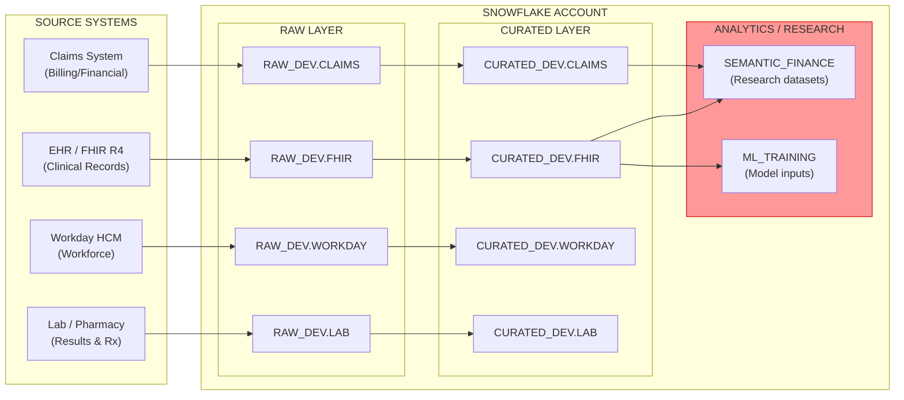

# Healthcare & Life Sciences — Discovery & Current State

> Synthesized from: Healthcare Data Platform Assessment Framework, HIPAA Compliance Gap Analysis, Clinical Data Integration Discovery

## Executive Summary

Healthcare organizations operating on Snowflake face a unique challenge: clinical data (FHIR, HL7, claims) carries strict regulatory requirements (HIPAA, HITRUST, 21st Century Cures Act) that demand automated, provable governance. Manual compliance audits cannot keep pace with data growth. PHI proliferates across analytics environments without classification. The same patient appears in 3-5 systems under different identifiers with no automated matching.

The primary objective is to **deploy a Knowledge Graph-governed clinical data platform** that provides automated PHI detection, cross-system patient resolution, and continuous HIPAA compliance scoring.

## Current State Architecture

### Multi-System Clinical Data Topology

### System Details

| System | Data Type | PHI Elements | Governance Status |
|--------|-----------|-------------|-------------------|
| EHR (FHIR R4) | Clinical records | Patient name, DOB, SSN, MRN, address, diagnoses | Partially tagged — HIPAA_CATEGORY on some columns |
| Claims | Billing/financial | Patient name, DOB, SSN, provider NPI, diagnosis codes | Minimal tagging — no masking policies on analytics copies |
| Workday HCM | Workforce | Employee name, SSN, salary, benefits elections | Well-governed (Workday module) |
| Lab/Pharmacy | Clinical results | Patient identifiers, test results, medication history | Untagged — loaded as raw JSON blobs |

## Key Challenges — "The Compliance Gaps"

### 1. PHI Propagation Without Classification

**Problem**: Clinical data is copied from governed CURATED tables to analytics/research schemas without carrying HIPAA tags. Downstream consumers unknowingly query unmasked PHI.

**Impact**: HIPAA violation risk. If audited, organization cannot prove PHI is classified everywhere it exists.

**DCA Solution**: Knowledge Graph PHI lineage tracing — RAI detects unclassified copies of PHI-tagged source columns.

### 2. Patient Entity Resolution

**Problem**: The same patient exists in FHIR (Patient resource), Claims (subscriber), and Workday (employee benefits). Each system uses different identifiers. No master patient index spans all systems.

**Impact**: Population health analytics are incomplete. Care gap analysis misses patients. Duplicate records inflate costs.

**DCA Solution**: RAI entity resolution using graph-based similarity matching (name + DOB + gender Jaccard).

### 3. HIPAA Audit Trail Gaps

**Problem**: ACCESS_HISTORY shows who queried what, but there's no automated way to determine if that access was authorized under a Business Associate Agreement (BAA) or minimum necessary principle.

**Impact**: Cannot demonstrate HIPAA compliance during OCR audit. Manual review of access logs is unsustainable.

**DCA Solution**: Knowledge Graph access analysis — graph edges link ROLE → TABLE → PHI_COLUMN, cross-referenced with BAA coverage edges.

### 4. Orphaned Clinical Datasets

**Problem**: Research teams create ML training datasets containing PHI without data contracts, IRB approval edges, or de-identification audit trails.

**Impact**: Research data used for model training may violate HIPAA research exemptions (45 CFR 164.512(i)).

**DCA Solution**: Ownership gap detection + contract enforcement via Knowledge Graph scoring.

### 5. Care Pathway Fragmentation

**Problem**: A patient's clinical journey (encounters → diagnoses → procedures → medications → outcomes) is scattered across multiple tables with no linked traversal path.

**Impact**: Care gap analysis, readmission prediction, and clinical decision support lack holistic context.

**DCA Solution**: Clinical knowledge graph edges create traversable care pathways.

## Discovery Questions (HCLS-Specific)

| # | Question | What It Diagnoses |
|---|----------|------------------|
| 1 | "Can you prove that every column containing PHI is classified and masked?" | PHI governance completeness |
| 2 | "If the same patient is in your EHR and claims system, can you link them programmatically?" | Entity resolution maturity |
| 3 | "During your last HIPAA audit, how did you demonstrate minimum necessary access?" | Access governance |
| 4 | "Are your ML training datasets derived from PHI under an IRB-approved protocol?" | Research compliance |
| 5 | "Can you trace a patient's full care pathway from admission to discharge to follow-up across systems?" | Clinical data integration |

## Gap Summary

| # | Gap | Severity | Regulatory Risk | DCA Solution |
|---|-----|----------|----------------|--------------|
| 1 | PHI Propagation Without Classification | Critical | HIPAA §164.312(a) — Access Controls | Knowledge Graph PHI lineage tracing + RAI inference |
| 2 | Patient Entity Resolution | High | Population health analytics incomplete | RAI entity resolution (Jaccard similarity) |
| 3 | HIPAA Audit Trail Gaps | Critical | HIPAA §164.312(b) — Audit Controls | Graph-based access analysis + governance scoring |
| 4 | Orphaned Clinical Datasets | High | 45 CFR 164.512(i) — Research Use | Ownership gap detection + data contract enforcement |
| 5 | Care Pathway Fragmentation | Medium | Clinical decision support quality | Clinical knowledge graph edges (temporal traversal) |
