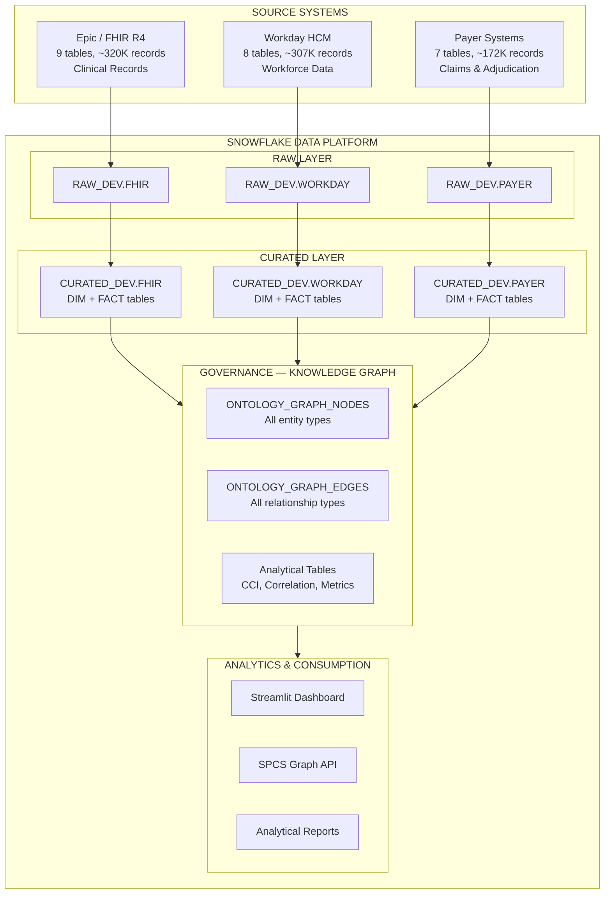
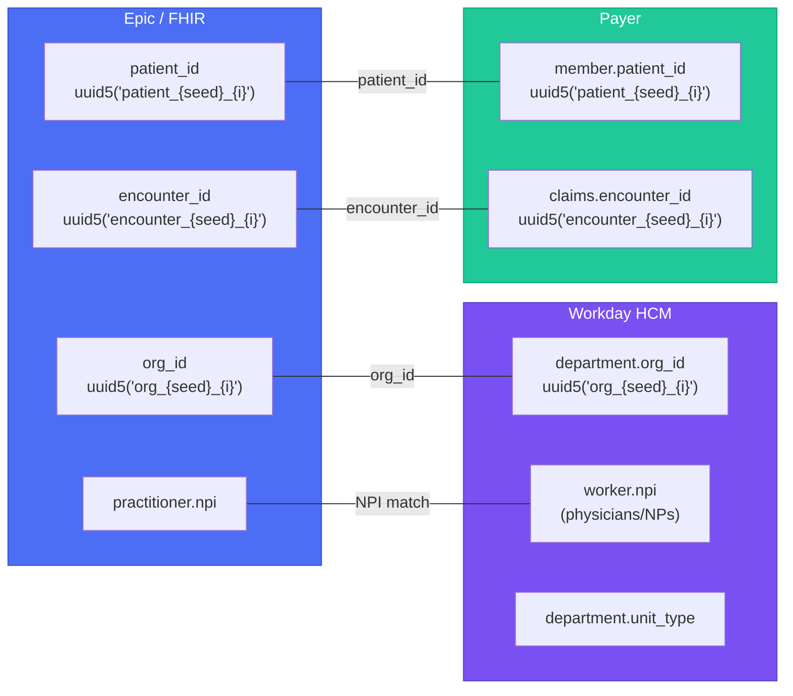
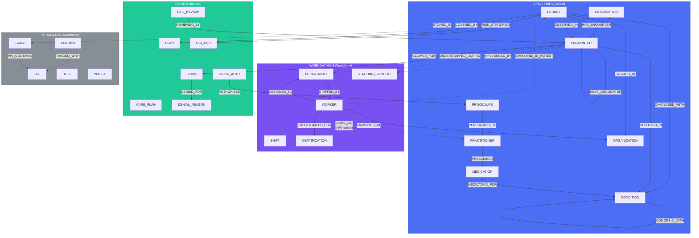

# Healthcare & Life Sciences — Cross-System Ontology Map

> Full entity-relationship document showing how Epic/FHIR, Workday HCM, and Payer data connect through the Knowledge Graph. This is the canonical reference for all node types, edge types, and cross-system linkage keys.

## 1. System Landscape



## 2. Node Type Catalog (Complete)

### FHIR Clinical Nodes (from Epic)

| Node Type | ID Pattern | Source Table | Key Properties |
|-----------|-----------|-------------|----------------|
| PATIENT | `HCLS_PAT_{MD5(patient_id)}` | CURATED_DEV.FHIR.DIM_PATIENT | mrn, name, dob, gender, insurance_payer |
| ENCOUNTER | `HCLS_ENC_{MD5(encounter_id)}` | CURATED_DEV.FHIR.FACT_ENCOUNTERS | class, status, admit_date, discharge_date, total_charges |
| CONDITION | `HCLS_DX_{MD5(condition_id)}` | CURATED_DEV.FHIR.FACT_CONDITIONS | icd10_code, description, severity, clinical_status |
| OBSERVATION | `HCLS_OBS_{MD5(observation_id)}` | CURATED_DEV.FHIR.FACT_OBSERVATIONS | loinc_code, value, unit, status |
| MEDICATION | `HCLS_MED_{MD5(medication_id)}` | CURATED_DEV.FHIR.FACT_MEDICATIONS | rxnorm_code, name, dosage, frequency, status |
| PROCEDURE | `HCLS_PROC_{MD5(procedure_id)}` | CURATED_DEV.FHIR.FACT_PROCEDURES | cpt_code, description, outcome |
| PRACTITIONER | `HCLS_PRAC_{MD5(practitioner_id)}` | CURATED_DEV.FHIR.DIM_PRACTITIONER | npi, specialty, name |
| ORGANIZATION | `HCLS_ORG_{MD5(org_id)}` | CURATED_DEV.FHIR.DIM_ORGANIZATION | name, type, bed_count |

### Workday HCM Nodes

| Node Type | ID Pattern | Source Table | Key Properties |
|-----------|-----------|-------------|----------------|
| WORKER | `WD_WKR_{MD5(worker_id)}` | CURATED_DEV.WORKDAY.DIM_WORKERS | employee_id, name, job_family, specialty, credentials, npi |
| DEPARTMENT | `WD_DEPT_{MD5(department_id)}` | CURATED_DEV.WORKDAY.DIM_DEPARTMENTS | department_name, unit_type, bed_count, target_nurse_ratio, cost_center |
| SHIFT | `WD_SHIFT_{MD5(shift_id)}` | CURATED_DEV.WORKDAY.FACT_SHIFTS | shift_date, hours_worked, nurse_patient_ratio, unit_census, acuity_score |
| CERTIFICATION | `WD_CERT_{MD5(cert_id)}` | CURATED_DEV.WORKDAY.DIM_CERTIFICATIONS | certification_type, expiration_date, is_expired, ce_hours |
| STAFFING_CONTEXT | `WD_STAFF_{MD5(department_id \|\| shift_date)}` | Computed (HCLS_STAFFING_CONTEXT) | actual_ratio, overtime_pct, avg_census, understaffed_events |

### Payer Nodes

| Node Type | ID Pattern | Source Table | Key Properties |
|-----------|-----------|-------------|----------------|
| PLAN | `PYR_PLAN_{MD5(plan_id)}` | CURATED_DEV.PAYER.DIM_PLANS | plan_name, plan_type, payer_name, deductible, max_oop |
| CLAIM | `PYR_CLM_{MD5(claim_id)}` | CURATED_DEV.PAYER.FACT_CLAIMS | claim_status, billed_amount, allowed_amount, paid_amount, denial_reason |
| PRIOR_AUTH | `PYR_AUTH_{MD5(auth_id)}` | CURATED_DEV.PAYER.FACT_PRIOR_AUTH | status, days_to_decision, approved_units, urgency |
| UTIL_REVIEW | `PYR_UR_{MD5(review_id)}` | CURATED_DEV.PAYER.FACT_UTIL_REVIEWS | determination, approved_days, actual_days, variance_days |
| CARE_PLAN | `PYR_POC_{MD5(poc_id)}` | CURATED_DEV.PAYER.FACT_PLAN_OF_CARE | intervention_type, approved_visits, used_visits, outcome |
| CCI_TIER | `PYR_CCI_{MD5(patient_id \|\| cci_tier)}` | Computed (HCLS_PATIENT_COMORBIDITY) | cci_score, cci_tier, calculation_date |
| DENIAL_REASON | `PYR_DEN_{MD5(reason_code)}` | Reference Data | code, description, category |

### Metadata Nodes (from Base Knowledge Graph)

| Node Type | ID Pattern | Source | Key Properties |
|-----------|-----------|--------|----------------|
| TABLE | `TBL_{MD5(fqn)}` | INFORMATION_SCHEMA.TABLES | table_name, schema, database, row_count |
| COLUMN | `COL_{MD5(fqn.col)}` | INFORMATION_SCHEMA.COLUMNS | column_name, data_type, is_nullable |
| TAG | `TAG_{MD5(tag_name \|\| tag_value)}` | TAG_REFERENCES | tag_name, tag_value, tag_schema |
| ROLE | `ROLE_{MD5(role_name)}` | SHOW ROLES | role_name, role_type |
| POLICY | `POL_{MD5(policy_name)}` | INFORMATION_SCHEMA.MASKING_POLICIES | policy_name, policy_type |
| SHARE | `SHARE_{MD5(share_name)}` | SHOW SHARES | share_name, share_type |

## 3. Edge Type Catalog (Complete)

### Clinical Edges (FHIR)

| Edge Type | From → To | Cardinality | Properties |
|-----------|-----------|-------------|------------|
| DIAGNOSED_WITH | PATIENT → CONDITION | 1:N | onset_date, severity, clinical_status |
| RESULTED_IN | ENCOUNTER → CONDITION | 1:N | sequence, verification_status |
| PRESCRIBED | PRACTITIONER → MEDICATION | 1:N | for_patient_id, prescription_date |
| PERFORMED_BY | PROCEDURE → PRACTITIONER | N:1 | procedure_date |
| TREATED_AT | PATIENT → ORGANIZATION | N:M | encounter_count, first_visit, last_visit |
| NEXT_ENCOUNTER | ENCOUNTER → ENCOUNTER | 1:1 | days_between, same_condition |
| BILLED_FOR | ENCOUNTER → CLAIM | 1:N | billed_amount, service_date |
| HAS_ENCOUNTER | PATIENT → ENCOUNTER | 1:N | encounter_class |
| OBSERVED_IN | OBSERVATION → ENCOUNTER | N:1 | observation_date |
| MEDICATION_FOR | MEDICATION → CONDITION | N:M | therapeutic_intent |

### Staffing Edges (Workday)

| Edge Type | From → To | Cardinality | Properties |
|-----------|-----------|-------------|------------|
| ASSIGNED_TO | WORKER → DEPARTMENT | N:M | shift_type, start_date, end_date, is_float_pool |
| EMPLOYED_AT | WORKER → ORGANIZATION | N:1 | hire_date, department_name |
| CREDENTIALED_FOR | WORKER → CERTIFICATION | 1:N | status, expiry_date |
| STAFFED_BY | DEPARTMENT → WORKER | 1:N | shift_date, shift_type, is_primary |
| REPORTS_TO | WORKER → WORKER | N:1 | department_id |
| OVERTIME_EXPOSURE | WORKER → SHIFT | 1:N | hours_over_threshold, consecutive_days |

### Cross-System Correlation Edges

| Edge Type | From → To | Cardinality | Properties | Linkage Method |
|-----------|-----------|-------------|------------|----------------|
| SAME_AS | WORKER → PRACTITIONER | 1:1 | confidence (0.99), match_method ('NPI') | NPI exact match |
| INFLUENCED_BY | ENCOUNTER → STAFFING_CONTEXT | N:M | correlation_strength, metric_pair | org_id + date overlap |
| UNDERSTAFFED_DURING | ENCOUNTER → DEPARTMENT | N:1 | actual_ratio, target_ratio, ratio_vs_target | org_id + date + ratio threshold |
| EMPLOYEE_IS_PATIENT | WORKER → PATIENT | 1:1 | confidence, match_method ('NAME_DOB') | Name + DOB fuzzy match |

### Payer Edges

| Edge Type | From → To | Cardinality | Properties |
|-----------|-----------|-------------|------------|
| COVERED_BY | PATIENT → PLAN | N:M | effective_date, termination_date, status |
| CLAIMED_FOR | ENCOUNTER → CLAIM | 1:N | line_count, total_billed |
| AUTHORIZED | PRIOR_AUTH → PROCEDURE | 1:1 | determination, approved_units, urgency |
| REVIEWED_BY | UTIL_REVIEW → ENCOUNTER | 1:1 | criteria_used, determination, reviewer_type |
| DENIED_FOR | CLAIM → DENIAL_REASON | N:M | reason_code, appeal_status, amount_denied |
| COMORBID_WITH | CONDITION → CONDITION | N:M | co_occurrence_rate, shared_patients_pct |
| RISK_STRATIFIED | PATIENT → CCI_TIER | 1:1 | cci_score, calculation_date, condition_count |

### Governance Edges (from Base Knowledge Graph)

| Edge Type | From → To | Cardinality | Properties |
|-----------|-----------|-------------|------------|
| PHI_CONTAINS | TABLE/COLUMN → TAG | N:M | detection_method, confidence |
| HIPAA_CLASSIFIED | COLUMN → TAG | 1:1 | hipaa_category, classification_date |
| BAA_COVERS | ROLE → TABLE | N:M | baa_id, effective_date |
| DE_IDENTIFIED_FROM | TABLE → TABLE | N:1 | method, date, protocol |
| IRB_APPROVED | TABLE → PROTOCOL | N:1 | irb_number, approval_date |
| STORED_IN | Clinical Node → TABLE | N:1 | source_system |
| TAGGED_WITH | COLUMN → TAG | N:M | tag_name, tag_value |
| LINEAGE_FROM | TABLE/COLUMN → TABLE/COLUMN | N:M | transform_type |
| GRANTED_TO | ROLE → ROLE | N:M | grant_type |

## 4. Cross-System Linkage Keys

The three source systems are connected through deterministic UUID5 keys generated with shared seeds. This ensures referential integrity across independently generated datasets.

### Primary Linkage Keys



### Key Details

| Linkage Key | System A | System B | Generation Pattern | Match Type |
|-------------|----------|----------|-------------------|------------|
| patient_id | FHIR DIM_PATIENT | Payer DIM_MEMBERS | `uuid5(NAMESPACE_OID, f"patient_{seed}_{i}")` | Exact (deterministic) |
| encounter_id | FHIR FACT_ENCOUNTERS | Payer FACT_CLAIMS_DETAIL | `uuid5(NAMESPACE_OID, f"encounter_{seed}_{i}")` | Exact (deterministic) |
| org_id | FHIR DIM_ORGANIZATION | Workday DIM_DEPARTMENTS | `uuid5(NAMESPACE_OID, f"org_{seed}_{i}")` | Exact (deterministic) |
| NPI | FHIR DIM_PRACTITIONER | Workday DIM_WORKERS | 10-digit NPI string | Exact (shared NPI pool) |
| unit_type + org_id | FHIR encounter location | Workday DIM_DEPARTMENTS | Composite | Logical join |
| Name + DOB | FHIR DIM_PATIENT | Workday DIM_WORKERS | ~5% overlap by design | Fuzzy (Jaccard > 0.7) |

### UUID5 Seed Patterns

All three generators use the same seed patterns to ensure cross-system referential integrity:

```python
import uuid

SEED = 42  # Default seed, configurable via --seed

# Shared key generation (used by all 3 generators)
patient_id  = uuid.uuid5(uuid.NAMESPACE_OID, f"patient_{SEED}_{i}")    # i in range(10000)
encounter_id = uuid.uuid5(uuid.NAMESPACE_OID, f"encounter_{SEED}_{i}") # i in range(50000)
org_id       = uuid.uuid5(uuid.NAMESPACE_OID, f"org_{SEED}_{i}")       # i in range(50)
```

## 5. Query Patterns

### Patient 360: All Relationships Across 3 Systems

```sql
-- Full patient context: clinical + workforce + payer
WITH patient AS (
    SELECT node_id, display_name, properties
    FROM DCA_DEMO.GOVERNANCE.ONTOLOGY_GRAPH_NODES
    WHERE node_type = 'PATIENT' AND node_id = :target_patient_node_id
)
SELECT 
    p.display_name AS patient,
    e.edge_type AS relationship,
    COALESCE(n_out.display_name, n_in.display_name) AS related_entity,
    COALESCE(n_out.node_type, n_in.node_type) AS entity_type,
    COALESCE(n_out.source_system, n_in.source_system) AS source_system,
    e.properties AS edge_properties
FROM patient p
LEFT JOIN DCA_DEMO.GOVERNANCE.ONTOLOGY_GRAPH_EDGES e 
    ON p.node_id = e.source_node_id OR p.node_id = e.target_node_id
LEFT JOIN DCA_DEMO.GOVERNANCE.ONTOLOGY_GRAPH_NODES n_out 
    ON e.target_node_id = n_out.node_id AND e.source_node_id = p.node_id
LEFT JOIN DCA_DEMO.GOVERNANCE.ONTOLOGY_GRAPH_NODES n_in 
    ON e.source_node_id = n_in.node_id AND e.target_node_id = p.node_id
ORDER BY source_system, relationship;
```

### Staffing-Outcome: Units Where Ratios Exceeded Targets During Readmissions

```sql
-- Understaffed units correlated with readmissions
SELECT 
    d.display_name AS department,
    d.properties:unit_type::STRING AS unit_type,
    sc.properties:actual_ratio::FLOAT AS nurse_ratio,
    sc.properties:overtime_pct::FLOAT AS overtime_pct,
    enc.display_name AS encounter,
    enc.properties:readmission_30day::BOOLEAN AS readmitted
FROM DCA_DEMO.GOVERNANCE.ONTOLOGY_GRAPH_EDGES e_under
JOIN DCA_DEMO.GOVERNANCE.ONTOLOGY_GRAPH_NODES enc 
    ON e_under.source_node_id = enc.node_id AND enc.node_type = 'ENCOUNTER'
JOIN DCA_DEMO.GOVERNANCE.ONTOLOGY_GRAPH_NODES d 
    ON e_under.target_node_id = d.node_id AND d.node_type = 'DEPARTMENT'
JOIN DCA_DEMO.GOVERNANCE.ONTOLOGY_GRAPH_EDGES e_inf
    ON enc.node_id = e_inf.source_node_id AND e_inf.edge_type = 'INFLUENCED_BY'
JOIN DCA_DEMO.GOVERNANCE.ONTOLOGY_GRAPH_NODES sc 
    ON e_inf.target_node_id = sc.node_id AND sc.node_type = 'STAFFING_CONTEXT'
WHERE e_under.edge_type = 'UNDERSTAFFED_DURING'
ORDER BY sc.properties:actual_ratio::FLOAT DESC;
```

### Comorbidity-Payer: Denial Rates by CCI Tier for Cardiac Procedures

```sql
-- Denial rates for cardiac procedures stratified by comorbidity
SELECT 
    pc.cci_tier,
    p.payer_name,
    cd.cpt_code,
    cd.cpt_description,
    COUNT(*) AS total_claims,
    SUM(CASE WHEN cd.claim_status = 'DENIED' THEN 1 ELSE 0 END) AS denied,
    ROUND(denied / NULLIF(total_claims, 0) * 100, 1) AS denial_rate_pct,
    ROUND(AVG(cd.billed_amount), 0) AS avg_billed
FROM DCA_DEMO.GOVERNANCE.HCLS_PATIENT_COMORBIDITY pc
JOIN CURATED_DEV.PAYER.DIM_MEMBERS m ON pc.patient_id = m.patient_id
JOIN CURATED_DEV.PAYER.FACT_CLAIMS_DETAIL cd ON m.member_id = cd.member_id
JOIN CURATED_DEV.PAYER.DIM_PLANS p ON m.plan_id = p.plan_id
WHERE cd.cpt_code LIKE '33%'  -- Cardiac surgery CPT range
GROUP BY 1, 2, 3, 4
HAVING total_claims > 10
ORDER BY pc.cci_tier, denial_rate_pct DESC;
```

### Cross-System Resolution: Workers Who Are Also Patients

```sql
-- Find all workers matched to patients via EMPLOYEE_IS_PATIENT or SAME_AS edges
SELECT 
    w.display_name AS worker,
    w.properties:job_family::STRING AS job_family,
    w.properties:department_id::STRING AS department,
    COALESCE(pat.display_name, prac.display_name) AS matched_entity,
    COALESCE(pat.node_type, prac.node_type) AS matched_type,
    e.edge_type AS match_type,
    e.properties:confidence::FLOAT AS confidence,
    e.properties:match_method::STRING AS method
FROM DCA_DEMO.GOVERNANCE.ONTOLOGY_GRAPH_NODES w
JOIN DCA_DEMO.GOVERNANCE.ONTOLOGY_GRAPH_EDGES e 
    ON w.node_id = e.source_node_id 
    AND e.edge_type IN ('SAME_AS', 'EMPLOYEE_IS_PATIENT')
LEFT JOIN DCA_DEMO.GOVERNANCE.ONTOLOGY_GRAPH_NODES pat 
    ON e.target_node_id = pat.node_id AND pat.node_type = 'PATIENT'
LEFT JOIN DCA_DEMO.GOVERNANCE.ONTOLOGY_GRAPH_NODES prac 
    ON e.target_node_id = prac.node_id AND prac.node_type = 'PRACTITIONER'
WHERE w.node_type = 'WORKER'
ORDER BY confidence DESC;
```

### Care Pathway with Staffing Context

```sql
-- Trace a patient's journey with staffing at each touchpoint
WITH patient_encounters AS (
    SELECT 
        e_he.target_node_id AS encounter_node_id,
        enc.display_name AS encounter,
        enc.properties:admit_date::DATE AS admit_date,
        enc.properties:encounter_class::STRING AS encounter_class,
        enc.properties:total_charges::NUMBER AS charges
    FROM DCA_DEMO.GOVERNANCE.ONTOLOGY_GRAPH_EDGES e_he
    JOIN DCA_DEMO.GOVERNANCE.ONTOLOGY_GRAPH_NODES enc 
        ON e_he.target_node_id = enc.node_id
    WHERE e_he.source_node_id = :target_patient_node_id
      AND e_he.edge_type = 'HAS_ENCOUNTER'
)
SELECT 
    pe.encounter,
    pe.admit_date,
    pe.encounter_class,
    pe.charges,
    sc.properties:actual_ratio::FLOAT AS nurse_ratio,
    sc.properties:overtime_pct::FLOAT AS overtime_pct,
    sc.properties:avg_census::NUMBER AS unit_census,
    CASE 
        WHEN e_inf.edge_id IS NOT NULL THEN 'INFLUENCED (understaffed)'
        ELSE 'ADEQUATE'
    END AS staffing_status,
    -- Next encounter info
    ne.display_name AS next_encounter,
    e_next.properties:days_between::NUMBER AS days_to_next
FROM patient_encounters pe
LEFT JOIN DCA_DEMO.GOVERNANCE.ONTOLOGY_GRAPH_EDGES e_inf 
    ON pe.encounter_node_id = e_inf.source_node_id AND e_inf.edge_type = 'INFLUENCED_BY'
LEFT JOIN DCA_DEMO.GOVERNANCE.ONTOLOGY_GRAPH_NODES sc 
    ON e_inf.target_node_id = sc.node_id
LEFT JOIN DCA_DEMO.GOVERNANCE.ONTOLOGY_GRAPH_EDGES e_next 
    ON pe.encounter_node_id = e_next.source_node_id AND e_next.edge_type = 'NEXT_ENCOUNTER'
LEFT JOIN DCA_DEMO.GOVERNANCE.ONTOLOGY_GRAPH_NODES ne 
    ON e_next.target_node_id = ne.node_id
ORDER BY pe.admit_date;
```

## 6. Full Entity Relationship Diagram



### Edge Count Summary

| Category | Edge Types | Estimated Count (Default Scale) |
|----------|-----------|-------------------------------|
| Clinical (FHIR) | 10 | ~500,000 |
| Staffing (Workday) | 6 | ~270,000 |
| Cross-System Correlation | 4 | ~15,000 |
| Payer | 7 | ~250,000 |
| Governance | 9 | ~50,000 |
| **Total** | **36** | **~1,085,000** |

## 7. Node/Edge Property Storage

All node and edge properties are stored as Snowflake VARIANT columns using OBJECT_CONSTRUCT:

```sql
-- Node properties example (PATIENT)
OBJECT_CONSTRUCT(
    'mrn', p.mrn,
    'first_name', p.first_name,
    'last_name', p.last_name,
    'date_of_birth', p.date_of_birth,
    'gender', p.gender,
    'insurance_payer', p.insurance_payer,
    'cci_score', pc.cci_score,
    'cci_tier', pc.cci_tier
)

-- Edge properties example (INFLUENCED_BY)
OBJECT_CONSTRUCT(
    'correlation_strength', corr.coefficient,
    'metric_pair', 'ratio_vs_readmission',
    'staffing_date', sc.shift_date,
    'actual_ratio', sc.actual_ratio,
    'target_ratio', sc.target_nurse_ratio
)
```

## 8. Data Volume at Scale

| Dataset | Table | Default Count | Quick (10%) | Full Scale |
|---------|-------|---------------|-------------|------------|
| **FHIR** | patients | 10,000 | 1,000 | Configurable |
| | practitioners | 500 | 50 | |
| | organizations | 50 | 5 | |
| | encounters | 50,000 | 5,000 | |
| | conditions | 80,000 | 8,000 | |
| | observations | 100,000 | 10,000 | |
| | medications | 40,000 | 4,000 | |
| | procedures | 30,000 | 3,000 | |
| | claims | 60,000 | 6,000 | |
| **Workday** | workers | 8,000 | 800 | |
| | departments | 200 | 20 | |
| | staffing_assignments | 50,000 | 5,000 | |
| | shifts | 200,000 | 20,000 | |
| | certifications | 15,000 | 1,500 | |
| | time_off | 20,000 | 2,000 | |
| | turnover_events | 2,000 | 200 | |
| | compensation_history | 12,000 | 1,200 | |
| **Payer** | plans | 50 | 5 | |
| | members | 10,000 | 1,000 | |
| | coverage_periods | 12,000 | 1,200 | |
| | claims_detail | 80,000 | 8,000 | |
| | prior_authorizations | 15,000 | 1,500 | |
| | utilization_reviews | 10,000 | 1,000 | |
| | plan_of_care | 25,000 | 2,500 | |
| | quality_measures | 5,000 | 500 | |
