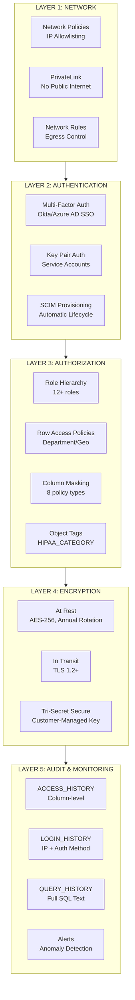
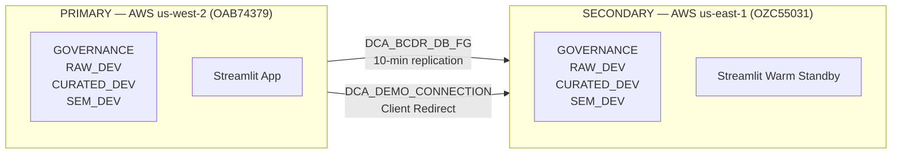

# Platform Security — Defense in Depth for Healthcare

## Executive Summary

Snowflake Business Critical provides HIPAA-grade security as a platform capability — not an add-on. This document maps the platform's security architecture to healthcare compliance requirements, providing the technical backing for EA delivery in healthcare engagements.

Business Critical edition includes: end-to-end encryption with customer-managed keys, HITRUST CSF r2 certification, cross-region failover, network isolation, and column-level audit trails. Combined with the demo's governance framework (8 masking policies, 12+ roles, automated PHI classification), this creates a defense-in-depth security posture that satisfies HIPAA Security Rule requirements without external tools.

---

## 1. Defense in Depth — 5 Layers



Each layer operates independently — a breach at one layer is contained by the next. No single failure exposes PHI.

---

## 2. HIPAA Safeguard Mapping

| HIPAA Requirement | Safeguard | Snowflake Implementation | Demo Evidence |
|---|---|---|---|
| §164.312(a)(1) — Access Control | Unique user ID | SSO + SCIM provisioning | `SHOW USERS` |
| §164.312(a)(2)(i) — Unique User ID | Per-user credentials | Key pair auth, SSO integration | `LOGIN_HISTORY` |
| §164.312(a)(2)(ii) — Emergency Access | Break-glass procedure | ACCOUNTADMIN with MFA | Role hierarchy diagram |
| §164.312(a)(2)(iii) — Automatic Logoff | Session timeout | `HCLS_SESSION_POLICY` (30 min idle) | `SHOW SESSION POLICIES` |
| §164.312(a)(2)(iv) — Encryption | Data at rest | AES-256, periodic rekeying | `SHOW PARAMETERS '%KEY%'` |
| §164.312(b) — Audit Controls | Access logging | ACCESS_HISTORY (column-level) | Query ACCESS_HISTORY |
| §164.312(c)(1) — Integrity | Data validation | Data contracts, hash verification | ONTOLOGY_GRAPH_SCORES |
| §164.312(c)(2) — Authentication | Data origin auth | `_ROW_HASH`, `_SOURCE_SYSTEM` columns | Query any table |
| §164.312(d) — Person/Entity Auth | MFA + SSO | Okta/Azure AD, TOTP | `LOGIN_HISTORY` |
| §164.312(e)(1) — Transmission Security | Encrypted transit | TLS 1.2+ mandatory | Network config |
| §164.312(e)(2)(i) — Integrity Controls | Hash verification | SHA-256 row hashes on all records | `_ROW_HASH` column |
| §164.312(e)(2)(ii) — Encryption | End-to-end encryption | PrivateLink + TLS + AES-256 | `SHOW NETWORK POLICIES` |

---

## 3. Role-Based Access Control — Healthcare Model

The demo implements a 12+ role hierarchy mapped to healthcare personas, enforcing the HIPAA minimum necessary principle:

```
                        ACCOUNTADMIN
                              │
                         SYSADMIN
                              │
                         DATA_ADMIN ◄── Owns all demo objects
                              │
      ┌───────────────────────┼───────────────────────┐
      │                       │                       │
 DATA_ENGINEER           DATA_STEWARD            PII_VIEWER
      │                       │                       │
      │          ┌────────────┼────────────┐          │
      │          │            │            │          │
      │      ANALYST      MANAGER      AUDITOR        │
      │          │            │            │          │
      │          └──────┬─────┴──────┬─────┘          │
      │                 │            │                │
      └─────────►   VIEWER     EXTERNAL_PARTNER  ◄────┘
                        │
                    AI_AGENT
```

### Healthcare Persona Mapping

| Role | Healthcare Persona | PHI Access | Use Case |
|---|---|---|---|
| **ACCOUNTADMIN** | Security Officer | Full (break-glass only) | Emergency access, security config |
| **DATA_ADMIN** | Platform Administrator | Full (owns objects) | Schema management, governance setup |
| **DATA_STEWARD** | Privacy Officer / Compliance | Partial (masked emails) | Tag management, policy enforcement |
| **DATA_ENGINEER** | Clinical Data Integrator | Full (pipeline operations) | ETL, data loading, pipeline maintenance |
| **PII_VIEWER** | Authorized PHI Access (clinicians) | Full (minimum necessary) | Direct patient care, clinical operations |
| **ANALYST** | Researchers | De-identified only | Population health, outcomes research |
| **MANAGER** | Department Heads | Partial (last-4 SSN, rounded salary) | Operational reporting, team management |
| **AUDITOR** | Compliance Auditor | Read-only governance metadata | HIPAA audits, access reviews |
| **VIEWER** | General Staff | Fully masked | Read-only dashboards, general reporting |
| **AI_AGENT** | Automated Services | Partial (first initial names) | Inference pipelines, automated analytics |
| **EXTERNAL_PARTNER** | BAA-covered partners | Restricted access | Data sharing under BAA |
| **ONTOLOGY_ADMIN** | Governance Analytics | Read governance tables | Compliance scoring, governance dashboards |

**Minimum necessary enforcement**: Each role sees only what HIPAA allows. The same `SELECT * FROM PATIENTS` query returns different data depending on the executing role — no application-layer filtering required.

---

## 4. Dynamic Data Masking — PHI Protection

All 8 masking policies from `sql/07_governance.sql`, mapped to healthcare PHI categories:

### MASK_NAME (Patient/Employee Names)
- **PII_VIEWER, DATA_ADMIN, MANAGER, ANALYST**: Full name visible
- **AI_AGENT**: First initial only (e.g., `J.`)
- **All others**: `[NAME REDACTED]`

### MASK_SSN (Social Security Numbers)
- **DATA_ADMIN, PII_VIEWER**: Full SSN
- **MANAGER**: Last 4 only (e.g., `XXX-XX-1234`)
- **All others**: `***-**-****`

### MASK_DOB (Date of Birth)
- **DATA_ADMIN, PII_VIEWER**: Full date
- **MANAGER, ANALYST**: Year only (age bracket) via `DATE_TRUNC('YEAR', val)`
- **All others**: `NULL`

### MASK_EMAIL (Email Addresses)
- **DATA_ADMIN, PII_VIEWER, MANAGER**: Full email
- **ANALYST, DATA_STEWARD**: Partial (e.g., `jo***@hospital.org`)
- **All others**: `[EMAIL REDACTED]`

### MASK_PHONE (Phone Numbers)
- **DATA_ADMIN, PII_VIEWER, MANAGER**: Full number
- **ANALYST**: Last 4 digits only (e.g., `XXX-XXX-5678`)
- **All others**: `[PHONE REDACTED]`

### MASK_ADDRESS (Physical Addresses)
- **DATA_ADMIN, PII_VIEWER**: Full address
- **MANAGER, ANALYST**: `[Address in Region]`
- **All others**: `[ADDRESS REDACTED]`

### MASK_SALARY (Compensation/Financial)
- **DATA_ADMIN, PII_VIEWER**: Exact amount
- **MANAGER**: Rounded to nearest $10,000
- **All others**: `NULL`

### MASK_PATIENT_ID (Healthcare Identifiers — MRN, etc.)
- **DATA_ADMIN, PII_VIEWER**: Full identifier
- **MANAGER, ANALYST**: SHA-256 hash (linkable but de-identified)
- **All others**: `[PHI REDACTED]`

### Demo: Same Query, Different Results

```sql
-- Run as each role to demonstrate progressive masking
USE ROLE PII_VIEWER;
SELECT FIRST_NAME, LAST_NAME, SSN, BIRTH_DATE FROM RAW_DEV.FHIR.PATIENTS LIMIT 3;
-- Returns: John | Smith | 123-45-6789 | 1985-03-15

USE ROLE MANAGER;
SELECT FIRST_NAME, LAST_NAME, SSN, BIRTH_DATE FROM RAW_DEV.FHIR.PATIENTS LIMIT 3;
-- Returns: John | Smith | XXX-XX-6789 | 1985-01-01

USE ROLE VIEWER;
SELECT FIRST_NAME, LAST_NAME, SSN, BIRTH_DATE FROM RAW_DEV.FHIR.PATIENTS LIMIT 3;
-- Returns: [NAME REDACTED] | [NAME REDACTED] | ***-**-**** | NULL
```

---

## 5. Encryption Architecture

### At Rest
- **AES-256** encryption on all data files, metadata, and temporary storage
- **Hierarchical key model**: root key → account key → table key → file key
- **Annual automatic key rotation** (BC auto-enabled)
- `PERIODIC_DATA_REKEYING = TRUE` on Business Critical — re-encrypts data with new keys on a regular schedule, not just key metadata

### In Transit
- **TLS 1.2+** mandatory for all client connections
- Certificate pinning for Snowflake drivers
- Internal service communication encrypted
- **PrivateLink**: traffic never traverses public internet when configured

### Tri-Secret Secure (Customer-Managed Keys)
Tri-Secret Secure provides the highest level of encryption control for regulated workloads:

```
┌─────────────────┐     ┌──────────────────┐     ┌─────────────────┐
│  Snowflake Key  │ ──► │  Composite Key   │ ◄── │  Customer Key   │
│  (managed by SF)│     │  (both required)  │     │  (AWS KMS /     │
│                 │     │                   │     │   Azure KV /    │
│                 │     │  Used to encrypt  │     │   GCP Cloud KMS)│
│                 │     │  all data at rest │     │                 │
└─────────────────┘     └──────────────────┘     └─────────────────┘
```

- Customer provides wrapping key via their cloud KMS
- Both Snowflake's key and the customer's key are required to decrypt data
- Customer can revoke access instantly by disabling their KMS key
- Satisfies HIPAA §164.312(a)(2)(iv) key management requirement
- Available on Business Critical and higher editions

---

## 6. Network Security

### Network Policies
The demo deploys (`09_hcls_network_hardening.sql`):

| Policy/Rule | Type | Purpose |
|---|---|---|
| `HCLS_CORPORATE_ACCESS` | Network Rule (Ingress) | IP allowlisting — corporate CIDR only |
| `HCLS_SNOWFLAKE_INTERNAL` | Network Rule (Egress) | Snowflake service access |
| `HCLS_RESTRICTED_ACCESS` | Network Policy | Combines rules — account-level enforcement |
| `HCLS_SESSION_POLICY` | Session Policy | 30-min idle, 15-min UI timeout |
| `HCLS_SPCS_EGRESS` | Network Rule (Egress) | Container egress lockdown |

### Architecture with PrivateLink

```
┌─────────────────────────────────────────────────────┐
│  Customer VPC                                       │
│  ┌──────────────┐    ┌─────────────────────────┐    │
│  │ Application  │───►│ VPC Endpoint            │    │
│  │ (Streamlit)  │    │ (PrivateLink)           │    │
│  └──────────────┘    └───────────┬─────────────┘    │
│                                  │ No public         │
│                                  │ internet           │
└──────────────────────────────────┼──────────────────┘
                                   │
                    ┌──────────────▼──────────────┐
                    │  Snowflake Service          │
                    │  ┌──────────────────────┐   │
                    │  │ Network Policy       │   │
                    │  │ (IP allowlisting)    │   │
                    │  └──────────┬───────────┘   │
                    │             │                │
                    │  ┌──────────▼───────────┐   │
                    │  │ Encrypted Storage    │   │
                    │  │ (AES-256 + TSS)      │   │
                    │  └──────────────────────┘   │
                    └─────────────────────────────┘
```

### SPCS Container Isolation
Containers running on Snowpark Container Services (including inference Native Apps) are restricted via `HCLS_SPCS_EGRESS` to communicate only with `*.snowflakecomputing.com:443`. This prevents any data exfiltration from container workloads to external endpoints.

---

## 7. Business Continuity & Disaster Recovery

### Architecture



- **Cross-region database replication**: 10-minute schedule via `DCA_BCDR_DB_FG`
- **Client-redirect connections**: `DCA_DEMO_CONNECTION` provides transparent failover — applications reconnect automatically
- **Failover groups include**: all 4 demo databases, governance objects, masking policies, tags
- **Account-level group** (`ICEBERG_BCDR_ACCOUNT_FG`): roles, warehouses, network policies, integrations

### Healthcare RPO/RTO Targets

| Metric | Target | How Achieved |
|---|---|---|
| **RPO** (Recovery Point Objective) | 10 minutes | Max data loss = 1 replication cycle |
| **RTO** (Recovery Time Objective) | 5 minutes | Client redirect + warm standby Streamlit |
| Failover drill frequency | Monthly | Documented in `DEPLOYMENT_RUNBOOK.md` |
| Replication monitoring | Continuous | Alert if lag > 15 minutes |

### CMS Conditions of Participation
Healthcare systems must have a documented disaster recovery plan. This demo satisfies:
- Documented failover procedures (`08_hcls_bcdr_deploy.sql`, Part 7)
- Monthly drill schedule with recorded results
- RPO/RTO targets with measurement methodology
- Governance object replication verification

---

## 8. Audit & Compliance Evidence

Snowflake provides comprehensive audit evidence automatically — no additional logging infrastructure required.

### Built-in Audit Views

| View | Purpose | Retention | HIPAA Relevance |
|---|---|---|---|
| `LOGIN_HISTORY` | Every authentication attempt | 365 days | §164.312(d) — Person authentication |
| `ACCESS_HISTORY` | Column-level access tracking | 365 days | §164.312(b) — Audit controls |
| `QUERY_HISTORY` | Full SQL text of every query | 365 days | §164.312(b) — Audit controls |
| `COPY_HISTORY` | Every data load with file names | 365 days | Data provenance |
| `REPLICATION_GROUP_REFRESH_HISTORY` | DR compliance evidence | 365 days | BC/DR compliance |

### Sample Audit Evidence Query

```sql
-- Show all access to PHI columns in the last 30 days
SELECT 
    user_name, 
    query_start_time,
    ARRAY_AGG(DISTINCT col.value:columnName) AS phi_columns_accessed
FROM SNOWFLAKE.ACCOUNT_USAGE.ACCESS_HISTORY ah,
     LATERAL FLATTEN(ah.base_objects_accessed) obj,
     LATERAL FLATTEN(obj.value:columns) col
WHERE col.value:columnName::STRING IN (
    'BIRTH_DATE', 'SSN', 'MRN', 'FIRST_NAME', 'LAST_NAME',
    'EMAIL', 'PHONE', 'ADDRESS', 'NATIONAL_ID', 'PATIENT_ID'
)
  AND query_start_time > DATEADD('day', -30, CURRENT_TIMESTAMP())
GROUP BY 1, 2
ORDER BY query_start_time DESC;
```

### Audit Workflow for HIPAA Reviews
1. **Who accessed PHI?** → `ACCESS_HISTORY` with column-level granularity
2. **From where?** → `LOGIN_HISTORY` with `CLIENT_IP` and auth method
3. **What query?** → `QUERY_HISTORY` with full SQL text
4. **Was data exported?** → `COPY_HISTORY` for any `COPY INTO` or `UNLOAD` operations
5. **Is DR tested?** → `REPLICATION_GROUP_REFRESH_HISTORY` + drill snapshots

---

## 9. Compliance Certifications

Snowflake Business Critical maintains the following certifications:

| Certification | Status | Relevance |
|---|---|---|
| **HITRUST CSF r2** | Validated | Gold standard for healthcare data security |
| **SOC 1 Type II** | Certified | Financial controls assurance |
| **SOC 2 Type II** | Certified | Security, availability, confidentiality |
| **ISO 27001** | Certified | Information security management |
| **FedRAMP Moderate** | Certified (GovCloud) | US government compliance |
| **PCI DSS Level 1** | Certified | Payment card data (relevant for payer data) |

**Healthcare-specific**: Snowflake executes Business Associate Agreements (BAAs) with customers on Business Critical and higher editions. One BAA covers all data in the account — no per-table or per-database BAA management.

---

## 10. Competitive Security Comparison

| Capability | Snowflake BC | Databricks | Cloud DW (BigQuery/Redshift) |
|---|---|---|---|
| Built-in column masking | Native policies (8 types) | External tools required | Limited / IAM-based |
| Row-level security | Native RLS policies | Unity Catalog (newer) | IAM-based |
| Object tagging + auto-governance | Native tags with propagation | Manual classification | Limited |
| Cross-region failover | Built-in with client redirect | Manual configuration | Limited |
| PrivateLink | Native | Native | Native |
| Tri-Secret Secure (CMK) | Native | Not available | CMK only (no dual-key) |
| Column-level audit | ACCESS_HISTORY (automatic) | Limited | Limited |
| HITRUST CSF certification | Yes | No | No |
| Session policies | Native (idle + UI timeout) | Workspace-level settings | IAM session |
| SPCS egress control | Network rules on compute pools | Cluster network config | N/A |
| BAA execution | Standard on BC edition | Available | Available |
| Periodic data rekeying | Auto-enabled on BC | Not available | Limited |

---

## 11. Demo Talking Points (for CISO/Security Audience)

Use these when presenting to a CISO, VP of Security, or Compliance Officer:

1. **One security perimeter, three clinical systems.** Epic, Workday, and Payer data under a single set of masking policies, a single role hierarchy, and a single BAA. No middleware vendors to audit.

2. **Column-level masking is native, not bolted on.** Eight masking policies enforced at the engine level — the same SELECT statement returns different data depending on the role. No application-layer filtering to bypass.

3. **Every PHI access is logged at column granularity.** ACCESS_HISTORY tracks which user queried which PHI column, when, from which IP. This is automatic — no logging configuration required.

4. **Cross-region failover with 5-minute RTO.** Client-redirect connections mean applications reconnect transparently. Monthly failover drills are documented and measurable.

5. **Tri-Secret Secure means you hold the kill switch.** Your KMS key + Snowflake's key = composite encryption. Disable your key and all data is instantly inaccessible, even to Snowflake.

6. **Network isolation eliminates public internet exposure.** PrivateLink + network policies + SPCS egress restrictions. Containers cannot reach external endpoints.

7. **HITRUST CSF r2 validated — the only major cloud data platform with this certification.** HITRUST is the accepted framework for healthcare security assessments. This accelerates your security review.

8. **Session policies enforce HIPAA automatic logoff.** 30-minute idle timeout, 15-minute UI timeout. Applied at the platform level — not dependent on client configuration.

9. **Automated PHI classification eliminates compliance blind spots.** The platform tags and scores every table and column continuously. Annual audits become real-time dashboards.

10. **Zero-ETL pipelines reduce your attack surface.** Dynamic Tables replace Airflow/Spark middleware. Fewer services = fewer BAAs = fewer vulnerability surfaces = fewer audit findings.
