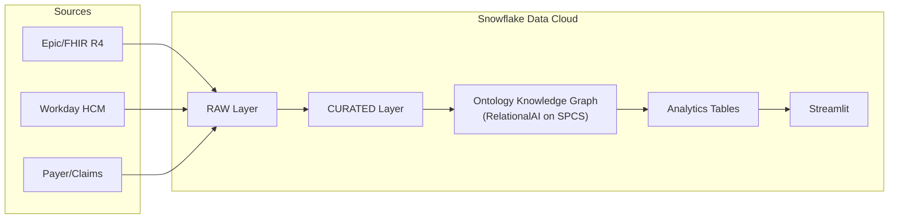
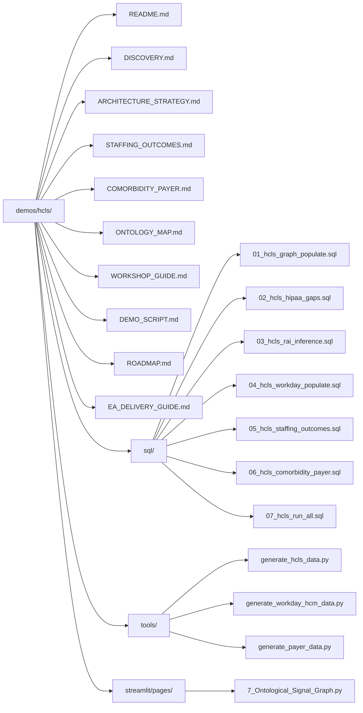

# Healthcare & Life Sciences — Staffing, Outcomes & Payer Intelligence Platform

> **Three-System HCLS Analytics on Snowflake** — Epic/FHIR clinical data, Workday HCM workforce data, and payer adjudication data unified through an Ontology Knowledge Graph to reveal cross-system correlations between staffing decisions, patient outcomes, and payer behavior.

## Executive Summary

This demo extends the core DCA (Data Cloud Architecture) platform into a full three-system HCLS analytics platform. It proves three core analytical theses:

1. **Understaffing correlates with worse patient outcomes** — Nurse-patient ratios, overtime, and staffing adequacy predict readmissions, adverse events, and length-of-stay outliers.
2. **Comorbidity burden drives payer behavior patterns** — Charlson Comorbidity Index (CCI) stratification reveals systematic denial rate escalation, adjudication delays, and care gap patterns by risk tier.
3. **The Knowledge Graph reveals cross-system insights invisible in flat data** — Ontological edges connecting clinical, workforce, and financial entities surface correlations that no single-system query can produce.

### Source Systems

| System | Domain | Tables | Records (default) |
|--------|--------|--------|-------------------|
| **Epic/FHIR** (Clinical) | Patients, encounters, conditions, observations, medications, procedures, claims | 10 | ~320K |
| **Workday HCM** (Workforce) | Workers, departments, shifts, staffing assignments, certifications, turnover | 8 | ~307K |
| **Payer** (Financial) | Plans, members, claims adjudication, prior authorizations, utilization reviews, quality measures | 8 | ~172K |

## Architecture Overview



## Data Model

### Epic/FHIR (Clinical) — 10 Tables

| Table | Records | Key Fields | ~Size |
|-------|---------|------------|-------|
| `patients` | 10,000 | SSN, DOB, MRN, address, phone, email | 8MB |
| `practitioners` | 500 | NPI, DEA number, specialty | 0.3MB |
| `organizations` | 50 | name, type, address | 0.02MB |
| `encounters` | 50,000 | patient_id, class, diagnosis codes, nurse_patient_ratio, staffing_adequacy, readmission_30day | 20MB |
| `conditions` | 30,000 | ICD-10 codes, patient_id, onset | 10MB |
| `observations` | 100,000 | LOINC codes, clinical values | 35MB |
| `medications` | 25,000 | RxNorm codes, prescriber | 10MB |
| `procedures` | 15,000 | CPT codes, patient_id, performer | 6MB |
| `claims` | 40,000 | charges, payer, patient_id | 15MB |
| `comorbidity_scores` | 10,000 | patient_id, CCI score, tier (LOW/MODERATE/HIGH/SEVERE) | 1MB |

### Workday HCM (Workforce) — 8 Tables

| Table | Records | Key Fields |
|-------|---------|------------|
| `workers` | 8,000 | worker_id, name, role, department, NPI (physicians/NPs/PAs) |
| `departments` | 200 | dept_id, org_id, unit_type, capacity |
| `staffing_assignments` | 50,000 | worker_id, dept_id, role, shift_pattern |
| `shifts` | 200,000 | worker_id, dept_id, date, hours, acuity, occupancy |
| `certifications` | 15,000 | worker_id, cert_type, expiry |
| `time_off` | 20,000 | worker_id, type, dates, approved |
| `turnover_events` | 2,000 | worker_id, reason, separation_date |
| `compensation_history` | 12,000 | worker_id, base_salary, effective_date |

### Payer (Financial) — 8 Tables

| Table | Records | Key Fields |
|-------|---------|------------|
| `plans` | 50 | plan_id, type (Medicare Advantage, PPO, HMO, Medicaid, HDHP) |
| `members` | 10,000 | member_id, patient_id, plan_id |
| `coverage_periods` | 12,000 | member_id, plan_id, start/end dates |
| `claims_detail` | 80,000 | claim_id, member_id, encounter_id, status, adjudication |
| `prior_authorizations` | 15,000 | auth_id, member_id, status, turnaround_days |
| `utilization_reviews` | 10,000 | review_id, encounter_id, decision, LOS approved vs actual |
| `plan_of_care` | 25,000 | poc_id, member_id, goals, interventions |
| `quality_measures` | 5,000 | measure_id, HEDIS code, compliance rate |

## Cross-System Ontology

All three data generators use deterministic `uuid5` seeds for entity linkage:

| Linkage Key | Pattern | Connects |
|-------------|---------|----------|
| `patient_id` | `uuid5(NAMESPACE_OID, f'patient_{seed}_{i}')` | FHIR patients ↔ Payer members |
| `org_id` | `uuid5(NAMESPACE_OID, f'org_{seed}_{i}')` | FHIR organizations ↔ Workday departments |
| `NPI` | Generated for physicians/NPs/PAs | FHIR practitioners ↔ Workday workers |
| `encounter_id` | `uuid5(NAMESPACE_OID, f'encounter_{seed}_{i}')` | FHIR encounters ↔ Payer claims/reviews |

The Knowledge Graph uses these linkage keys to create `SAME_AS` edges for cross-system entity resolution.

## Knowledge Graph — HCLS Extensions

The base Knowledge Graph (core scripts 11-15) provides foundational nodes and edges. The HCLS demo extends it across three domains:

### Clinical (Scripts 01-03)
- **Node types**: ENCOUNTER, CONDITION, MEDICATION, PROCEDURE, PRACTITIONER, CLAIM, ORGANIZATION
- **Edge types**: DIAGNOSED_WITH, PRESCRIBED, PERFORMED_BY, RESULTED_IN, BILLED_FOR, REFERRED_TO, TREATED_AT
- **PHI governance**: PHI_CONTAINS, HIPAA_CLASSIFIED, BAA_COVERS, DE_IDENTIFIED_FROM
- **RAI inference**: Care pathways, entity resolution, HIPAA compliance scoring

### Workforce (Scripts 04-05)
- **Node types**: WORKER (`WD_WKR_`), DEPARTMENT (`WD_DEPT_`), STAFFING_CONTEXT (`WD_STAFF_`)
- **Edge types**: ASSIGNED_TO (`WD_ASGN_`), EMPLOYED_AT (`WD_EMP_`), SAME_AS (`WD_MATCH_`), INFLUENCED_BY (`WD_INF_`), UNDERSTAFFED_DURING (`WD_UNDER_`)
- **Analytics tables**: HCLS_STAFFING_CONTEXT, HCLS_STAFFING_OUTCOME_METRICS, HCLS_CORRELATION_RESULTS

### Comorbidity & Payer (Script 06)
- **Node types**: CCI_TIER (`PYR_CCI_`), PLAN (`PYR_PLAN_`), DENIAL_PATTERN (`PYR_DENY_`)
- **Edge types**: RISK_STRATIFIED (`PYR_RISK_`), COVERED_BY (`PYR_COV_`), DENIED_FOR (`PYR_DENYEDGE_`), COMORBID_WITH (`PYR_COMRB_`)
- **Analytics tables**: HCLS_PATIENT_COMORBIDITY, HCLS_COMORBIDITY_PAIRS, HCLS_PAYER_METRICS, HCLS_CARE_GAPS

## Key Stakeholders

| Role | Responsibility |
|------|---------------|
| Chief Medical Informatics Officer (CMIO) | Clinical data strategy, care pathway analytics, outcomes improvement |
| Chief Nursing Officer (CNO) | Staffing models, nurse-patient ratios, burnout prevention |
| Chief Privacy Officer (CPO) | HIPAA compliance, PHI governance, BAA management |
| VP Data & Analytics | Platform architecture, data engineering, cross-system integration |
| Director of Population Health | Risk stratification, cohort identification, care gap analysis |
| VP Revenue Cycle / Payer Relations | Denial management, AR optimization, payer contract analytics |
| Data Engineer | FHIR integration, pipeline development, graph population |
| Snowflake Enterprise Architect | Architecture engagement delivery, demo execution |

## Key Analytical Questions

### Staffing & Outcomes
- Does understaffing correlate with readmissions in our ICU?
- What is the relationship between overtime and adverse events?
- Which units have the highest turnover AND worst outcomes?
- Are there seasonal staffing patterns that predict outcome variance?

### Comorbidity & Risk
- What are the most common comorbidity clusters in our population?
- How does CCI score affect length of stay and total cost?
- Which comorbidity pairs co-occur most frequently?
- What is the cost differential between LOW and SEVERE CCI tiers?

### Payer Intelligence
- Which payers deny most frequently for high-comorbidity patients?
- What is the gap between payer-approved and actual LOS by risk tier?
- Where are prior auth delays causing care delivery bottlenecks?
- What are denial rates by plan type (Medicare Advantage, PPO, HMO, Medicaid, HDHP)?

### Governance
- Can we prove every PHI column is classified and masked?
- Are ML training datasets derived from PHI under approved protocols?
- What is the HIPAA compliance score per dataset?
- Which datasets have orphaned ownership?

## Setup Instructions

### Prerequisites
- Core DCA demo deployed (scripts 01-15)
- Python 3.8+ with `faker` package (`pip install faker`)
- Snowflake account with SYSADMIN access

### 1. Generate Data

```bash
cd demos/hcls/tools

# FHIR clinical data (~100MB, 10 tables, 320K+ records)
python generate_hcls_data.py --output ../data

# Workday HCM workforce data (~60MB, 8 tables, 307K+ records)
python generate_workday_hcm_data.py --output ../data

# Payer financial data (~40MB, 8 tables, 172K+ records)
python generate_payer_data.py --output ../data

# Quick mode for testing (~10% scale)
python generate_hcls_data.py --output ../data --quick
python generate_workday_hcm_data.py --output ../data --quick
python generate_payer_data.py --output ../data --quick
```

### 2. Load into Snowflake

```sql
-- Upload to stage
PUT file:///path/to/demos/hcls/data/*.csv @RAW_DEV.STAGING.DATA_STAGE/hcls/ AUTO_COMPRESS=TRUE;

-- Load using dynamic schema inference
CALL RAW_DEV.STAGING.LOAD_SOURCE_SYSTEM('FHIR', 'CSV');
CALL RAW_DEV.STAGING.LOAD_SOURCE_SYSTEM('WORKDAY_HCM', 'CSV');
CALL RAW_DEV.STAGING.LOAD_SOURCE_SYSTEM('PAYER', 'CSV');
```

### 3. Deploy Graph Extensions (7 SQL Scripts)

```sql
-- Clinical knowledge graph (FHIR entities + edges)
@demos/hcls/sql/01_hcls_graph_populate.sql

-- Intentional HIPAA governance gaps (for demo)
@demos/hcls/sql/02_hcls_hipaa_gaps.sql

-- RAI inference rules (care pathways, entity resolution, compliance scoring)
@demos/hcls/sql/03_hcls_rai_inference.sql

-- Workday HCM graph population (workers, departments, cross-system linkage)
@demos/hcls/sql/04_hcls_workday_populate.sql

-- Staffing-outcomes correlation analysis (Pearson, Fisher z-transform)
@demos/hcls/sql/05_hcls_staffing_outcomes.sql

-- Comorbidity indexing + payer response analytics (CCI, denial patterns)
@demos/hcls/sql/06_hcls_comorbidity_payer.sql

-- Master orchestrator (runs all pipelines in dependency order)
@demos/hcls/sql/07_hcls_run_all.sql
```

### 4. Run the Master Orchestrator

```sql
-- Full pipeline (15 steps, all three domains)
CALL SP_HCLS_MASTER_ORCHESTRATOR();

-- Quick refresh (7 steps, skip heavy recomputation)
CALL SP_HCLS_QUICK_REFRESH();
```

### 5. Verify Deployment

```sql
-- Check node/edge counts by source system
SELECT node_type, COUNT(*) FROM ONTOLOGY_GRAPH_NODES GROUP BY 1 ORDER BY 2 DESC;
SELECT edge_type, COUNT(*) FROM ONTOLOGY_GRAPH_EDGES GROUP BY 1 ORDER BY 2 DESC;

-- Verify all three source systems present
SELECT source_system, COUNT(*) FROM ONTOLOGY_GRAPH_NODES GROUP BY 1;
-- Expected: FHIR, WORKDAY_HCM, PAYER
```

## Documentation Index

| Document | Purpose |
|----------|---------|
| [README.md](README.md) | This file — platform overview, setup instructions, data model |
| [DISCOVERY.md](DISCOVERY.md) | Current-state gap analysis, HIPAA compliance gaps, pain point mapping |
| [ARCHITECTURE_STRATEGY.md](ARCHITECTURE_STRATEGY.md) | Three-stage architecture evolution with Mermaid diagrams |
| [STAFFING_OUTCOMES.md](STAFFING_OUTCOMES.md) | Staffing-to-outcomes correlation methodology deep-dive |
| [COMORBIDITY_PAYER.md](COMORBIDITY_PAYER.md) | Charlson Comorbidity Index and payer response analytics |
| [ONTOLOGY_MAP.md](ONTOLOGY_MAP.md) | Full cross-system entity-relationship map with node/edge catalogs |
| [WORKSHOP_GUIDE.md](WORKSHOP_GUIDE.md) | 3-hour facilitation guide for HCLS customer engagements |
| [DEMO_SCRIPT.md](DEMO_SCRIPT.md) | 30-minute live demo walkthrough (8 parts) |
| [ROADMAP.md](ROADMAP.md) | 30/60/90 day phased execution plan |
| [EA_DELIVERY_GUIDE.md](EA_DELIVERY_GUIDE.md) | Enterprise Architect delivery guide for customer-facing demos |

## File Structure


