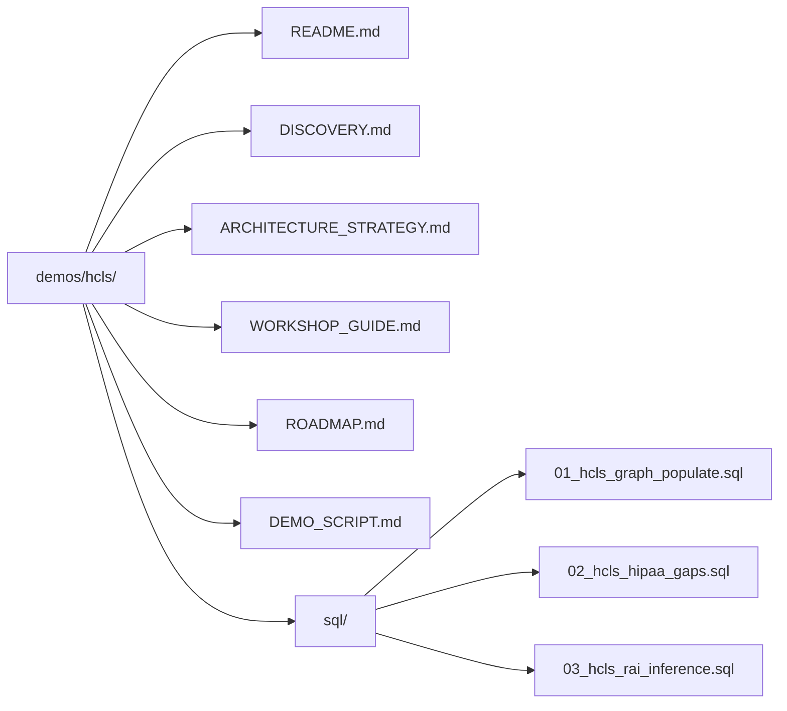

# Healthcare & Life Sciences — Focused Demo

> **From Fragmented Clinical Data to Knowledge Graph-Governed HCLS Platform** — Applying Data Cloud Architecture patterns with RAI-powered governance to solve HIPAA compliance, PHI lineage, and patient entity resolution challenges.

## Company Context

**Generic HCLS Organization** (Health System or Integrated Delivery Network) with Snowflake as the clinical analytics platform. Data flows from EHR (FHIR R4), claims systems, pharmacy, lab, and workforce (Workday) into a centralized data lake. The organization must maintain HIPAA compliance while enabling analytics, AI/ML research, and population health management.

**Snowflake Engagement**: Architecture engagement to implement automated PHI governance, cross-system patient matching, and HIPAA compliance scoring using the Ontology Knowledge Graph.

## The Challenge → Pattern Mapping

| HCLS Challenge | DCA Pattern | Core Demo Reference |
|---------------|-------------|---------------------|
| **PHI propagation without classification** — clinical data copied to analytics without HIPAA tags | Knowledge Graph PHI lineage tracing + RAI inference | [KNOWLEDGE_GRAPH.md](../../docs/KNOWLEDGE_GRAPH.md) |
| **Patient entity resolution** — same patient in EHR, Claims, Workday with different IDs | RAI entity resolution (Jaccard similarity on name + DOB) | [KNOWLEDGE_GRAPH.md](../../docs/KNOWLEDGE_GRAPH.md) |
| **HIPAA audit gaps** — who accessed PHI, was it authorized, is BAA in place | Graph-based access analysis + governance scoring | [GOVERNANCE.md](../../docs/GOVERNANCE.md) |
| **Orphaned clinical datasets** — ML models using patient data without contracts | Ownership gap detection + data contract enforcement | [ARCHITECTURE.md](../../docs/ARCHITECTURE.md) |
| **Care pathway fragmentation** — encounters, conditions, medications not linked | Clinical knowledge graph edges (DIAGNOSED_WITH, PRESCRIBED, PERFORMED_BY) | [KNOWLEDGE_GRAPH.md](../../docs/KNOWLEDGE_GRAPH.md) |
| **De-identification for research** — sharing clinical data without proper anonymization | Masking policies + row access + sharing governance | [GOVERNANCE.md](../../docs/GOVERNANCE.md) |

## Key Stakeholders

| Role | Responsibility |
|------|---------------|
| Chief Medical Information Officer (CMIO) | Clinical data strategy, care pathway analytics |
| Chief Privacy Officer (CPO) | HIPAA compliance, PHI governance, BAA management |
| VP Data & Analytics | Platform architecture, data engineering |
| Director of Population Health | Cross-system analytics, cohort identification |
| Data Engineer | FHIR integration, pipeline development |

## FHIR Data Model (Already in Core Demo)

The core DCA demo generates realistic FHIR R4 clinical data:

| Resource | Curated Table | Key Attributes |
|----------|--------------|----------------|
| Patient | `CURATED_DEV.FHIR.DIM_PATIENT` | identifier, name, birthDate, gender, address, SSN |
| Practitioner | `CURATED_DEV.FHIR.DIM_PRACTITIONER` | identifier, name, specialty, NPI |
| Organization | `CURATED_DEV.FHIR.DIM_ORGANIZATION` | name, type, address |
| Encounter | `CURATED_DEV.FHIR.FACT_ENCOUNTERS` | patient_key, class, period, status |
| Condition | `CURATED_DEV.FHIR.FACT_CONDITIONS` | patient_key, encounter_key, code, onset |
| Observation | `CURATED_DEV.FHIR.FACT_OBSERVATIONS` | patient_key, code, value, effective_date |
| MedicationRequest | `CURATED_DEV.FHIR.FACT_MEDICATION_REQUESTS` | patient_key, medication, prescriber_key |
| Procedure | `CURATED_DEV.FHIR.FACT_PROCEDURES` | patient_key, encounter_key, code, performer |

## Knowledge Graph — HCLS Extension

The base Knowledge Graph (scripts 11-15) provides PATIENT nodes and PATIENT→ENCOUNTER edges. This HCLS demo extends it with:

- **Clinical node types**: ENCOUNTER, CONDITION, MEDICATION, PROCEDURE, PRACTITIONER, CLAIM, ORGANIZATION
- **Clinical edge types**: DIAGNOSED_WITH, PRESCRIBED, PERFORMED_BY, RESULTED_IN, BILLED_FOR, REFERRED_TO, TREATED_AT
- **PHI governance edges**: PHI_CONTAINS, HIPAA_CLASSIFIED, BAA_COVERS, DE_IDENTIFIED_FROM
- **HIPAA scoring**: Specialized compliance score (access controls, classification, BAA, de-identification, audit trail)

## Demo Documents

| Document | Purpose |
|----------|---------|
| [DISCOVERY.md](DISCOVERY.md) | Current state, HIPAA compliance gaps, pain point mapping |
| [ARCHITECTURE_STRATEGY.md](ARCHITECTURE_STRATEGY.md) | Target architecture with Knowledge Graph governance |
| [WORKSHOP_GUIDE.md](WORKSHOP_GUIDE.md) | 3-hour facilitation guide for HCLS engagement |
| [ROADMAP.md](ROADMAP.md) | 30/60/90 phased execution for HCLS Knowledge Graph |
| [DEMO_SCRIPT.md](DEMO_SCRIPT.md) | 15-minute live demo walkthrough |

## Setup Instructions

```bash
# Prerequisites: Core DCA demo deployed (scripts 01-15)
# FHIR data generated and loaded

# 1. Populate HCLS-specific graph nodes and edges
@demos/hcls/sql/01_hcls_graph_populate.sql

# 2. Create intentional HIPAA governance gaps (for demo)
@demos/hcls/sql/02_hcls_hipaa_gaps.sql

# 3. Run HCLS-specific RAI inference
@demos/hcls/sql/03_hcls_rai_inference.sql
```

## File Structure


