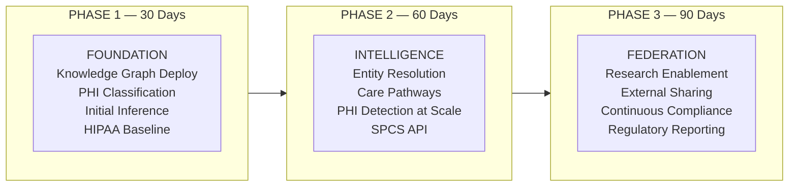

# Healthcare & Life Sciences — 30/60/90 Execution Roadmap

> Phased deployment of Knowledge Graph-governed clinical data platform with automated HIPAA compliance.

## Roadmap Overview

---

## Phase 1: Foundation (30 Days)

**Theme**: Deploy Knowledge Graph with FHIR data, classify PHI, run initial inference.

### Workstreams

#### 1.1 Knowledge Graph Deployment

| Task | Detail | Owner | Status |
|------|--------|-------|--------|
| Deploy core DCA scripts 11-15 | Ontology graph schema, population, RAI inference, SPCS API, Streamlit | Data Engineering | ☐ |
| Verify graph populated | Confirm FHIR nodes (PATIENT, ENCOUNTER, CONDITION) appear in graph | Data Engineering | ☐ |
| Run SP_REFRESH_GRAPH() | Full metadata + business layer graph refresh | Data Engineering | ☐ |
| Deploy HCLS graph extensions | Run 01_hcls_graph_populate.sql for clinical node/edge types | Data Engineering | ☐ |

#### 1.2 PHI Classification

| Task | Detail | Owner | Status |
|------|--------|-------|--------|
| Audit known PHI columns | Document all columns in FHIR schema containing PHI elements | Privacy/Compliance | ☐ |
| Apply HIPAA_CATEGORY tags | Tag all DIM_PATIENT, FACT_ENCOUNTERS PHI columns | Data Steward | ☐ |
| Run SP_REFRESH_GRAPH() | Re-populate graph with new tag relationships | Data Engineering | ☐ |
| Validate tag propagation | Confirm TAGGED_WITH edges exist for all PHI columns in graph | Joint | ☐ |

#### 1.3 Initial Inference

| Task | Detail | Owner | Status |
|------|--------|-------|--------|
| Run SP_RUN_INFERENCE() | Execute base RAI inference against FHIR-populated graph | Data Engineering | ☐ |
| Run SP_HCLS_PHI_DETECTION() | HCLS-specific PHI propagation detection | Data Engineering | ☐ |
| Review recommendations with CPO | Walk through HIGH severity findings | Joint — CPO + Data Eng | ☐ |
| Prioritize remediation | Rank gaps by regulatory risk and data sensitivity | Privacy/Compliance | ☐ |

#### 1.4 HIPAA Gap Baseline

| Task | Detail | Owner | Status |
|------|--------|-------|--------|
| Record initial governance scores | Snapshot all FHIR object scores as compliance baseline | Data Steward | ☐ |
| Document known gaps | Record intentional gaps (demo) vs. real gaps (production) | Privacy/Compliance | ☐ |
| Establish scoring thresholds | Define acceptable score ranges (e.g., >0.7 = compliant) | Joint — CPO + Legal | ☐ |
| Create baseline report | Generate first HIPAA compliance evidence package | Privacy/Compliance | ☐ |

### Phase 1 Success Criteria

- [ ] Graph populated with FHIR metadata + business nodes
- [ ] All DIM_PATIENT columns tagged with HIPAA_CATEGORY
- [ ] RAI detecting at least 3 PHI propagation gaps
- [ ] Baseline compliance score recorded

---

## Phase 2: Intelligence (60 Days)

**Theme**: Entity resolution, care pathways, automated PHI detection at scale.

### Workstreams

#### 2.1 Patient Entity Resolution

| Task | Detail | Owner | Status |
|------|--------|-------|--------|
| Run SP_HCLS_PATIENT_RESOLUTION() | Cross-system matching (FHIR + Workday) | Data Engineering | ☐ |
| Configure confidence thresholds | Set minimum Jaccard similarity for auto-match vs. manual review | Joint | ☐ |
| Validate match accuracy | Manually verify sample of entity clusters | Clinical Informatics | ☐ |
| Extend to Claims system | Add claims subscriber matching to resolution logic | Data Engineering | ☐ |

#### 2.2 Care Pathway Construction

| Task | Detail | Owner | Status |
|------|--------|-------|--------|
| Run SP_HCLS_CARE_PATHWAY() | Build temporal encounter→condition→medication edges | Data Engineering | ☐ |
| Validate pathway completeness | Confirm full journey traversable for sample patients | Clinical Informatics | ☐ |
| Add procedure edges | Link FACT_PROCEDURES to encounters and practitioners | Data Engineering | ☐ |
| Test pathway queries | Verify care gap detection works via graph traversal | Analytics | ☐ |

#### 2.3 PHI Detection Expansion

| Task | Detail | Owner | Status |
|------|--------|-------|--------|
| Extend inference to all schemas | Run PHI detection beyond FHIR — include RAW, SEMANTIC layers | Data Engineering | ☐ |
| Add Claims PHI patterns | Extend pattern matching for claims-specific PHI identifiers | Data Engineering | ☐ |
| Add Lab/Pharmacy patterns | Detect PHI in raw JSON blob columns from lab systems | Data Engineering | ☐ |
| Validate false positive rate | Review and tune detection patterns to minimize noise | Joint | ☐ |

#### 2.4 Automated Remediation

| Task | Detail | Owner | Status |
|------|--------|-------|--------|
| Configure SP_APPLY_RECOMMENDATIONS() | Set auto-tagging rules for HIGH-confidence recommendations | Data Steward + Security | ☐ |
| Define approval workflow | Which recommendations auto-apply vs. require CPO approval | Privacy/Compliance | ☐ |
| Test auto-remediation | Run on sample gaps, verify correct tags applied | Data Engineering | ☐ |
| Monitor remediation history | Track recommendations applied vs. outstanding over time | Data Steward | ☐ |

#### 2.5 SPCS API Integration

| Task | Detail | Owner | Status |
|------|--------|-------|--------|
| Deploy graph API for clinical apps | SPCS endpoint returning patient 360 + governance scores | Data Engineering | ☐ |
| Integrate with clinical decision support | Connect API to downstream clinical applications | App Development | ☐ |
| Add HIPAA scoring endpoint | API returns compliance posture for any object/patient | Data Engineering | ☐ |
| Load test API | Validate performance under clinical workload patterns | Platform | ☐ |

### Phase 2 Success Criteria

- [ ] 90%+ patient match rate across FHIR and Claims
- [ ] Care pathways traversable for any patient
- [ ] PHI detection covers all RAW, CURATED, SEMANTIC schemas
- [ ] SPCS API returning governance scores to clinical apps

---

## Phase 3: Federation (90 Days)

**Theme**: Research enablement, external partner sharing, continuous compliance.

### Workstreams

#### 3.1 De-identification Provenance

| Task | Detail | Owner | Status |
|------|--------|-------|--------|
| Track research datasets | Record DE_IDENTIFIED_FROM edges for all research-derived tables | Data Engineering | ☐ |
| Document de-identification methods | Store method (Safe Harbor, Expert Determination) as edge properties | Privacy/Compliance | ☐ |
| Link to IRB approvals | Create IRB_APPROVED edges from research datasets to protocol references | Privacy/Compliance | ☐ |
| Validate provenance queries | Confirm any research dataset can trace back to source PHI with method | Joint | ☐ |

#### 3.2 External Partner Sharing

| Task | Detail | Owner | Status |
|------|--------|-------|--------|
| Configure ONTOLOGY_GRAPH_DATA_SHARE | Set up governed share for approved external partners | Platform | ☐ |
| Define sharing policies | Which data, what de-identification level, which partners | Privacy/Compliance + Legal | ☐ |
| Validate governance travels with share | Confirm masking/RAP policies apply to shared data | Security | ☐ |
| Onboard first external partner | Execute end-to-end sharing workflow with pilot partner | Joint | ☐ |

#### 3.3 Continuous Compliance Dashboard

| Task | Detail | Owner | Status |
|------|--------|-------|--------|
| Deploy Streamlit compliance page | Real-time HIPAA posture for CPO with trend analysis | Data Engineering | ☐ |
| Add trend visualizations | Score history, remediation velocity, gap aging | Data Engineering | ☐ |
| Configure alerting | Notify CPO when scores drop below threshold | Platform | ☐ |
| Validate with privacy office | CPO acceptance testing of dashboard for audit readiness | Privacy/Compliance | ☐ |

#### 3.4 Regulatory Reporting

| Task | Detail | Owner | Status |
|------|--------|-------|--------|
| Generate HIPAA compliance evidence | Automated evidence packages from graph data (access, classification, audit) | Data Engineering | ☐ |
| Map to HIPAA safeguards | Link evidence to specific §164.312 requirements | Privacy/Compliance | ☐ |
| Test with mock audit | Simulate OCR audit using generated evidence | Legal + Compliance | ☐ |
| Document audit response process | Playbook for using Knowledge Graph during real audits | Privacy/Compliance | ☐ |

#### 3.5 Integration with Existing GRC Tools

| Task | Detail | Owner | Status |
|------|--------|-------|--------|
| Export scores to ServiceNow/Archer | Push governance scores and recommendations to GRC platform | Platform + GRC Team | ☐ |
| Configure bidirectional sync | Pull remediation status back from GRC into graph | Data Engineering | ☐ |
| Validate workflow integration | Confirm GRC tickets created automatically for HIGH findings | Joint | ☐ |
| Document integration architecture | API contracts and data flow for GRC integration | Data Engineering | ☐ |

### Phase 3 Success Criteria

- [ ] Research datasets have provable de-identification lineage
- [ ] External partners access de-identified data via governed share
- [ ] CPO has real-time compliance dashboard (no manual audits)
- [ ] HIPAA audit evidence generated automatically

---

## Pilot Selection Framework

Use this framework during the workshop (Segment 5) to select the initial pilot:

| Criterion | Weight | Candidate 1 | Candidate 2 | Candidate 3 |
|-----------|--------|------------|------------|------------|
| **Regulatory urgency** — does solving this reduce audit risk now? | High | | | |
| **Data readiness** — is the FHIR/clinical data loaded and accessible? | High | | | |
| **Team availability** — can Privacy + Engineering staff this? | Medium | | | |
| **Architecture coverage** — does it exercise graph, inference, and scoring? | Medium | | | |
| **Research potential** — does it enable downstream research use cases? | Low | | | |

**Likely pilot candidates** (based on discovery):
1. **PHI Classification Sweep** — Run inference against existing CURATED tables, remediate top-10 gaps
2. **Patient Matching for Population Health** — FHIR + Claims entity resolution for cohort identification
3. **Research Dataset Provenance** — Track de-identification lineage for existing ML training datasets

## Accountability Matrix

| Role | Phase 1 Responsibility | Phase 2 Responsibility | Phase 3 Responsibility |
|------|----------------------|----------------------|----------------------|
| **Chief Privacy Officer** | Define HIPAA thresholds, approve baseline | Approve auto-remediation rules | Accept compliance dashboard, sign-off on evidence |
| **CMIO** | Validate clinical graph structure | Validate care pathways and entity resolution | Validate research enablement workflow |
| **VP Data & Analytics** | Executive sponsor, resource allocation | API integration decisions | GRC integration, external sharing strategy |
| **Data Engineer** | Deploy scripts, populate graph, run inference | Extend detection, build pathways, deploy API | Build dashboard, evidence generation, GRC export |
| **Snowflake EA** | Architecture guidance, DCA demo support | SPCS API design review | Federation and sharing governance review |

## References

- [Discovery & Current State](DISCOVERY.md)
- [Architecture Strategy](ARCHITECTURE_STRATEGY.md)
- [Workshop Facilitation Guide](WORKSHOP_GUIDE.md)
- [Knowledge Graph Documentation](../../docs/KNOWLEDGE_GRAPH.md)
- [Governance Framework](../../docs/GOVERNANCE.md)
