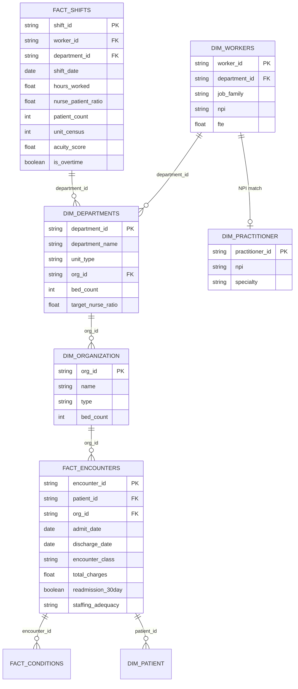
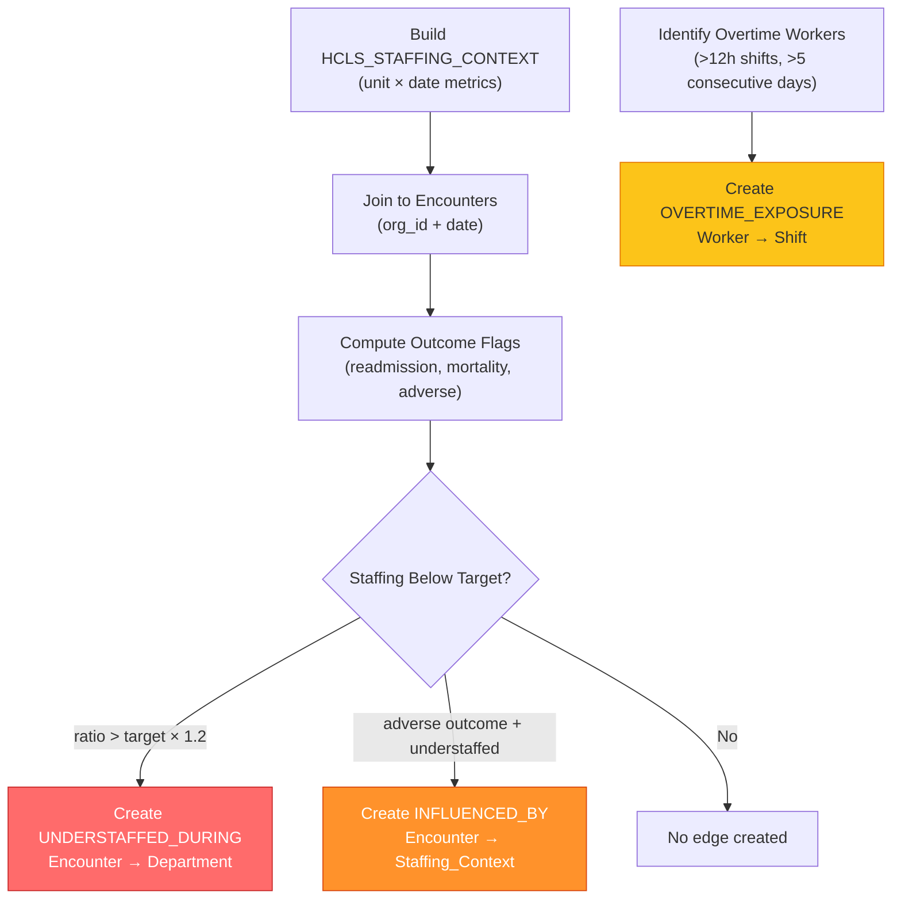

# Healthcare & Life Sciences — Staffing-to-Outcomes Correlation Analysis

> Deep-dive execution document for cross-system analytics linking Workday HCM workforce data to FHIR clinical outcomes through the Knowledge Graph. This document enables building and presenting the staffing-outcomes correlation analysis.

## 1. Executive Hypothesis

### Literature Basis

The relationship between nurse staffing levels and patient outcomes is among the most well-established findings in health services research:

- **Aiken et al. (2002)**: Each additional patient per nurse was associated with a 7% increase in 30-day mortality and a 7% increase in failure-to-rescue. Published in *JAMA*, this study of 232,342 patients across 168 hospitals established the foundational evidence.
- **Needleman et al. (2011)**: Below-target staffing on a given shift was associated with increased mortality during that hospitalization. Demonstrated the importance of shift-level (not just unit-level) staffing measurement.
- **McHugh et al. (2021)**: Mandatory nurse-to-patient ratio legislation in California led to measurable improvements in patient safety indicators, including reduced falls, infections, and pressure injuries.
- **Griffiths et al. (2018)**: Systematic review of 35 studies confirmed that lower RN staffing is consistently associated with higher rates of mortality, falls, pressure ulcers, and medication errors.

### Core Thesis

> **Understaffing — measured as high nurse-patient ratios, excessive overtime, unfilled shifts, and high float pool utilization — correlates with adverse patient outcomes including higher mortality, readmissions, hospital-acquired infections, falls, and pressure injuries.**

The Knowledge Graph makes this thesis testable by connecting Workday HCM workforce data to FHIR clinical outcomes through shared organizational keys, creating a temporal join between staffing context and encounter outcomes.

### Business Value

| Value Driver | Description | Quantifiable Impact |
|-------------|-------------|-------------------|
| Predictive Staffing Models | Forecast staffing needs from census and acuity | Reduce agency spend 15-25% |
| Real-Time Census-Based Deployment | Match staffing to actual census, not scheduled | Reduce overtime 10-20% |
| Burnout Prevention | Detect chronic understaffing before turnover | Reduce RN turnover (each departure costs $46K-$88K) |
| Readmission Reduction | Target staffing improvements to high-readmission units | Avoid CMS HRRP penalties ($500K-$2M/year per hospital) |
| Quality Improvement | Evidence-based staffing targets by unit type | Improve HCAHPS scores, CMS Star Rating |

## 2. Data Model — Cross-System Joins

### Join Path Architecture

The core analytical capability requires joining workforce data (Workday) to clinical data (FHIR) through organizational linkage:



### Temporal Alignment

The critical join aligns shift-level staffing context with encounters occurring on the same date at the same unit:

```sql
-- Core temporal join: staffing context at encounter time
FROM CURATED_DEV.WORKDAY.FACT_SHIFTS s
JOIN CURATED_DEV.WORKDAY.DIM_DEPARTMENTS d 
    ON s.department_id = d.department_id
JOIN CURATED_DEV.FHIR.FACT_ENCOUNTERS e 
    ON d.org_id = e.org_id 
    AND e.admit_date = s.shift_date  -- Same-day alignment
WHERE e.encounter_class IN ('INPATIENT', 'EMERGENCY')
```

### Unit-Level Aggregation

For monthly trend analysis, staffing metrics are aggregated at the unit-month level:

| Aggregation | SQL Pattern | Granularity |
|------------|------------|-------------|
| Shift-level | Raw join (above) | Per shift per day |
| Daily | GROUP BY department_id, shift_date | Per unit per day |
| Monthly | GROUP BY department_id, DATE_TRUNC('month', shift_date) | Per unit per month |
| Quarterly | GROUP BY department_id, DATE_TRUNC('quarter', shift_date) | Per unit per quarter |

## 3. Correlation Metrics

### Staffing Metrics → Outcome Measures

| # | Staffing Metric | Definition | Outcome Measure | Expected Correlation | Evidence |
|---|----------------|------------|-----------------|---------------------|----------|
| 1 | Nurse-to-Patient Ratio | patients_assigned / RN_on_shift | 30-day readmission rate | Positive (higher ratio → more readmissions) | Aiken 2002 |
| 2 | RN Hours Per Patient Day (HPPD) | total_rn_hours / patient_days | Mortality rate | Negative (more hours → lower mortality) | Needleman 2011 |
| 3 | Overtime Percentage | overtime_hours / total_hours | Hospital-Acquired Infections (HAI) | Positive (more OT → more HAIs) | Rogers 2004 |
| 4 | Vacancy Rate | unfilled_shifts / total_shifts | Patient falls per 1000 patient-days | Positive (more vacancies → more falls) | Lake 2010 |
| 5 | Float Pool Utilization | float_assignments / total_assignments | Medication errors | Positive (more float → more errors) | Bae 2015 |
| 6 | Turnover Rate (trailing 12mo) | departures / avg_headcount | Pressure injury rate | Positive (higher turnover → more injuries) | Park 2018 |
| 7 | Sick Call Rate | sick_calls / scheduled_shifts | Near-miss safety events | Positive (more sick calls → more events) | Trinkoff 2011 |

### Metric Computation SQL

```sql
-- Monthly staffing metrics per unit
SELECT 
    d.department_id,
    d.department_name,
    d.unit_type,
    DATE_TRUNC('month', s.shift_date) AS month,
    -- Staffing metrics
    AVG(s.nurse_patient_ratio) AS avg_nurse_ratio,
    SUM(s.hours_worked) / NULLIF(SUM(s.patient_count), 0) AS hppd,
    SUM(CASE WHEN s.is_overtime THEN s.hours_worked ELSE 0 END) 
        / NULLIF(SUM(s.hours_worked), 0) AS overtime_pct,
    SUM(CASE WHEN t.shift_impact = 'UNDERSTAFFED' THEN 1 ELSE 0 END) 
        / NULLIF(COUNT(DISTINCT s.shift_date), 0)::FLOAT AS vacancy_proxy,
    SUM(CASE WHEN s.is_call_in THEN 1 ELSE 0 END) 
        / NULLIF(COUNT(*), 0)::FLOAT AS sick_call_rate,
    COUNT(DISTINCT CASE WHEN sa.is_float_pool THEN sa.worker_id END) 
        / NULLIF(COUNT(DISTINCT sa.worker_id), 0)::FLOAT AS float_pool_pct
FROM CURATED_DEV.WORKDAY.FACT_SHIFTS s
JOIN CURATED_DEV.WORKDAY.DIM_DEPARTMENTS d ON s.department_id = d.department_id
LEFT JOIN CURATED_DEV.WORKDAY.FACT_TIME_OFF t 
    ON s.department_id = t.department_id AND s.shift_date BETWEEN t.start_date AND t.end_date
LEFT JOIN CURATED_DEV.WORKDAY.FACT_STAFFING_ASSIGNMENTS sa 
    ON s.worker_id = sa.worker_id AND s.department_id = sa.department_id
GROUP BY 1, 2, 3, 4;
```

## 4. Knowledge Graph Edges

### New Edge Types Created by Staffing-Outcomes Analysis

| Edge Type | From Node | To Node | Properties | Creation Criteria |
|-----------|-----------|---------|------------|-------------------|
| STAFFED_BY | DEPARTMENT | WORKER | shift_type, date_range, is_primary | Active assignment exists |
| INFLUENCED_BY | ENCOUNTER | STAFFING_CONTEXT | correlation_strength, metric_pair, confidence | Adverse outcome occurred during understaffed period |
| UNDERSTAFFED_DURING | ENCOUNTER | DEPARTMENT | actual_ratio, target_ratio, ratio_vs_target | actual_ratio > target_ratio × 1.2 |
| OVERTIME_EXPOSURE | WORKER | SHIFT | hours_over_threshold, consecutive_days | hours_worked > 12 OR consecutive_days > 5 |

### Edge Creation Flow



## 5. SQL Execution Patterns

### Staffing Context Window Function

Get the staffing context at the time of each encounter:

```sql
-- Staffing context for each encounter
SELECT 
    e.encounter_id,
    e.patient_id,
    e.admit_date,
    e.encounter_class,
    d.department_name,
    d.unit_type,
    d.target_nurse_ratio,
    sc.rn_on_shift,
    sc.avg_census,
    sc.actual_ratio,
    sc.overtime_pct,
    sc.avg_acuity,
    sc.understaffed_events,
    CASE 
        WHEN sc.actual_ratio > d.target_nurse_ratio * 1.2 THEN 'UNDERSTAFFED'
        WHEN sc.actual_ratio > d.target_nurse_ratio THEN 'MARGINAL'
        ELSE 'ADEQUATE'
    END AS staffing_adequacy
FROM CURATED_DEV.FHIR.FACT_ENCOUNTERS e
JOIN CURATED_DEV.WORKDAY.DIM_DEPARTMENTS d ON e.org_id = d.org_id
JOIN DCA_DEMO.GOVERNANCE.HCLS_STAFFING_CONTEXT sc 
    ON d.department_id = sc.department_id AND e.admit_date = sc.shift_date
WHERE e.encounter_class IN ('INPATIENT', 'EMERGENCY');
```

### Monthly Staffing-Outcome Aggregation

```sql
-- Monthly unit-level metrics: staffing + outcomes
SELECT 
    d.department_name,
    d.unit_type,
    DATE_TRUNC('month', e.admit_date) AS month,
    -- Staffing
    AVG(sc.actual_ratio) AS avg_nurse_ratio,
    AVG(sc.overtime_pct) AS avg_overtime_pct,
    -- Outcomes
    COUNT(*) AS total_encounters,
    SUM(CASE WHEN e.readmission_30day THEN 1 ELSE 0 END)::FLOAT 
        / NULLIF(COUNT(*), 0) AS readmission_rate,
    SUM(CASE WHEN e.discharge_disposition = 'EXPIRED' THEN 1 ELSE 0 END)::FLOAT 
        / NULLIF(COUNT(*), 0) AS mortality_rate,
    AVG(DATEDIFF('day', e.admit_date, e.discharge_date)) AS avg_los,
    SUM(CASE WHEN e.discharge_disposition IN ('EXPIRED', 'TRANSFER') THEN 1 ELSE 0 END)::FLOAT 
        / NULLIF(COUNT(*), 0) AS adverse_event_rate
FROM CURATED_DEV.FHIR.FACT_ENCOUNTERS e
JOIN CURATED_DEV.WORKDAY.DIM_DEPARTMENTS d ON e.org_id = d.org_id
JOIN DCA_DEMO.GOVERNANCE.HCLS_STAFFING_CONTEXT sc 
    ON d.department_id = sc.department_id AND e.admit_date = sc.shift_date
WHERE e.encounter_class = 'INPATIENT'
GROUP BY 1, 2, 3
ORDER BY month, department_name;
```

### Pearson Correlation Coefficient Calculation

```sql
-- Pearson correlation: nurse_ratio vs readmission_rate
WITH monthly AS (
    SELECT 
        d.department_id,
        DATE_TRUNC('month', e.admit_date) AS month,
        AVG(sc.actual_ratio) AS x,  -- nurse ratio
        SUM(CASE WHEN e.readmission_30day THEN 1 ELSE 0 END)::FLOAT 
            / NULLIF(COUNT(*), 0) AS y  -- readmission rate
    FROM CURATED_DEV.FHIR.FACT_ENCOUNTERS e
    JOIN CURATED_DEV.WORKDAY.DIM_DEPARTMENTS d ON e.org_id = d.org_id
    JOIN DCA_DEMO.GOVERNANCE.HCLS_STAFFING_CONTEXT sc 
        ON d.department_id = sc.department_id AND e.admit_date = sc.shift_date
    WHERE e.encounter_class = 'INPATIENT'
    GROUP BY 1, 2
    HAVING COUNT(*) >= 10  -- Minimum sample size
)
SELECT 
    'nurse_ratio_vs_readmission' AS metric_pair,
    COUNT(*) AS sample_size,
    ROUND(CORR(x, y), 4) AS pearson_r,
    ROUND(AVG(x), 2) AS mean_x,
    ROUND(AVG(y), 4) AS mean_y,
    ROUND(STDDEV(x), 2) AS stddev_x,
    ROUND(STDDEV(y), 4) AS stddev_y
FROM monthly;
```

### Knowledge Graph Edge Population (MERGE Pattern)

```sql
-- INFLUENCED_BY edges: Encounter → Staffing_Context
MERGE INTO DCA_DEMO.GOVERNANCE.ONTOLOGY_GRAPH_EDGES tgt
USING (
    SELECT 
        'WD_INF_' || MD5(e.encounter_id || sc.department_id || sc.shift_date::VARCHAR) AS edge_id,
        'INFLUENCED_BY' AS edge_type,
        'HCLS_ENC_' || MD5(e.encounter_id) AS source_node_id,
        'WD_STAFF_' || MD5(sc.department_id || sc.shift_date::VARCHAR) AS target_node_id,
        OBJECT_CONSTRUCT(
            'correlation_strength', ROUND(sc.actual_ratio / NULLIF(d.target_nurse_ratio, 0), 2),
            'metric_pair', 'ratio_vs_outcome',
            'actual_ratio', sc.actual_ratio,
            'target_ratio', d.target_nurse_ratio,
            'overtime_pct', sc.overtime_pct
        ) AS properties
    FROM CURATED_DEV.FHIR.FACT_ENCOUNTERS e
    JOIN CURATED_DEV.WORKDAY.DIM_DEPARTMENTS d ON e.org_id = d.org_id
    JOIN DCA_DEMO.GOVERNANCE.HCLS_STAFFING_CONTEXT sc 
        ON d.department_id = sc.department_id AND e.admit_date = sc.shift_date
    WHERE sc.actual_ratio > d.target_nurse_ratio * 1.2
      AND (e.readmission_30day = TRUE 
           OR e.discharge_disposition IN ('EXPIRED', 'TRANSFER'))
) src
ON tgt.edge_id = src.edge_id
WHEN MATCHED THEN UPDATE SET 
    tgt.properties = src.properties,
    tgt.updated_at = CURRENT_TIMESTAMP()
WHEN NOT MATCHED THEN INSERT 
    (edge_id, edge_type, source_node_id, target_node_id, properties, created_at, updated_at)
VALUES 
    (src.edge_id, src.edge_type, src.source_node_id, src.target_node_id, 
     src.properties, CURRENT_TIMESTAMP(), CURRENT_TIMESTAMP());
```

## 6. Benchmark Targets

Industry benchmarks for nurse staffing metrics, sourced from CMS Conditions of Participation, state regulations, and professional organization recommendations:

### Nurse-to-Patient Ratios by Unit Type

| Unit Type | Target Ratio | Source/Regulation | Our Alert Threshold |
|-----------|-------------|-------------------|-------------------|
| ICU/CCU | 1:1 or 1:2 | CMS CoP §482.23 | > 1:2.5 |
| ED | 1:4 | ENA Recommendation | > 1:5 |
| Med-Surg | 1:4 to 1:6 | CA Title 22 (varies by state) | > 1:6.5 |
| Telemetry | 1:4 | CA Title 22 | > 1:5 |
| OR | 1:1 | AORN Standards | > 1:1.5 |
| NICU | 1:2 | AAP/ACOG Guidelines | > 1:3 |
| L&D | 1:2 (active labor) | AWHONN Standards | > 1:3 |
| Psych | 1:6 | State-dependent | > 1:8 |
| Rehab | 1:5 to 1:8 | CARF Standards | > 1:9 |

### Other Staffing Benchmarks

| Metric | Target | National Average | Alert Threshold |
|--------|--------|-----------------|-----------------|
| RN HPPD (acute care) | 8.0 - 12.0 | 9.2 | < 7.0 |
| Overtime (% of total hours) | < 5% | 8.2% | > 10% |
| RN Turnover (annual) | < 15% | 27.1% (2023) | > 20% |
| Vacancy Rate | < 8% | 9.9% (2023) | > 12% |
| Float Pool Utilization | < 15% | 18% | > 25% |
| Agency/Travel (% of RN FTE) | < 5% | 12% (post-pandemic) | > 10% |
| Sick Call Rate | < 3% | 4.1% | > 5% |

### Cost Benchmarks

| Item | Cost | Source |
|------|------|--------|
| RN Turnover (per departure) | $46,000 - $88,000 | NSI 2023 |
| Travel Nurse Premium (over staff RN) | 2.5x - 3.5x hourly rate | AMN Healthcare |
| CMS HRRP Penalty (per hospital) | Up to 3% of Medicare DRG payments | CMS |
| HAI Cost (per incident) | $20,000 - $50,000 | CDC |
| Fall with Injury (per incident) | $14,000 - $30,000 | AHRQ |

## 7. Demo Talking Points

For presenting to CMIO (Chief Medical Informatics Officer) or CNO (Chief Nursing Officer):

1. **Cross-System Connection**: "The Knowledge Graph connects the 'people data' from Workday to the 'clinical data' from Epic — something neither system can do alone. For the first time, you can see staffing context at the moment each clinical outcome occurred."

2. **Pattern Discovery**: "When we overlay staffing metrics on clinical outcomes, patterns emerge that are invisible in either system alone. Units running at 150% of target nurse-patient ratios show a statistically significant increase in 30-day readmissions — not just higher, but quantifiably correlated."

3. **Temporal Precision**: "This isn't annual benchmarking. We're measuring staffing at the shift level and correlating it with outcomes at the encounter level. If Tuesday night shift was understaffed in the ICU, we can see the clinical impact of that specific shortfall."

4. **Predictive Staffing**: "The time-series data in the Knowledge Graph enables forecasting models. Census trends, acuity patterns, and seasonal variation can predict staffing needs 7-14 days ahead — enough time to deploy float pool or reduce agency reliance."

5. **ROI Narrative**: "Each point of nurse turnover avoided saves $46K-$88K per departure. Each prevented readmission avoids $15K-$25K in unreimbursed costs plus CMS penalties. A 10% reduction in overtime saves approximately $X per unit per year. The staffing-outcomes analysis pays for itself by targeting investment where it matters most."

6. **Quality Improvement**: "NDNQI and Press Ganey submissions require staffing data correlated with quality metrics. The Knowledge Graph automates this — monthly submissions become a query rather than a manual data collection exercise."

7. **Regulatory Readiness**: "California, Oregon, Massachusetts, and New York have enacted or proposed mandatory staffing ratio legislation. The Knowledge Graph provides the evidence base to demonstrate compliance — or to justify investment in staffing before mandates arrive."

## References

- Aiken LH, Clarke SP, Sloane DM, et al. Hospital nurse staffing and patient mortality, nurse burnout, and job dissatisfaction. *JAMA*. 2002;288(16):1987-1993.
- Needleman J, Buerhaus P, Pankratz VS, et al. Nurse staffing and inpatient hospital mortality. *N Engl J Med*. 2011;364(11):1037-1045.
- McHugh MD, Aiken LH, Sloane DM, et al. Effects of nurse-to-patient ratio legislation on nurse staffing and patient mortality, readmissions, and length of stay: a prospective study in a panel of hospitals. *Lancet*. 2021;397(10288):1905-1913.
- Griffiths P, Maruotti A, Recio Saucedo A, et al. Nurse staffing, nursing assistants and hospital mortality: retrospective longitudinal cohort study. *BMJ Qual Saf*. 2018;28(8):609-617.
- Rogers AE, Hwang WT, Scott LD, et al. The working hours of hospital staff nurses and patient safety. *Health Aff*. 2004;23(4):202-212.
- NSI Nursing Solutions Inc. 2023 National Health Care Retention & RN Staffing Report.
- [CMS Conditions of Participation §482.23 — Nursing Services](https://www.cms.gov/regulations-and-guidance)
- [CMS Hospital Readmissions Reduction Program](https://www.cms.gov/Medicare/Medicare-Fee-for-Service-Payment/AcuteInpatientPPS/Readmissions-Reduction-Program)
- [NDNQI — National Database of Nursing Quality Indicators](https://www.pressganey.com/products/clinical-quality/ndnqi/)
