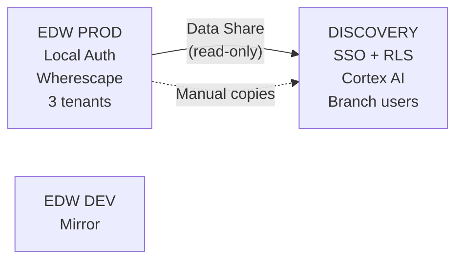
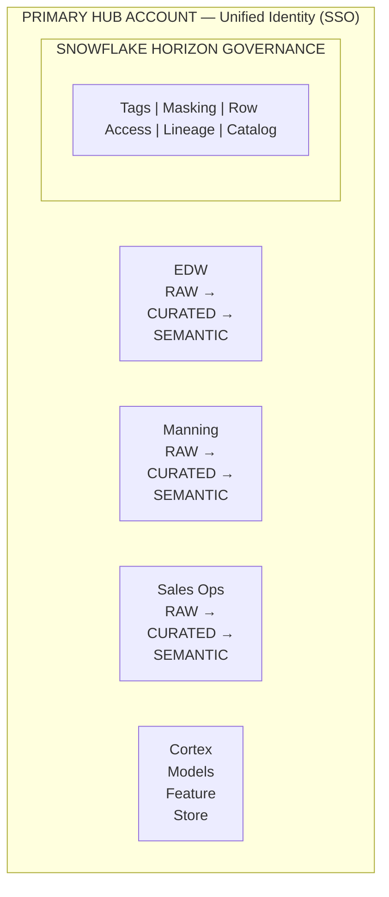
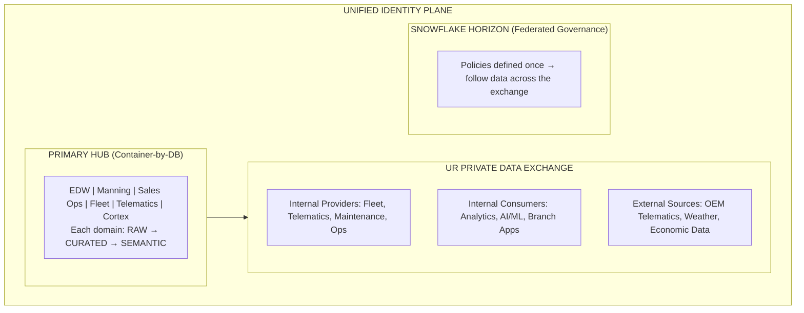
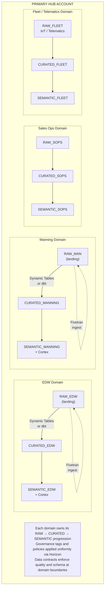
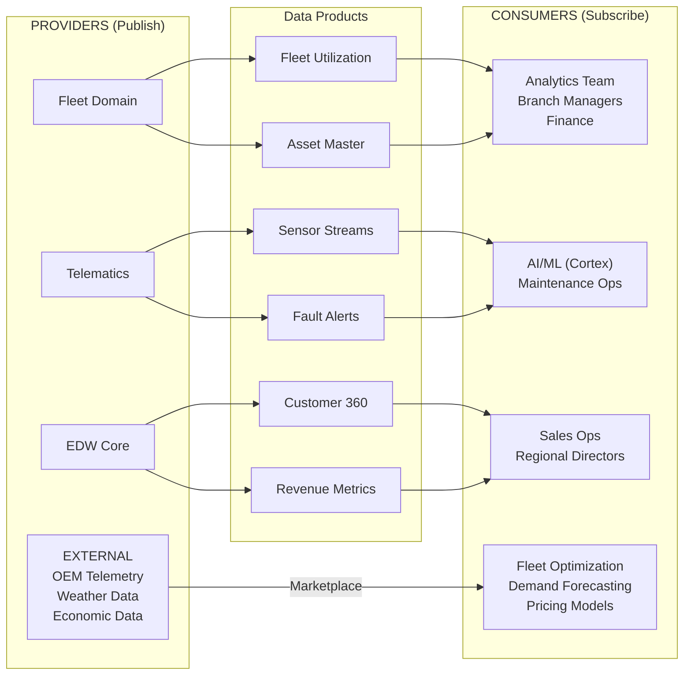
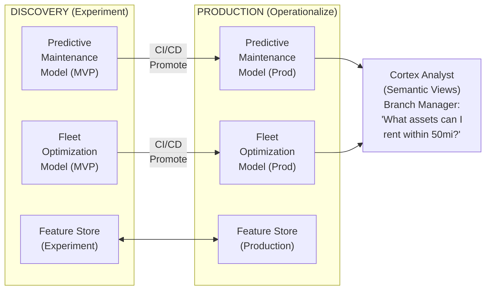

# United Rentals — Architecture Strategy

> Target architecture design, comparison scorecards, and mapping of DCA patterns to UR's specific requirements.

## Strategic Thesis

Most of UR's operational friction originates from **physical account boundaries creating artificial data movement and governance fragmentation**. The "Heroics" experienced by the team are an architectural symptom, not a people problem.

The solution is a **Federated Data Platform** built on the Container-by-DB pattern, unified governance via Snowflake Horizon, and an internal marketplace for self-service data consumption — eliminating the need for manual data movement between accounts.

## Architecture Principles

These principles are adapted from the core DCA framework to UR's specific context:

| Principle | UR Application |
|-----------|---------------|
| **Minimize Data Movement** | Eliminate ETL between Discovery and Production; use live sharing instead of data copies |
| **Interoperability and Flexibility** | Support Fivetran, Dynamic Tables, dbt, and Cortex AI within one federated topology |
| **Reduce Infrastructure Management** | Replace Wherescape Red with declarative transformations (Dynamic Tables) or code-first (dbt) |
| **Built-in HA/DR/Redundancy** | Leverage Snowflake's native replication instead of custom backup processes |
| **Governed Semantic Layer** | Snowflake Horizon governance + Cortex Analyst semantic views for branch-level AI access |

## Architecture Evolution — Three Stages

### Stage 1: Current State (Fragmented Multi-Account)

### Stage 2: Unified (Container-by-DB in Single Hub)

### Stage 3: Federated Platform with Marketplace

## Architecture Comparison Scorecard

This scorecard captures the evolution from UR's current friction to a federated data platform:

| Capability | Current State (Fragmented) | Stage 2 (Unified / Container-by-DB) | Stage 3 (Federation + Marketplace) | Strategic Impact |
|-----------|---------------------------|--------------------------------------|-------------------------------------|-----------------|
| **Data Movement** | Manual ETL; "Heroics" in Wherescape/Python | Logical separation; zero-copy cloning within one account | Live Data Sharing via Internal Marketplace; no ETL across accounts | Eliminates data latency and storage duplication |
| **Governance** | Localized/Inconsistent; siloed security policies | Centralized via Snowflake Horizon in a single hub | Federated — policies defined once, follow data across the exchange | Scales security without bottlenecking domain owners |
| **Data Discovery** | Word-of-mouth; users "ask" for access to tables | Catalog-driven; centralized metadata search | Self-Service Marketplace — users "Browse & Subscribe" to certified data products | Moves UR from "Ticket Culture" to "Product Culture" |
| **External Data** | Brittle APIs/SFTP; high maintenance for 3rd party | Traditional data loading into the unified hub | External Marketplace Access — instant mounting of OEM/Weather/Market data | Faster time-to-insight for Fleet & Telematics enrichment |
| **AI Readiness** | Fragmented context; AI models lack holistic data access | Unified context; Cortex-ready data in a single account | Federated AI — Cortex models run across the mesh with full governance | Enables "Branch Manager AI" with a 360-degree view |

## Container-by-DB Pattern — Applied to UR

The Container-by-DB pattern treats each database as a logical container whose boundaries are **contract boundaries**, not physical account walls. For UR, this means:

**Key advantages for UR**:
- Manning and Sales Ops get autonomous dev/prod cycles without leaving the hub
- Each domain's Git repo controls its own transformations
- Zero-copy cloning provides instant dev/test environments per domain
- Governance policies apply once at the Horizon level, not per-account

## Transformation Strategy — Replacing Wherescape Red

UR's current Wherescape Red dependency can be replaced with a hybrid approach:

| Approach | Best For | UR Application |
|----------|---------|----------------|
| **Dynamic Tables** | Declarative, zero-orchestration, SLA-driven | Fleet utilization metrics, real-time telematics aggregations, operational dashboards |
| **dbt** | Code-first, test-driven, Git-native, existing team skills | EDW core models, complex business logic, teams already familiar with SQL-based transformation tools |
| **Hybrid** | Different domains choose their engine | Fleet/Telematics on Dynamic Tables (real-time); EDW/Manning on dbt (complex logic) |

See [DBT_VS_DYNAMIC_TABLES.md](../../docs/DBT_VS_DYNAMIC_TABLES.md) for the full comparison framework.

## Internal Marketplace Design

The UR Private Data Exchange enables domain teams to publish and consume data products without ETL:

## Snowflake Horizon — Governance That Follows the Data

In the federated model, governance policies are defined once at the source domain and **travel with the data product** when shared via the marketplace:

| Governance Layer | Implementation | UR Application |
|-----------------|----------------|----------------|
| **Object Tags** | `DATA_CLASSIFICATION`, `PII_TYPE`, `AI_ALLOWED` | Tag contract pricing as CONFIDENTIAL, customer PII as SENSITIVE, fleet telemetry as INTERNAL |
| **Masking Policies** | Dynamic column masking based on role | Mask customer SSN/EIN for all non-PII_VIEWER roles; mask contract pricing for external partners |
| **Row Access Policies** | Filter rows by region, branch, or customer segment | Branch managers see only their region's data; regional directors see their territory |
| **Lineage** | ACCESS_HISTORY + Snowflake Horizon catalog | End-to-end tracing from Fivetran ingestion through Cortex AI outputs |
| **Data Contracts** | Schema + quality + SLA contracts at domain boundaries | Fleet domain publishes utilization data with guaranteed freshness SLA and quality tests |

## Cortex AI Pipeline — Discovery to Production

The key insight: branch managers access AI-powered answers through **Cortex Analyst + Semantic Views**, governed by the same Snowflake Horizon policies that protect the underlying data. No separate AI access layer needed.

## References

- [Core DCA Architecture](../../docs/ARCHITECTURE.md)
- [SDLC & Deployment Patterns](../../docs/SDLC_ARCHITECTURE.md)
- [dbt vs Dynamic Tables](../../docs/DBT_VS_DYNAMIC_TABLES.md)
- [Governance Framework](../../docs/GOVERNANCE.md)
- [Account Architecture Patterns](../../docs/snowflake_account_architecture_patterns.md)
