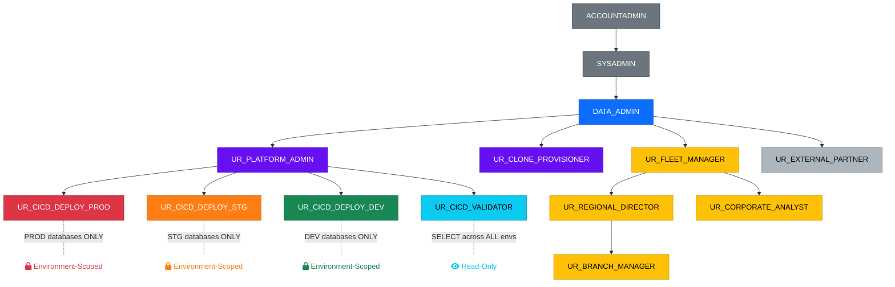
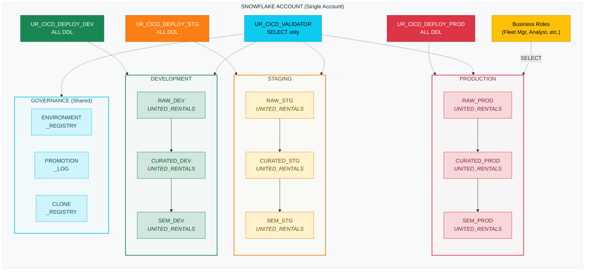
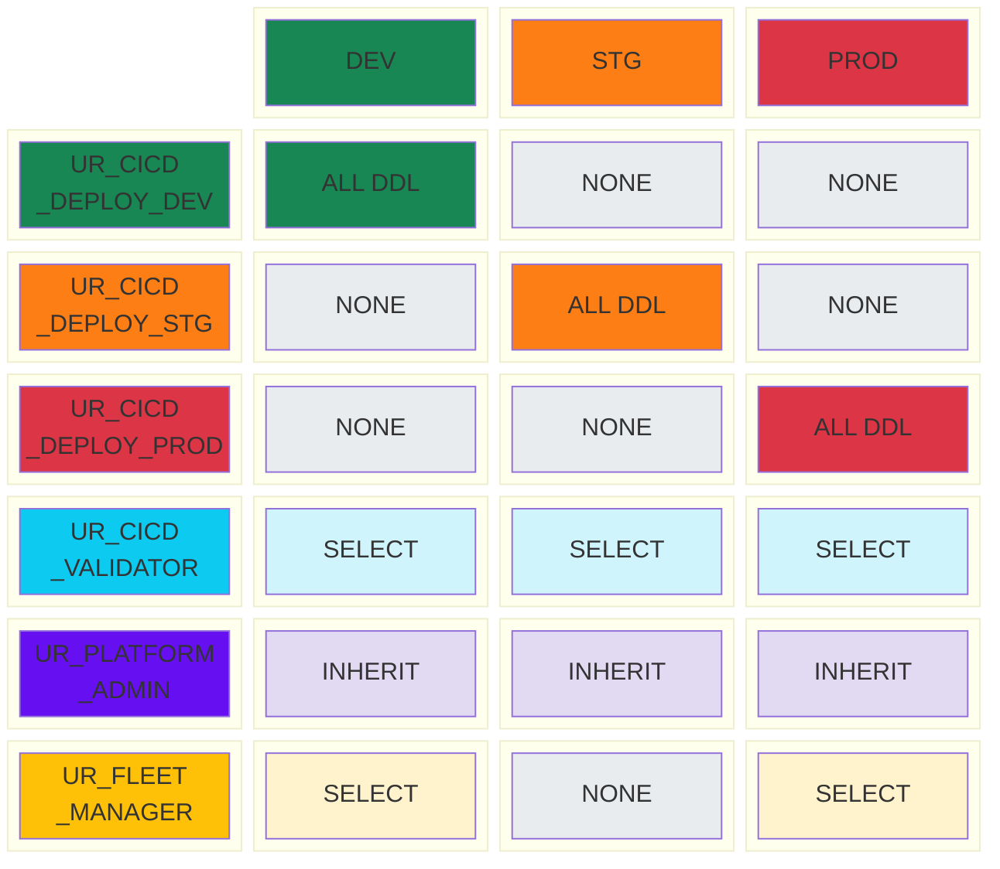
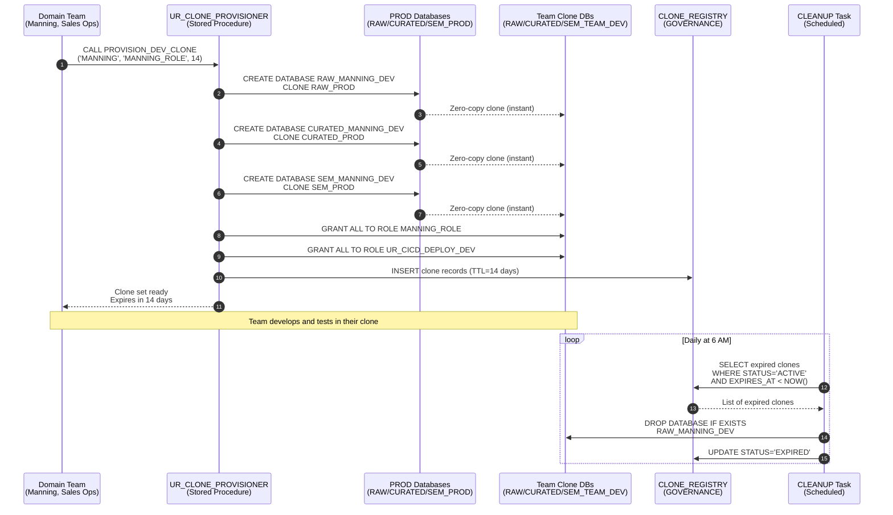
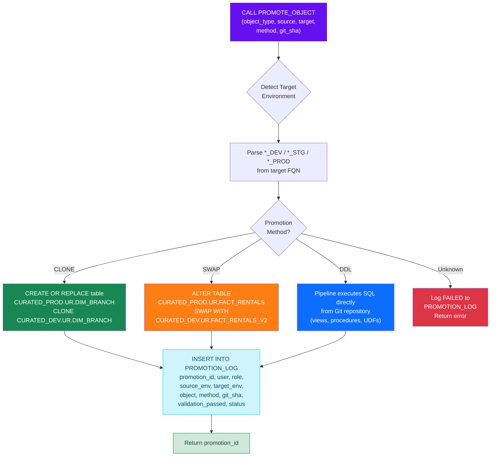
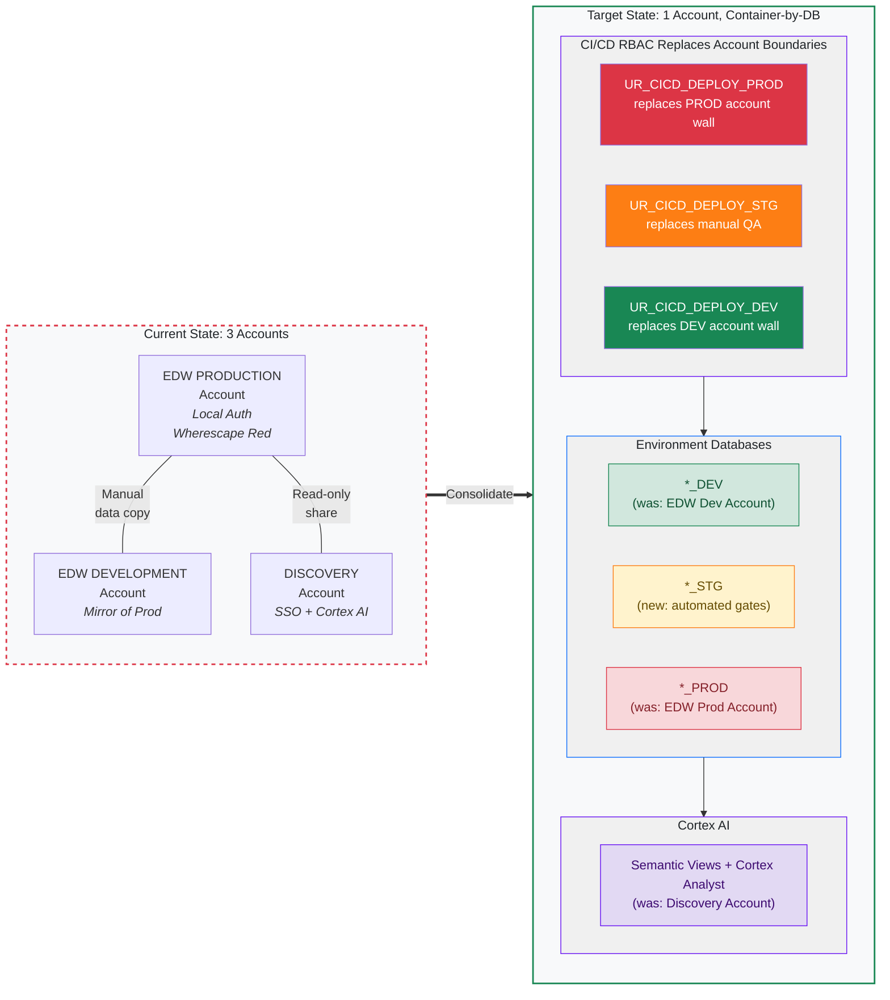
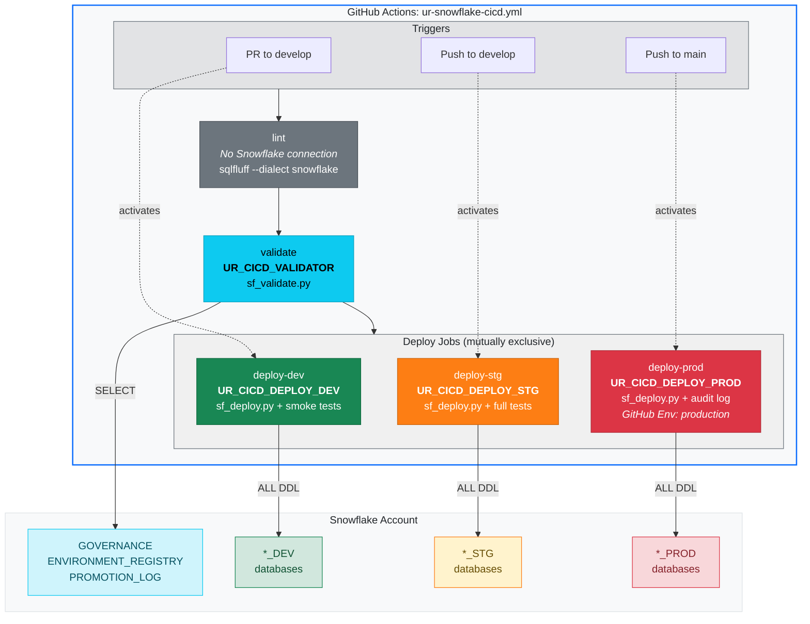
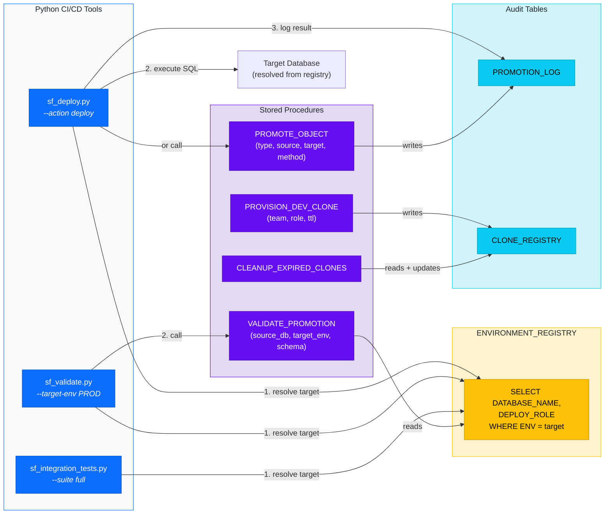

# United Rentals — CI/CD RBAC & Environment Architecture Diagrams

> Mermaid diagrams for the database-as-a-container pattern, CI/CD role hierarchy, promotion pipeline, and clone lifecycle.

---

## 1. Complete Role Hierarchy (CI/CD + Business)

Shows how CI/CD service roles and business consumer roles coexist under a single `DATA_ADMIN` root. The critical design: deploy roles are **siblings under UR_PLATFORM_ADMIN**, not chained — a compromised DEV deployer cannot reach PROD.

---

## 2. Database-as-a-Container: Environment Architecture

The single-account environment model. Each column is an environment (DEV, STG, PROD). Each row is a data layer (RAW, CURATED, SEMANTIC). Each **database is a container** — the environment boundary IS the database boundary.

---

## 3. CI/CD Promotion Pipeline with Validation Gates

The end-to-end flow from a feature branch through DEV, STG, and PROD — with the four promotion gates. Each gate must pass before the next stage. Failed gates halt the pipeline and notify the developer.

```mermaid
flowchart LR
    subgraph GIT["Git Repository"]
        FB["Feature<br/>Branch"]
        DEV_BR["develop<br/>branch"]
        MAIN["main<br/>branch"]
        FB -->|"PR"| DEV_BR
        DEV_BR -->|"PR + Review"| MAIN
    end

    subgraph DEV_DEPLOY["DEV Environment"]
        DD["Deploy to<br/>*_DEV databases"]
        DT["Run unit tests<br/>in cloned data"]
    end

    subgraph GATES["Promotion Gates"]
        direction TB
        G1{"Gate 1<br/>Contract<br/>Validation"}
        G2{"Gate 2<br/>Governance<br/>Check"}
        G3{"Gate 3<br/>Peer<br/>Review"}
        G4{"Gate 4<br/>Integration<br/>Test"}
        G1 -->|"Pass"| G2
        G2 -->|"Pass"| G3
        G3 -->|"Approved"| G4
    end

    subgraph STG_DEPLOY["STG Environment"]
        SD["Deploy to<br/>*_STG databases"]
        IT["Integration<br/>tests"]
    end

    subgraph PROD_DEPLOY["PROD Environment"]
        PD["Deploy to<br/>*_PROD databases"]
        POST["Post-deploy:<br/>Log + Notify"]
    end

    FB -->|"UR_CICD_DEPLOY_DEV"| DD
    DD --> DT
    DT --> G1

    G4 -->|"UR_CICD_DEPLOY_STG"| SD
    SD --> IT

    IT -->|"UR_PLATFORM_ADMIN<br/>approval"| PD
    PD -->|"UR_CICD_DEPLOY_PROD"| POST

    %% Failure paths
    G1 -->|"Fail"| BLOCK1["Block &<br/>Notify"]
    G2 -->|"Fail"| BLOCK2["Block &<br/>Notify"]
    G3 -->|"Rejected"| BLOCK3["Back to<br/>Dev"]
    G4 -->|"Fail"| BLOCK4["Block &<br/>Notify"]

    style GIT fill:#e2e3e5,stroke:#6c757d,color:#212529
    style DEV_DEPLOY fill:#d1e7dd,stroke:#198754,color:#0f5132
    style GATES fill:#fff3cd,stroke:#ffc107,color:#664d03
    style STG_DEPLOY fill:#ffe5d0,stroke:#fd7e14,color:#664d03
    style PROD_DEPLOY fill:#f8d7da,stroke:#dc3545,color:#842029

    style BLOCK1 fill:#dc3545,color:#fff,stroke:#b02a37
    style BLOCK2 fill:#dc3545,color:#fff,stroke:#b02a37
    style BLOCK3 fill:#dc3545,color:#fff,stroke:#b02a37
    style BLOCK4 fill:#dc3545,color:#fff,stroke:#b02a37
```

---

## 4. Environment-Scoped Grant Model

The access control matrix visualized. Shows exactly what each role can do in each environment. This is the visual proof that **role-level isolation replaces account-level isolation**.

---

## 5. Zero-Copy Clone Lifecycle

Shows how team dev environments are provisioned from PROD via cloning, used for development, and automatically cleaned up when their TTL expires.

---

## 6. Promotion Object Flow (CLONE / SWAP / DDL Methods)

Three strategies for moving objects from DEV to PROD. Each is logged to the `PROMOTION_LOG` with full audit context.

---

## 7. "AND World" — Layered Security Model

UR needs shared spaces AND department-locked AND user-only simultaneously. This shows how RBAC + RLS + Column Masking combine to create the "AND world" across both CI/CD and business access.

```mermaid
flowchart TB
    subgraph LAYER1["Layer 1: RBAC (Role Hierarchy)"]
        direction LR
        R1["CI/CD Roles<br/>control WHERE<br/>you can deploy"]
        R2["Business Roles<br/>control WHAT<br/>you can query"]
    end

    subgraph LAYER2["Layer 2: Environment Isolation (Database Grants)"]
        direction LR
        E1["DEV deployer<br/>→ *_DEV only"]
        E2["STG deployer<br/>→ *_STG only"]
        E3["PROD deployer<br/>→ *_PROD only"]
        E4["Business roles<br/>→ PROD read only"]
    end

    subgraph LAYER3["Layer 3: Row Access Policies"]
        direction LR
        RAP1["RAP_UR_REGION<br/>Fleet Mgr: ALL regions<br/>Regional Dir: SOUTHWEST<br/>Branch Mgr: BR-01024"]
        RAP2["RAP_UR_CUSTOMER<br/>Internal: ALL types<br/>External: CONSTRUCTION,<br/>INFRASTRUCTURE, GOV only"]
    end

    subgraph LAYER4["Layer 4: Column Masking"]
        direction LR
        M1["Customer PII<br/>Fleet Mgr: Full<br/>Analyst: Partial<br/>External: Redacted"]
        M2["Pricing<br/>Internal: Visible<br/>External: NULL"]
        M3["Credit Limits<br/>Fleet Mgr: Visible<br/>All others: NULL"]
    end

    subgraph LAYER5["Layer 5: Audit Trail"]
        direction LR
        A1["PROMOTION_LOG<br/>who deployed what,<br/>where, when"]
        A2["ACCESS_HISTORY<br/>who queried what,<br/>when"]
        A3["CLONE_REGISTRY<br/>who cloned what,<br/>TTL tracking"]
    end

    LAYER1 --> LAYER2
    LAYER2 --> LAYER3
    LAYER3 --> LAYER4
    LAYER4 --> LAYER5

    style LAYER1 fill:#e2d9f3,stroke:#6610f2,color:#3d0a70
    style LAYER2 fill:#d1e7dd,stroke:#198754,color:#0f5132
    style LAYER3 fill:#fff3cd,stroke:#ffc107,color:#664d03
    style LAYER4 fill:#f8d7da,stroke:#dc3545,color:#842029
    style LAYER5 fill:#cff4fc,stroke:#0dcaf0,color:#055160
```

---

## 8. UR Migration Path: 3 Accounts → 1 Account

Shows how UR's current fragmented architecture maps to the target Container-by-DB model — with CI/CD RBAC replacing account-level isolation.

---

## 9. GitHub Actions → Snowflake Role Mapping

Shows how each GitHub Actions job maps to a specific Snowflake CI/CD role and target environment. The workflow file is the orchestrator; the Snowflake role is the enforcer.

---

## 10. Python Tooling → Stored Procedure Call Chain

Shows how the three Python CI/CD scripts call Snowflake stored procedures and tables. Every tool queries `ENVIRONMENT_REGISTRY` first — no hardcoded database names.

