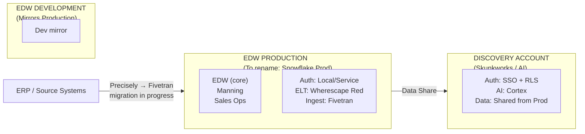
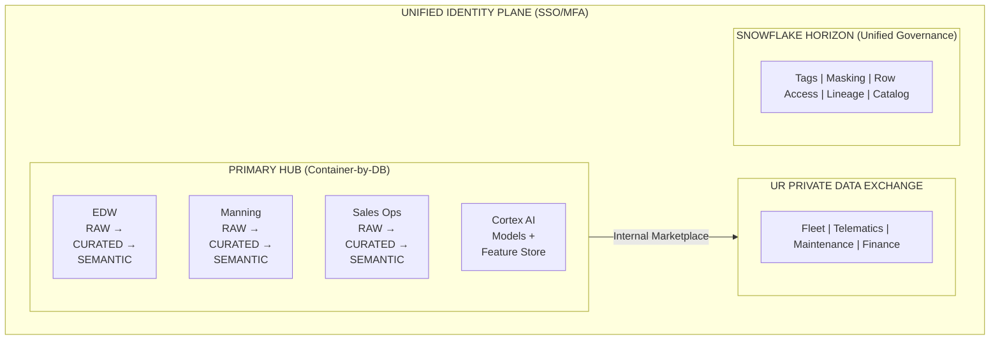
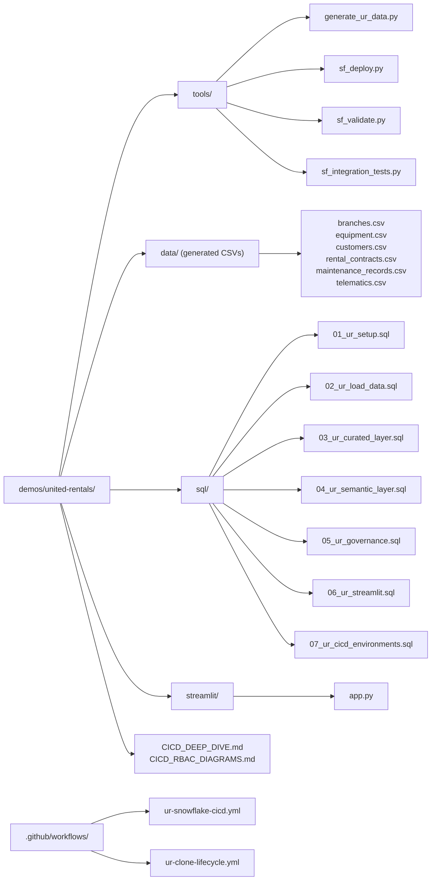

# United Rentals — Focused Demo


> **From Manual Heroics to the UR Federated Data Product Factory** — Applying Data Cloud Architecture patterns to eliminate data friction across United Rentals' fragmented Snowflake environment.

## Company Context

**United Rentals** is the largest equipment rental company in North America. Their data platform supports fleet management, rental operations, telematics/IoT, maintenance scheduling, and branch-level analytics across thousands of locations.

**Snowflake Engagement**: Enterprise Architecture engagement to modernize a legacy "lift and shift" Teradata migration into a cloud-native, federated data platform.

## The Challenge → Pattern Mapping

Each of UR's core challenges maps directly to a DCA pattern demonstrated in the core framework:

| UR Challenge | DCA Pattern | Core Demo Reference |
|-------------|-------------|---------------------|
| **No SDLC bridge** between Discovery and Production accounts | CI/CD pipeline with Git integration, promotion roles | [SDLC_ARCHITECTURE.md](../../docs/SDLC_ARCHITECTURE.md) |
| **Fragmented governance** — local auth in Prod, SSO in Discovery | Snowflake Horizon: tags, masking, row access policies | [GOVERNANCE.md](../../docs/GOVERNANCE.md) |
| **Lost lineage** across account boundaries | Data contracts, ACCESS_HISTORY, Snowflake Horizon catalog | [ARCHITECTURE.md](../../docs/ARCHITECTURE.md) |
| **Tenant isolation** — Manning/Sales Ops sharing Prod space | Container-by-DB (Database-as-a-Container) with domain autonomy | [snowflake_account_architecture_patterns.md](../../docs/snowflake_account_architecture_patterns.md) |
| **AI models stuck in Discovery** — no path to operationalize | Cortex AI pipeline, feature store, model registry in Prod | [DEMO_SCRIPT.md](../../docs/DEMO_SCRIPT.md) |
| **Legacy ELT** via Wherescape Red | Dynamic Tables + dbt hybrid transformation | [DBT_VS_DYNAMIC_TABLES.md](../../docs/DBT_VS_DYNAMIC_TABLES.md) |

## Key Stakeholders

| Role | Responsibility |
|------|---------------|
| Director of Enterprise Data | Executive sponsor, strategic alignment |
| EDW/Production Owner | Production account governance, Wherescape Red, data quality |
| Discovery/AI Owner | Discovery account, Cortex AI, SSO/RLS, branch analytics |
| Data Engineer | Migration execution, Git integration, pipeline development |

## Current State — Three Account Architecture



## Target State — Federated Data Product Factory



## Engagement Timeline

| Date | Milestone | Materials |
|------|-----------|-----------|
| Dec 2025 | Technical Discovery Kickoff | [DISCOVERY.md](DISCOVERY.md) |
| Feb 2026 | Architecture Strategy Presentation | [ARCHITECTURE_STRATEGY.md](ARCHITECTURE_STRATEGY.md) |
| Mar 2026 | On-Site Workshop (Stanford) | [WORKSHOP_GUIDE.md](WORKSHOP_GUIDE.md) |
| Post-Workshop | 30/60/90 Execution | [ROADMAP.md](ROADMAP.md) |

## Demo Documents

| Document | Purpose |
|----------|---------|
| [DISCOVERY.md](DISCOVERY.md) | Current state architecture, pain points, gap analysis, discovery framework |
| [ARCHITECTURE_STRATEGY.md](ARCHITECTURE_STRATEGY.md) | Target architecture, comparison scorecard, DCA pattern mapping |
| [WORKSHOP_GUIDE.md](WORKSHOP_GUIDE.md) | Full facilitation guide for the 4-hour on-site workshop |
| [ROADMAP.md](ROADMAP.md) | 30/60/90 phased execution plan with pilot selection |

## Live Demo — Fleet Finder

An interactive Streamlit app demonstrating RBAC, geospatial fleet search, and Cortex Analyst natural language queries against a synthetic United Rentals dataset.

### What It Shows

- **Interactive Map**: Find available equipment within N miles of any US metro using `ST_DISTANCE` geospatial queries
- **RBAC Demo**: 5 role personas (Fleet Manager, Regional Director, Branch Manager, Corporate Analyst, External Partner) with graduated access — masking policies on PII/pricing, row access policies by region/branch
- **Cortex Analyst**: Natural language fleet intelligence ("Show available boom lifts within 50 miles of Dallas") powered by FLEET_FINDER and RENTAL_ANALYTICS semantic views

### Dataset

Generated via `tools/generate_ur_data.py` — 6 tables, 39K+ records with real US coordinates:

| Table | Records | Key Columns |
|-------|---------|-------------|
| `branches` | 100 | Branch locations with lat/lon across 36 US metros |
| `equipment` | 5,000 | Fleet assets: 6 categories, status, condition, geospatial location |
| `customers` | 1,000 | Customer accounts with type, credit rating, location |
| `rental_contracts` | 10,000 | Rental transactions with delivery location, duration, revenue |
| `maintenance_records` | 3,000 | Service events with cost breakdown |
| `telematics` | 20,000 | IoT/GPS readings with fault codes |

### Setup Instructions

```bash
# 1. Generate data (requires: pip install faker)
cd demos/united-rentals/tools
python generate_ur_data.py --output ../data

# 2. Upload CSVs to Snowflake stage
# In a Snowflake worksheet:
PUT file:///path/to/demos/united-rentals/data/*.csv @RAW_DEV.UNITED_RENTALS.UR_DATA_STAGE;

# 3. Run SQL scripts in order
#    01_ur_setup.sql       — Schemas, 5 UR roles, governance tags, role-region mapping
#    02_ur_load_data.sql   — Stage + COPY INTO for 6 tables
#    03_ur_curated_layer.sql — Dynamic Tables with GEOGRAPHY columns
#    04_ur_semantic_layer.sql — FLEET_FINDER + RENTAL_ANALYTICS semantic views
#    05_ur_governance.sql  — Masking policies, row access policies, tag application
#    06_ur_streamlit.sql   — Deploy Fleet Finder Streamlit app
#    07_ur_cicd_environments.sql — CI/CD RBAC, environment databases, promotion workflows

# 4. Upload Streamlit app
PUT file:///path/to/demos/united-rentals/streamlit/app.py @SEM_DEV.UNITED_RENTALS.UR_STREAMLIT_STAGE OVERWRITE=TRUE;
```

### Business RBAC Access Matrix

| Data Element | Fleet Manager | Regional Dir | Branch Mgr | Corp Analyst | External Partner |
|-------------|:---:|:---:|:---:|:---:|:---:|
| Equipment data | All regions | SW only | 1 branch | All regions | SW only |
| Customer name | Full | Full | Full | Masked | Masked |
| Customer email/phone | Full | Full | Full | Masked | Hidden |
| Rental pricing | Visible | Visible | Visible | Visible | Hidden |
| Credit limits | Visible | Hidden | Hidden | Hidden | Hidden |

### CI/CD RBAC — Environment Isolation Matrix

The database-as-a-container pattern replaces account-level isolation with role-scoped grants. Each CI/CD role can ONLY access its target environment:

| CI/CD Role | `*_DEV` | `*_STG` | `*_PROD` | Purpose |
|-----------|:---:|:---:|:---:|---------|
| `UR_CICD_DEPLOY_DEV` | ALL DDL | — | — | Pipeline deploys to DEV |
| `UR_CICD_DEPLOY_STG` | — | ALL DDL | — | Pipeline deploys to STG |
| `UR_CICD_DEPLOY_PROD` | — | — | ALL DDL | Pipeline deploys to PROD |
| `UR_CICD_VALIDATOR` | SELECT | SELECT | SELECT | Cross-env validation gates |
| `UR_CLONE_PROVISIONER` | CREATE DB | — | READ (src) | Team dev clone lifecycle |
| `UR_PLATFORM_ADMIN` | *(inherits all)* | *(inherits all)* | *(inherits all)* | CI/CD infrastructure admin |

Deploy roles are **siblings, not a hierarchy** — a compromised DEV service account cannot touch PROD.

### CI/CD Pipeline (GitHub Actions)

Two workflows automate the full promotion lifecycle. See [CICD_DEEP_DIVE.md](CICD_DEEP_DIVE.md) for architecture details.

| Workflow | Trigger | Role Used | What It Does |
|----------|---------|-----------|--------------|
| `ur-snowflake-cicd.yml` | PR / push to develop / push to main | DEV/STG/PROD deploy roles | Lint → Validate → Deploy → Integration Test |
| `ur-clone-lifecycle.yml` | Manual dispatch / daily 6 AM CT | `UR_CLONE_PROVISIONER` | Provision team clones, cleanup expired, status report |

Pipeline tools (in `tools/`):
- **`sf_deploy.py`** — Queries `ENVIRONMENT_REGISTRY` for dynamic target resolution, executes SQL, logs promotions
- **`sf_validate.py`** — Calls `VALIDATE_PROMOTION` stored procedure, enforces gates
- **`sf_integration_tests.py`** — Post-deploy verification (smoke + full suites)

### File Structure


