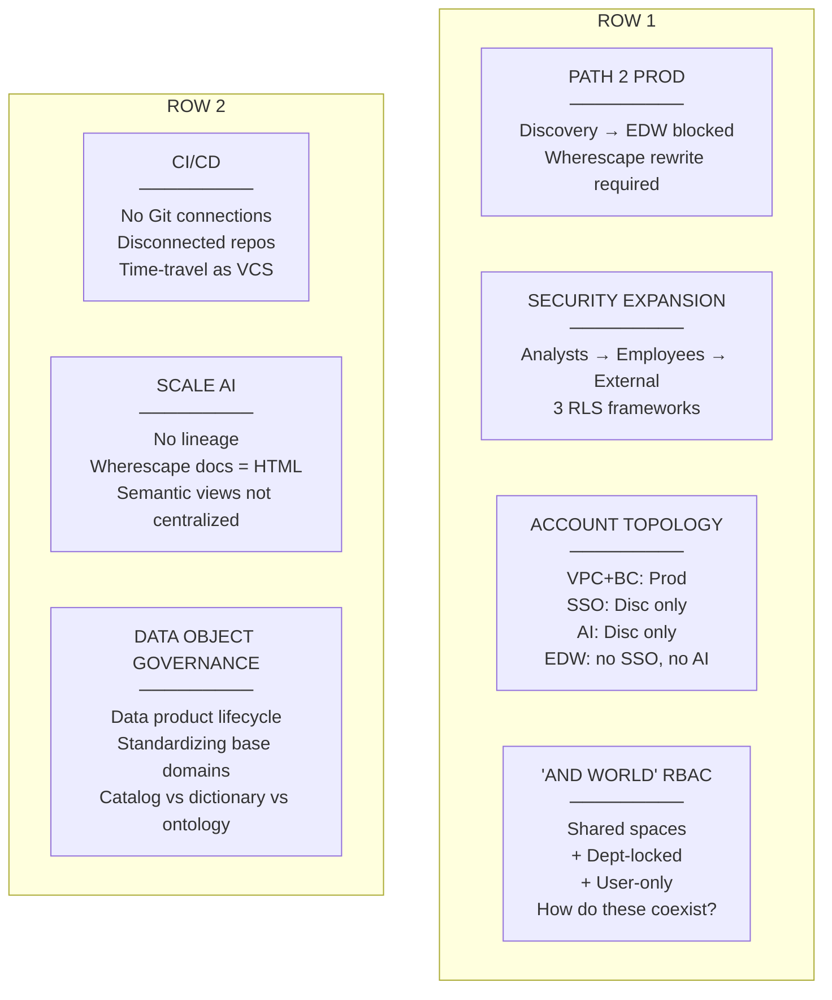
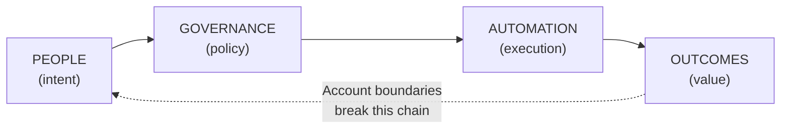
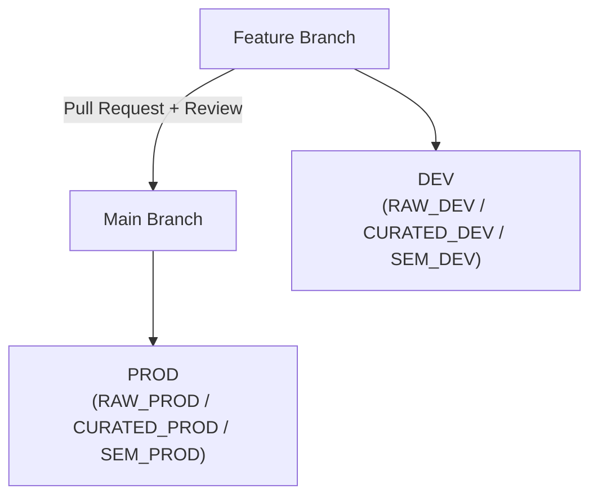
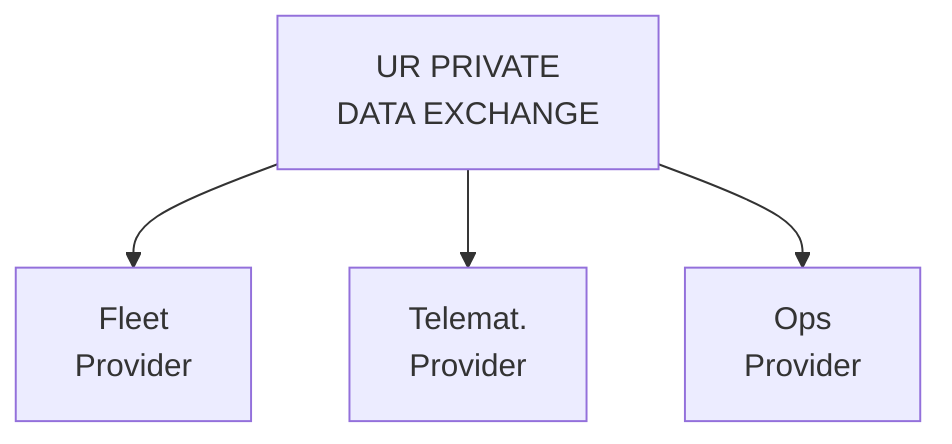

# United Rentals — Workshop Facilitation Guide

> **On-Site Architecture Whiteboarding Session** — "From Manual Heroics to the UR Federated Data Product Factory"

## Session Details

| Field | Detail |
|-------|--------|
| **Date** | 23 MAR 2026 |
| **Time** | 9:00 AM - 1:00 PM (4 hours, working lunch 12:00-1:00) |
| **Location** | Stanford HQ |
| **Format** | Whiteboard-led workshop with slide anchors, live Fleet Finder demo, interactive handouts |
| **Remote Access** | WebEx for remote participants |

## Attendees

**Snowflake**: Enterprise Data Architect (Lead), Account Team

**United Rentals**: Data Engineering, Analytics Leadership, Platform/Ops, Business Domain Owners (Fleet, Telematics)

## UR Pain Points — Workshop Coverage Map

Every pain point raised in discovery must land in a specific workshop moment. This matrix is the facilitator's accountability checklist.

| # | UR Pain Point | Workshop Segment | Live Demo Moment |
|---|--------------|-----------------|-----------------|
| 1 | **Path 2 Production** — Discovery work doesn't translate to EDW DEV/Prod | Seg 1 (Friction Map), Seg 2 (Container-by-DB), Seg 3 (Dynamic Tables) | Show RAW → CURATED → SEMANTIC pipeline: same SQL runs in any account |
| 2 | **Security Expansion** — Analysts → employees → external customers; RBAC across all profiles; RLS/CLS with frameworks for locations, customers, geographies | Seg 1 (Security lane), Seg 2 (Horizon), **Seg 3 (Fleet Finder RBAC demo)** | Switch roles live: Fleet Mgr → Branch Mgr → External Partner. Show masking appear/disappear, rows filter by region |
| 3 | **Account Topology** — EDW Prod/DR on VPC+business critical; Discovery has SSO but EDW doesn't; Discovery has AI but EDW doesn't | Seg 1 (Root cause), Seg 2 (Identity Plane), Seg 4 (SSO Harmonization phase) | Whiteboard current 3-account split; show Fleet Finder running Cortex in a governed context |
| 4 | **"AND World" RBAC** — Shared spaces AND department-locked AND user-only spaces | Seg 2 (Horizon), **Seg 3 (Fleet Finder "AND World" demo)** | Show ROLE_REGION_MAPPING table → RAP_UR_REGION + RAP_UR_CUSTOMER running simultaneously. Same query, different role = different rows AND different columns |
| 5 | **CI/CD** — No Git connections, disconnected repos, time-travel as version control | Seg 1 (Migration lane), Seg 2 (Container-by-DB), Seg 4 (CI/CD phase) | Show SQL scripts in Git repo structure (01-06); whiteboard the Git → Deploy promotion path |
| 6 | **Scale AI** — No end-to-end lineage, Wherescape docs in HTML, semantic views not centralized, no centralized "successful" definitions | Seg 2 (Semantic layer), **Seg 3 (Cortex Analyst demo)** | Show FLEET_FINDER + RENTAL_ANALYTICS semantic views as the single source of truth; Cortex Analyst answers natural language using the centralized definitions |
| 7 | **Data Object Governance** — Data product lifecycle, standardizing base domains, catalog vs dictionary vs ontology | Seg 2 (Marketplace), Seg 3 (Tags demo), Seg 4 (Governance phase) | Show UR_DATA_DOMAIN / UR_SENSITIVITY / UR_REGION tags applied to every table and column; show how tags travel with data products |

## Pre-Work (Distribute 5 Business Days Before)

| Item | Owner | Purpose |
|------|-------|---------|
| Current-state account inventory (accounts, regions, key databases) | UR | Informs Segment 2 whiteboard |
| Top 3-5 "Heroic" processes (pain points in Discovery-to-Production promotion) | UR | Seeds the Friction Map in Segment 1 |
| Enterprise Architecture Guide v7 — Chapters 4 & 7 (excerpt) | Snowflake | Context on RAW, CURATED, SEMANTIC and Federated Execution |
| Architecture Comparison Scorecard (printed handout) | Snowflake | One per attendee |
| UR Data Contract Template v1.0 (printed handout) | Snowflake | One per attendee |
| **Fleet Finder Pain Point Worksheet** (printed handout) | Snowflake | One per attendee — 7 pain points with blank "current cost" and "target state" columns for attendees to fill in during Segment 1 |
| List of current RLS/CLS requirements by user profile (analysts, employees, external) | UR | Informs the RBAC demo in Segment 3 |

## Agenda at a Glance

| Time | Segment | Duration |
|------|---------|----------|
| 9:00 AM | **Segment 1** — The Problem: Mapping the Seven Friction Points | 45 min |
| 9:45 AM | **Segment 2** — The Pattern: Container-by-DB and Federated Marketplace | 60 min |
| 10:45 AM | BREAK | 15 min |
| 11:00 AM | **Segment 3** — The Proof: Fleet Finder Live Demo | 45 min |
| 11:45 AM | **Segment 4** — The Path: 30/60/90 Execution Roadmap | 45 min |
| 12:30 PM | **Segment 5** — Working Lunch: Pilot Selection and Commitments | 30 min |
| 1:00 PM | CLOSE | — |

---

## Segment 1 — The Problem: Mapping the Seven Friction Points

**Time**: 9:00 AM - 9:45 AM (45 minutes)

**Objective**: Shared understanding that "Heroics" are architectural symptoms, not people problems — and that UR's seven friction points are predictable consequences of account fragmentation.

### 9:00-9:10 | Opening and Introductions (10 min)

**Setup**: Stand at the whiteboard. Do not use slides. Have the Fleet Finder Pain Point Worksheet on each chair.

**Talk Track**:
> "We're here because United Rentals has outgrown its current Snowflake topology. You started with a production EDW, added a Discovery account for AI and analytics, and now you're hitting the walls that every enterprise hits at this stage: work built in Discovery can't promote to Production. Security models diverge. AI stays stuck in a sandbox. And the team spends its time on heroics — manual glue — instead of delivering value."
>
> "Today we're going to name those friction points explicitly, show you a working architecture that eliminates them, and leave with a named pilot. I've built a live demo using your own domain — fleet equipment, branches, rentals, telematics — so everything you see today maps directly to your world."

**Align on workshop outcomes**: Leave with (1) a consensus architecture pattern, (2) a governance model that handles the "AND world" of shared + department + user-only access, and (3) a named pilot workload with owners.

### 9:10-9:30 | Current-State Friction Map (20 min)

**Action**: Walk through all seven friction points. Use the printed Pain Point Worksheet as a guide. Ask the room to validate, amend, or add to each one. Write them on the whiteboard under seven lanes.

**Whiteboard Layout** — Seven lanes across two rows:



**Facilitation prompts for each lane**:

1. **Path 2 Production**: "Walk me through what happens when a model built in Discovery needs to run in EDW Prod. Who touches it? How many times does the SQL get rewritten?"
2. **Security Expansion**: "You started with analysts. Now general employees are in Discovery. External customers are next. What breaks when you add each new user class?"
3. **Account Topology**: "EDW Prod is on VPC with business-critical edition. Discovery has SSO and Cortex. How do you reconcile features that exist in one account but not the other?"
4. **"AND World" RBAC**: "You need shared spaces where everyone collaborates, department-locked spaces for finance or HR data, AND user-only sandboxes. How does that work today with your current role hierarchy?"
5. **CI/CD**: "Show of hands — who has a Git repo connected to any Snowflake account right now? Who's relying on query history or time-travel to find what changed last week?"
6. **Scale AI**: "If I asked you to trace the lineage from a Cortex Analyst answer all the way back to the source ERP table, could you do it today? Where does the chain break?"
7. **Data Object Governance**: "You're standardizing base data domains — fleet, telematics, customers. What's the difference between your catalog, your dictionary, and your ontology? Who owns each?"

### 9:30-9:45 | Root-Cause Analysis (15 min)

**Action**: Synthesize the whiteboard into root causes. Drive toward the thesis: all seven friction points originate from the same architectural gap — physical account boundaries creating artificial data movement, governance fragmentation, and identity discontinuity.

**Key DCA Anchor**:
> "Complex systems do not scale outcomes until they stabilize dependencies. These seven friction points aren't seven separate problems — they're seven symptoms of one: unstable boundaries. People define intent, but the multi-account topology breaks the chain before Governance and Automation can execute it. Fix the boundaries, and most of these resolve together."

**Draw the dependency chain on the whiteboard**:



**Leave the Friction Map on the whiteboard for the entire meeting.**

---

## Segment 2 — The Pattern: Container-by-DB and Federated Marketplace

**Time**: 9:45 AM - 10:45 AM (60 minutes)

**Objective**: Align on the evolution from fragmented to federated — and show how each of the seven friction points maps to a specific architectural pattern.

### 9:45-10:05 | Single vs. Multi-Account Architecture (20 min)

**Action**: Present two patterns side-by-side. Walk through the Architecture Comparison Scorecard row by row. Whiteboard UR's current topology against the target Container-by-DB model.

**Use the printed handout**: Architecture Comparison Scorecard (see [ARCHITECTURE_STRATEGY.md](ARCHITECTURE_STRATEGY.md) for the full table).

**Key discussion points**:
- UR's current fragmented state vs. unified (Container-by-DB) vs. federated (marketplace)
- Pros/cons of each for UR's specific team structure
- Reference: [Account Architecture Patterns](../../docs/snowflake_account_architecture_patterns.md)

**Pain Point #3 — Account Topology**: This is where you address VPC+business-critical on Prod vs. standard on Discovery. Show how Container-by-DB within a single account eliminates the feature disparity (SSO, AI, edition) while network policies and private connectivity handle the security boundary.

### 10:05-10:20 | RAW, CURATED, SEMANTIC within Container-by-DB (15 min)

**Action**: Map UR's Discovery, Development, and Production domains onto the three-layer progression (RAW → CURATED → SEMANTIC). Show how each database becomes a logical container whose boundaries are **contract boundaries**, not physical account walls.

**Whiteboard the Container-by-DB layout** showing EDW, Manning, Sales Ops, and Fleet as separate domains within the hub.

**Pain Point #1 — Path 2 Production**: This is the key moment. Show that in Container-by-DB, the same SQL that runs in RAW_DEV → CURATED_DEV → SEM_DEV runs identically in RAW_PROD → CURATED_PROD → SEM_PROD. No Wherescape rewrite. No manual translation. The promotion path is a Git merge.

**Key talk track for CURATED layer**:
> "This is where Dynamic Tables or dbt replace Wherescape Red. Each domain team chooses their transformation engine — the architecture doesn't care which tool you use, only that the data contract is satisfied. And because these are logical containers in the same account, they share the identity plane, the governance plane, and the AI plane."

**Pain Point #5 — CI/CD**: Sketch the Git-based promotion path:



### 10:20-10:35 | Internal Marketplace — Hub-and-Spoke (15 min)

**Action**: Sketch the Hub-and-Spoke model where Fleet, Telematics, and Ops act as Data Providers in a Private Exchange, and Discovery/Analytics act as Consumers.

**Whiteboard the marketplace**:



**Pain Point #7 — Data Object Governance**: Use the marketplace to clarify the catalog/dictionary/ontology question:
- **Catalog** = Snowflake Horizon (automatic, object-level metadata, tags, lineage)
- **Dictionary** = Semantic Views (centralized business definitions: "what does 'available equipment' mean?")
- **Ontology** = Data Contracts (relationships between domains, SLA rules, schema validation)
- **Practical answer**: "You don't need to build three separate systems. Snowflake provides the catalog natively. Semantic views ARE the dictionary. Data contracts define the ontology. Today we'll show you all three working together."

**External marketplace integration**: Show how UR can ingest 3rd-party data (weather, economic, OEM telematics) directly without ETL.

### 10:35-10:45 | Snowflake Horizon: Governance That Follows the Data (10 min)

**Action**: Demonstrate how Snowflake Horizon policies (tags, masking, row-level security) are enforced at the source and travel with the data product across the marketplace.

**Pain Point #2 — Security Expansion** and **Pain Point #4 — "AND World" RBAC**: This is the conceptual setup before the live demo. Whiteboard the three RLS frameworks:

#### "AND WORLD" RBAC Model

**Framework 1: Location-Based RLS (RAP_UR_REGION)**
- Fleet Manager: ALL regions
- Regional Director: SOUTHWEST only
- Branch Manager: SOUTHWEST, branch BR-01024 only
- External Partner: SOUTHWEST only

**Framework 2: Customer-Based RLS (RAP_UR_CUSTOMER)**
- Internal roles: ALL customer types
- External Partner: CONSTRUCTION, INFRASTRUCTURE, GOVERNMENT only

**Framework 3: Column-Level Security (Masking Policies)**
- Fleet Manager: Full PII, pricing, credit
- Regional Director: Full PII, pricing, no credit
- Branch Manager: Full PII, pricing, no credit
- Corporate Analyst: Masked PII, pricing, no credit
- External Partner: Masked PII, no pricing, no credit

**SHARED + DEPT + USER-ONLY via Role Hierarchy:**
- SHARED: FLEET_AVAILABILITY view (all UR roles)
- DEPT: RAP filters by region per role
- USER-ONLY: Future — personal sandbox schemas

**Talk track**:
> "This is the 'AND world' you described. Shared access to the fleet data AND department-locked by region AND graduated column masking by role. These three frameworks run simultaneously on the same tables. We'll show you this live in 15 minutes."

**Reference**: [GOVERNANCE.md](../../docs/GOVERNANCE.md) — show the tag taxonomy and policy examples from the core DCA demo.

---

## BREAK (10:45 AM - 11:00 AM)

**Facilitator prep during break**: Open Fleet Finder app on laptop. Verify it's running with `UR_FLEET_MANAGER` as the default role. Have the Snowflake UI open to `SEM_DEV.UNITED_RENTALS` schema showing the semantic views. Keep the governance script (`05_ur_governance.sql`) open in a tab for the policy walkthrough.

---

## Segment 3 — The Proof: Fleet Finder Live Demo

**Time**: 11:00 AM - 11:45 AM (45 minutes)

**Objective**: Show working proof of every pattern discussed in Segments 1-2 using UR's own domain — fleet equipment, branches, rentals, telematics. Every click maps back to a friction point on the whiteboard.

> **Facilitator note**: This is the highest-impact segment. You are showing, not telling. Point back to the whiteboard friction map constantly — "Remember friction point #2? Watch what happens when I switch roles."

### 11:00-11:10 | Pipeline Walkthrough — Path 2 Production Solved (10 min)

**Pain Points Addressed**: #1 (Path 2 Production), #5 (CI/CD), #6 (Scale AI — centralized definitions)

**Action**: Before opening the app, walk through the pipeline in the Snowflake UI.

**Click-by-click script**:

1. **Open Snowflake UI** → Navigate to `RAW_DEV.UNITED_RENTALS`
   - Show the 6 raw tables: BRANCHES, EQUIPMENT, CUSTOMERS, RENTAL_CONTRACTS, MAINTENANCE_RECORDS, TELEMATICS
   - Talk track: *"Raw data lands here. CSVs, Fivetran, Precisely — doesn't matter the source. This is the ingestion boundary."*

2. **Navigate to `CURATED_DEV.UNITED_RENTALS`** → Click on `DIM_EQUIPMENT` Dynamic Table
   - Show the Dynamic Table definition with `TARGET_LAG = '1 hour'`
   - Show `ST_MAKEPOINT(LONGITUDE, LATITUDE)` creating GEOGRAPHY columns
   - Talk track: *"This is what replaces the Wherescape Red rewrite. Dynamic Tables declare the transformation as SQL and Snowflake manages the refresh. TARGET_LAG is your SLA — one hour in DEV, maybe 15 minutes in Prod for telematics. Point is: this same DDL runs in any account. No translation required."*
   - **Point at whiteboard**: "That's friction point #1 — Path to Production — solved."

3. **Navigate to `SEM_DEV.UNITED_RENTALS`** → Click on `FLEET_FINDER` semantic view
   - Show the DIMENSIONS and METRICS definitions
   - Talk track: *"This is the centralized definition layer. What does 'available equipment' mean? It's defined here — once. What does 'average daily rate' mean? Defined here. Cortex Analyst reads these definitions to answer natural language questions. This IS your data dictionary."*
   - **Point at whiteboard**: "That's friction point #6 — no centralized definitions — solved."

4. **Show the SQL scripts in the Git repo** (switch to IDE/terminal briefly)
   - Show `sql/01_ur_setup.sql` through `sql/06_ur_streamlit.sql`
   - Talk track: *"Six scripts, numbered, idempotent, in Git. Run them in order in DEV. When they pass review, merge to main, run in Prod. That's your CI/CD pipeline — not time-travel, not query history."*
   - **Point at whiteboard**: "That's friction point #5 — CI/CD — solved."

### 11:10-11:25 | Fleet Finder App — RBAC and "AND World" Live (15 min)

**Pain Points Addressed**: #2 (Security Expansion), #4 ("AND World" RBAC), #3 (Account Topology — AI in governed context)

**Action**: Open the Fleet Finder Streamlit app. This is the core demo — take your time.

**Click-by-click script**:

1. **Open Fleet Finder** → App loads with sidebar showing role selector
   - Default role: `UR_FLEET_MANAGER`
   - Talk track: *"This is a Streamlit app running inside Snowflake. It uses Cortex Analyst for natural language queries and geospatial search for the map. Let me show you what a Fleet Manager sees."*

2. **Fleet Finder page — Full access demo**:
   - Select location: **Dallas, TX** from the dropdown
   - Set radius: **50 miles**
   - Select category: **All Categories**
   - Click search → Map populates with equipment pins around Dallas
   - Talk track: *"A fleet manager sees everything: all regions, all equipment, full pricing, full customer details. 50 miles from Dallas — here's every available asset."*
   - **Expand the branch summary** → Show branch names, equipment counts
   - **Show the data table** → Point out: customer name (visible), email (visible), daily rate (visible), credit limit (visible)

3. **Switch role to `UR_REGIONAL_DIRECTOR`** (sidebar dropdown):
   - Same search: Dallas, TX, 50 miles
   - Talk track: *"Regional Director — Southwest region only. Watch what changes."*
   - **Show the data table** → Customer name still visible, pricing still visible, but credit limit column is **gone**
   - Talk track: *"Column masking removed the credit limit. That's CLS framework #3."*

4. **Switch role to `UR_BRANCH_MANAGER`**:
   - Same search: Dallas, TX, 50 miles
   - Results filtered to branch BR-01024 only
   - Talk track: *"Branch manager — same region filter, but also filtered to their specific branch. That's RLS framework #1 — location-based. They see their branch, nobody else's."*

5. **Switch role to `UR_EXTERNAL_PARTNER`** — **This is the money shot**:
   - Same search: Dallas, TX, 50 miles
   - Talk track: *"External partner. Watch three things happen simultaneously."*
   - **Show the data table**:
     - Customer names: **MASKED** (shows `****`)
     - Customer email/phone: **HIDDEN** (columns gone)
     - Rental pricing: **HIDDEN** (columns gone)
     - Credit limits: **HIDDEN** (columns gone)
     - Rows: Only CONSTRUCTION, INFRASTRUCTURE, GOVERNMENT customer types visible
   - Talk track: *"Three frameworks firing at once: (1) Location RLS — Southwest only. (2) Customer-type RLS — only construction, infrastructure, government customers. (3) Column masking — PII masked, pricing hidden, credit hidden. THAT is the 'AND world.' Shared access to fleet availability AND region-locked AND customer-type-filtered AND column-masked. All from the same underlying tables."*
   - **Point at whiteboard**: "Friction points #2 AND #4 — solved. And notice: this external partner could be a customer accessing via SSO. Same governance applies regardless of how they authenticate."

6. **Show the ROLE_REGION_MAPPING table** (switch to Snowflake UI briefly):
   ```sql
   SELECT * FROM RAW_DEV.UNITED_RENTALS.ROLE_REGION_MAPPING;
   ```
   - Talk track: *"This is the control plane. One table drives all the row access policies. Add a new region assignment for a role — the policies pick it up automatically. No code changes, no redeployment."*

### 11:25-11:35 | Cortex Analyst — Centralized AI with Natural Language (10 min)

**Pain Points Addressed**: #6 (Scale AI — centralized definitions), #3 (Account Topology — AI in governed context)

**Action**: Switch to the Cortex Analyst page in Fleet Finder.

**Click-by-click script**:

1. **Switch to Cortex Analyst page** (sidebar navigation)
   - Select semantic view: `FLEET_FINDER`
   - Talk track: *"Same governance applies here. The role you're using determines what data Cortex can see and return."*

2. **Type the killer question** (with `UR_FLEET_MANAGER` role):
   > "Show me available boom lifts within 50 miles of Dallas"
   - Cortex Analyst generates SQL using the FLEET_FINDER semantic view
   - Results appear with a map
   - Talk track: *"Natural language → SQL → governed results → map. The semantic view defines what 'available' means, what 'boom lift' maps to, and Cortex writes the query. No one had to build a custom report."*

3. **Ask a revenue question** — switch semantic view to `RENTAL_ANALYTICS`:
   > "What is total rental revenue by region for the last 6 months?"
   - Results show revenue breakdown by region
   - Talk track: *"Different semantic view, same app. RENTAL_ANALYTICS covers revenue, utilization, customer metrics. These definitions are centralized — every analyst, every app, every dashboard gets the same answer."*
   - **Point at whiteboard**: "Friction point #6 — 'successful definitions not centralized' — solved. The semantic view IS the centralized definition."

4. **Switch role to `UR_EXTERNAL_PARTNER`** and repeat the first question:
   > "Show me available boom lifts within 50 miles of Dallas"
   - Results are filtered: fewer rows, no pricing columns
   - Talk track: *"Same question, different role, different results. Governance follows the data even through AI. The external partner gets a governed answer without you building a separate app or a separate data pipeline for them."*

### 11:35-11:45 | Tags and Data Product Governance (10 min)

**Pain Points Addressed**: #7 (Data Object Governance — lifecycle, catalog, dictionary, ontology)

**Action**: Switch to the Snowflake UI. Show the governance tags applied to the Fleet domain.

**Click-by-click script**:

1. **Show tag application** (run in worksheet):
   ```sql
   SELECT * FROM TABLE(
     RAW_DEV.INFORMATION_SCHEMA.TAG_REFERENCES_ALL_COLUMNS(
       'CURATED_DEV.UNITED_RENTALS.DIM_EQUIPMENT', 'TABLE'
     )
   );
   ```
   - Show UR_DATA_DOMAIN = 'FLEET', UR_SENSITIVITY tags on columns
   - Talk track: *"Every table and sensitive column is tagged. UR_DATA_DOMAIN tells you which business domain owns it. UR_SENSITIVITY tells you the classification level. These tags drive the masking policies automatically — tag a column as 'CONFIDENTIAL' and the masking policy kicks in."*

2. **Show the three-layer governance model**:
   - Talk track: *"You asked about catalog vs. dictionary vs. ontology. Here's the practical answer for Snowflake:*
     - *Catalog: Snowflake Horizon — automatic object discovery, tags, lineage, access history. You already have it.*
     - *Dictionary: Semantic Views — centralized business definitions. We just demoed it with Cortex Analyst.*
     - *Ontology: Data Contracts + Tags — UR_DATA_DOMAIN tags define domain ownership, data contracts define the schema and SLA rules between domains.*
   - *You don't build three separate systems. You use three Snowflake features that work together natively."*

3. **Walk through the data product lifecycle for Fleet**:

   ```mermaid
   flowchart LR
       RAW["RAW_DEV.UNITED_RENTALS\n(ingestion)"] -->|"Tagged:\nUR_DATA_DOMAIN = 'FLEET'"| CURATED["CURATED_DEV.UNITED_RENTALS\n(Dynamic Tables transform)"]
       CURATED -->|"Tagged: UR_SENSITIVITY\non PII columns\nMasking auto-applied"| SEM["SEM_DEV.UNITED_RENTALS\n(Semantic Views)"]
       SEM --> CONSUME["Cortex Analyst +\nStreamlit consume"]
       CONSUME -->|"All governed by\nRBAC + RLS + CLS"| USERS["Users"]
   ```

   - Talk track: *"This is the data product lifecycle for one domain — Fleet. Standardize this pattern, and every new domain (Manning, Sales Ops, Finance) follows the same path. The architecture enables reuse, not duplication."*
   - **Point at whiteboard**: "Friction point #7 — data product lifecycle and standardizing base domains — solved."

---

## Segment 4 — The Path: 30/60/90 Execution Roadmap

**Time**: 11:45 AM - 12:30 PM (45 minutes)

**Objective**: Transition from architecture vision to concrete execution plan, with each phase explicitly resolving specific friction points.

### 11:45-12:00 | Phase Breakdown (15 min)

**Whiteboard the three phases** (see [ROADMAP.md](ROADMAP.md) for full detail):

```mermaid
flowchart LR
    subgraph P1["PHASE 1 (30 Days)\nIdentity Plane"]
        P1A["SSO harmonize (#3)"]
        P1B["Container-by-DB (#1)"]
        P1C["Git connection (#5)"]
        P1D["RBAC: 'AND world' (#4)"]
    end
    subgraph P2["PHASE 2 (60 Days)\nInternal Marketplace"]
        P2A["First provider: Fleet (#7)"]
        P2B["Semantic views: Fleet (#6)"]
        P2C["CI/CD pipeline (#5)"]
        P2D["RLS 3-framework rollout (#2)"]
    end
    subgraph P3["PHASE 3 (90 Days)\nFederated Governance"]
        P3A["Cross-domain lineage (#6)"]
        P3B["External partner access (#2)"]
        P3C["Production Cortex AI (#3)"]
        P3D["Data contract registry (#7)"]
    end
    P1 --> P2 --> P3
```



**Talk track**: "Each line item maps back to a numbered friction point on the board. Phase 1 stabilizes the foundation — identity, containers, Git. Phase 2 lights up the first domain as a data product. Phase 3 scales it and opens it to external consumers."

**Pain Point #3 — Account Topology specific discussion**:
> "SSO harmonization means EDW Prod gets SSO in Phase 1. AI enablement means Cortex gets turned on in EDW with proper governance in Phase 3. The VPC/business-critical topology stays — we're not changing your network security. We're bringing the missing capabilities into the governed perimeter."

### 12:00-12:15 | Risk and Dependencies (15 min)

**Facilitated discussion**: For each phase, identify:
- What could block us?
- Who needs to be involved that isn't in the room?
- What existing processes need to change?

**Specific risks to surface**:
- **Phase 1**: VPC network policy changes require security team sign-off. SSO integration requires identity team.
- **Phase 2**: Wherescape Red decommission timeline — can we run Dynamic Tables in parallel?
- **Phase 3**: External partner SLA — what latency is acceptable for customer-facing data?

### 12:15-12:30 | Success Criteria (15 min)

Define measurable success criteria for each phase. Write these on the whiteboard alongside the phases.

**Suggested criteria mapped to friction points**:

| Phase | Success Metric | Friction Point |
|-------|---------------|---------------|
| 1 | SSO login works in EDW Prod | #3 Account Topology |
| 1 | One domain (Fleet) runs in Container-by-DB with RAW/CURATED/SEM | #1 Path 2 Prod |
| 1 | Git repo connected to at least one Snowflake account | #5 CI/CD |
| 2 | Fleet semantic view answers 10 standard business questions via Cortex | #6 Scale AI |
| 2 | 3-framework RLS active on Fleet domain (location + customer + column) | #2 Security, #4 AND World |
| 2 | Fleet data product tagged with UR_DATA_DOMAIN, UR_SENSITIVITY | #7 Data Object Gov |
| 3 | External partner accesses Fleet Finder with governed, filtered data | #2 Security Expansion |
| 3 | End-to-end lineage traces from Cortex answer to source ERP table | #6 Scale AI |

---

## Segment 5 — Working Lunch: Pilot Selection and Commitments

**Time**: 12:30 PM - 1:00 PM (30 minutes)

**Objective**: Leave with a named pilot workload and mutual accountability. Use Fleet Finder as the proof that the architecture works — the pilot is about applying it to real data.

### The 4-Week Pilot Exercise

**Setup**: Walk back to the Friction Map on the whiteboard. Open Fleet Finder on the screen behind you.

**Talk Track**:
> "You've seen Fleet Finder handle every friction point we named this morning — Path to Production, the AND-world RBAC, CI/CD via Git, centralized AI definitions, data product governance. But that was synthetic data. The question now is: what real UR domain do we light up first?"

### Force the Choice (10 min)

Get agreement on one pilot. **Recommended lead candidate** (steer toward this):

1. **Fleet Availability — Real Data** (highest impact, directly extends the demo)
   - Replace the synthetic dataset with real fleet/telematics data from Discovery
   - Stand up the RAW → CURATED → SEMANTIC pipeline in EDW DEV
   - Deploy Fleet Finder with real data, real RBAC, real Cortex Analyst
   - **Why this one**: The room just saw it work. The architecture is already built. The delta is data, not code.

2. **Discovery → Production promotion for one domain** (high impact, lower visibility)
   - Pick one existing Discovery model, containerize it, promote via Git

3. **SSO harmonization for EDW** (foundational, but no user-visible demo)
   - Enables everything else but hard to show leadership impact in 4 weeks

### Draft the Execution Plan (15 min)

**Action**: Erase the rest of the board. Write the chosen pilot in the center. Break it down:

| Step | Question | Owner |
|------|----------|-------|
| **1. The Domain** | Who owns the raw fleet/telematics data? Which source systems? | _______________ |
| **2. The Container** | Stand up RAW_DEV.FLEET, CURATED_DEV.FLEET, SEM_DEV.FLEET | _______________ |
| **3. The Pipeline** | Dynamic Tables or dbt for the CURATED layer? | _______________ |
| **4. The Governance** | Apply UR_DATA_DOMAIN, UR_SENSITIVITY tags. Deploy 3-framework RLS. | _______________ |
| **5. The AI Layer** | Point FLEET_FINDER semantic view at real curated tables | _______________ |
| **6. The App** | Deploy Fleet Finder Streamlit with real data | _______________ |
| **7. The RBAC** | Map real UR roles to the 5-role model (or extend it) | _______________ |
| **8. The Git Repo** | Create repo, connect to Snowflake, push SQL scripts 01-06 | _______________ |
| **9. The SSO** | Who provisions the SSO integration for EDW? (can parallel-path) | _______________ |
| **10. The Snowflake Support** | Who from Snowflake supports the UR team? | _______________ |

### The Close (5 min)

**Action**: Take a picture of the whiteboard. Open Fleet Finder one more time on the screen.

**Talk Track**:
> "Everything on this board maps to something we showed you working today. The architecture isn't theoretical — it's running. The governance isn't a roadmap item — it's filtering data right now based on role. The AI isn't a future feature — it just answered a natural language question about your fleet. The only thing left is to replace the synthetic data with real data and the demo roles with real UR roles. That's the pilot. See you in 4 weeks."

---

## Post-Workshop Deliverables

| Deliverable | Owner | Timeline |
|-------------|-------|----------|
| Whiteboard photos (Friction Map, AND-World RBAC, Architecture, Pilot Plan) | Snowflake | Same day |
| Architecture Comparison Scorecard (final, annotated with UR decisions) | Snowflake | 3 business days |
| Federated Governance Proposal (3-framework RLS mapping for real UR roles) | Snowflake | 5 business days |
| Fleet Finder demo environment (available for UR team to explore) | Snowflake | Same day |
| Semantic View definitions for Fleet + Rental Analytics (SQL files) | Snowflake | Same day (already in Git) |
| Marketplace Blueprint (technical design) | Snowflake + UR | 10 business days |
| Finalized 30/60/90 Roadmap with friction-point mapping | Joint | 5 business days |
| Pilot kick-off meeting | Joint | Within 1 week |

## Materials Checklist

- [ ] Whiteboard markers (multiple colors — use different colors for each friction point)
- [ ] Printed Architecture Comparison Scorecards (one per attendee)
- [ ] Printed Data Contract Template v1.0 (one per attendee)
- [ ] **Printed Fleet Finder Pain Point Worksheets** (one per attendee — 7 friction points with blank columns)
- [ ] Laptop with Fleet Finder demo ready:
  - [ ] Fleet Finder Streamlit app running (verify role switcher works)
  - [ ] Snowflake UI open to `SEM_DEV.UNITED_RENTALS` (semantic views visible)
  - [ ] Snowflake UI tab open to `05_ur_governance.sql` (for policy walkthrough)
  - [ ] Snowflake UI tab ready for `ROLE_REGION_MAPPING` query
  - [ ] Snowflake UI tab ready for `TAG_REFERENCES_ALL_COLUMNS` query
  - [ ] IDE/terminal open to `demos/united-rentals/sql/` directory (for Git/CI/CD discussion)
- [ ] Backup: Screenshots of Fleet Finder in each role (in case of connectivity issues)
- [ ] WebEx link for remote participants
- [ ] Camera/phone for whiteboard captures
- [ ] HDMI/USB-C adapter for projecting from laptop
