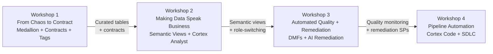

# Western Union -- 4-Workshop Engagement Arc

> **Theme: Data you can trust at the speed stakeholders need.**

## Overview

Four 90-minute sessions, each 2 weeks apart. Every session uses WU synthetic data on the participant's own Snowflake environment. Each workshop output becomes the next workshop's input -- compounding value, not isolated demos.

**Audience**: Surekha Durvasula (CDO), data engineering leads, compliance data team, platform architects.

**Ground rules**: No slides in the room. Every concept demonstrated live with WU data. Participants execute alongside.

## Session Dependency Chain

---

## Workshop 1: From Chaos to Contract

**Objective**: Stand up the full medallion pipeline with data contracts and governance tags using WU transaction data. Participants leave with a running pipeline they defined.

**DCA Modules**: `01_wu_setup.sql` through `05_wu_contracts.sql`, `07_wu_governance.sql`

**Duration**: 90 minutes

### Hands-On Steps

1. **Load WU synthetic data** -- Run `deploy.sh` or manual `01_wu_setup.sql` + `02_wu_load_data.sql`. Participants see 7 CSV files land in RAW_DEV across 3 schemas (WU_PAYMENTS, WU_KYC, WU_COMPLIANCE).
2. **Watch RAW to CURATED flow** -- Execute `03_wu_curated_layer.sql`. 8 Dynamic Tables activate with TARGET_LAG ranging from 1 minute (FACT_TRANSACTIONS) to 24 hours (DIM_CORRIDOR). Show the refresh cascade in real time.
3. **Define a data contract** -- Walk through `05_wu_contracts.sql`. Three contracts: FACT_TRANSACTIONS (amount positive, corridor not null, status valid, no structuring), DIM_CUSTOMER (KYC not stale, phone E.164, no expired-but-verified), DIM_BENEFICIARY (name not null, country ISO, no duplicates).
4. **Break it** -- INSERT a transaction with NULL corridor and negative amount. Run `SP_WU_VALIDATE_ALL_CONTRACTS()`. Watch contract violations fire and quarantine the record.
5. **Tag and mask** -- Execute `07_wu_governance.sql`. Tag a column as PII_TYPE = 'PERSON_NAME', apply `WU_PII_MASK`. Switch roles: COMPLIANCE_OFFICER sees full name, DATA_ANALYST sees `***MASKED***`, others see SHA2 hash.

### Talk Track

> "This pipeline isn't a demo artifact -- it's the same pattern your team would deploy. The contract definitions came from your business rules. The TARGET_LAG values map to your SLA requirements. The masking policies enforce your compliance posture. Change one row in the contract table and the enforcement changes everywhere."

### Snowflake Talent Needed

- Solutions Engineer (pipeline + Dynamic Tables)
- Security SE or SA (governance + tags)

### Takeaway

Participants leave with: a running medallion pipeline, 3 data contracts enforcing WU business rules, governance tags and masking policies active across roles.

---

## Workshop 2: Making Data Speak Business

**Objective**: Build Semantic Views on Workshop 1's curated tables. Demonstrate that the semantic schema IS the trust boundary -- consumers get natural language access, not raw tables.

**DCA Modules**: `04_wu_semantic_layer.sql`, `08_wu_streamlit.sql`, Cortex Analyst

**Duration**: 90 minutes

### Hands-On Steps

1. **Build Semantic Views** -- Execute `04_wu_semantic_layer.sql`. Four views materialize: TRANSACTION_VOLUME_BY_CORRIDOR, CUSTOMER_RISK_PROFILE, AGENT_COMPLIANCE_SCORECARD, CORRIDOR_RISK_HEATMAP.
2. **Cortex Code refinement** -- Use Cortex Code to modify a semantic view definition in natural language. Show how the semantic model can be iterated without touching the underlying pipeline.
3. **Ask Cortex Analyst** -- "Show me transaction volume by corridor for the last 30 days." "Which corridors have the highest compliance hold rate?" "Top 5 agents by SAR count." Each question returns SQL + results from the semantic view.
4. **Role-switch in Trust Dashboard** -- Open the Streamlit app. Switch between DATA_ANALYST (masked PII, full corridor data), COMPLIANCE_OFFICER (full PII, drill-through to transactions), and EXECUTIVE (top-level KPIs only). Same semantic view, different answers.

### Talk Track

> "The semantic view defines what 'transaction volume' means -- the join logic, the filters, the aggregation. That definition is enforced. Whether a human asks in English via Cortex Analyst or a dashboard queries the view directly, they get the same governed answer. The governance policies from Workshop 1 flow through automatically."

### Snowflake Talent Needed

- Solutions Engineer (Semantic Views + Cortex Analyst)
- SA (business value narrative)

### Takeaway

Participants leave with: 4 semantic views exposing WU business concepts, Cortex Analyst answering natural language questions against governed data, a Streamlit dashboard proving that role-switching changes the answer without changing the query.

---

## Workshop 3: Automated Quality + Remediation

**Objective**: Attach continuous monitoring to the pipeline from Workshops 1-2. Demonstrate that quality failures are detected, quarantined, and remediated automatically -- not by humans opening tickets.

**DCA Modules**: `06_wu_quality_automation.sql`, Cortex AI functions, lineage

**Duration**: 90 minutes

### Hands-On Steps

1. **Attach DMFs** -- Execute `06_wu_quality_automation.sql`. 6 Data Metric Functions attach to FACT_TRANSACTIONS, DIM_CUSTOMER, and DIM_BENEFICIARY. Metrics: freshness, completeness (NULL checks), accuracy (format validation).
2. **DMF coverage analysis** -- Use Cortex Code's data-quality skill to analyze current DMF coverage. Show recommendations for additional monitors.
3. **Inject bad data** -- INSERT records with malformed country codes ('UK' instead of 'GB', 'Philipines' instead of 'PH'), invalid phone formats ('555-0123' instead of '+15550123'). Watch DMF scores drop on the quality dashboard.
4. **AI remediation live** -- Call `SP_WU_REMEDIATE_COUNTRY_CODES()`. Cortex AI (mistral-large) standardizes 'UK' to 'GB', 'Philipines' to 'PH'. Call `SP_WU_REMEDIATE_PHONE_FORMAT()`. Watch scores recover.
5. **Trace upstream** -- Use lineage to trace a quality failure in CUSTOMER_RISK_PROFILE back through DIM_CUSTOMER to the raw KYC source. Show that the remediation at the curated layer propagated downstream.

### Monte Carlo Positioning

> "DMFs are native to Snowflake -- zero egress, sub-minute latency, enforced at the platform level. Monte Carlo provides richer anomaly detection ML and cross-platform coverage. They're complementary: DMFs for enforcement, Monte Carlo for intelligence. The contract framework here integrates with either."

### Snowflake Talent Needed

- Solutions Engineer (DMFs + Cortex AI)
- Data Science SA (AI remediation patterns)

### Takeaway

Participants leave with: 6 DMFs continuously monitoring WU data quality, 2 AI-powered remediation procedures that fix common data issues automatically, a quality dashboard showing real-time scores with quarantine/remediation history.

---

## Workshop 4: Pipeline Automation with Cortex Code

**Objective**: Close the loop. Show that the entire pipeline from Workshops 1-3 can be generated, validated, and promoted from a natural language prompt. This answers Question A directly.

**DCA Modules**: Cortex Code, SDLC pattern, contract gates

**Duration**: 90 minutes

### Hands-On Steps

1. **Open Cortex Code** -- Describe a new pipeline: "Build a corridor risk monitoring pipeline that flags corridors with > 5% compliance hold rate in the last 7 days."
2. **Generated artifacts** -- Cortex Code produces: a Dynamic Table definition, a data contract with validation rules, DMF attachment, and a semantic view exposing the new metric.
3. **SDLC pattern** -- Clone the DEV environment. Deploy the generated artifacts. Run contract validation. Show that the gates pass before promotion.
4. **End-to-end execution** -- The new pipeline runs against Workshop 1's data. The contract validates. The DMFs attach. The semantic view exposes the new metric to Cortex Analyst.
5. **Promote to production** -- Walk through the promotion flow: DEV -> STG -> PROD. Contract gates at each stage. Show that a failing contract blocks promotion.

### Talk Track

> "Your team just watched a production-grade pipeline get generated from a sentence, validated against business-defined contracts, and deployed through a governed SDLC. The artifacts are real SQL -- they can be versioned, reviewed, and maintained like any other code. The difference is the starting point: a prompt, not a blank editor."

### Snowflake Talent Needed

- Cortex Code specialist
- Solutions Engineer (SDLC + contracts)
- SA (executive narrative)

### Takeaway

Participants leave with: a new pipeline generated entirely from natural language, validated against contracts, deployed through SDLC gates. The proof that Question A has a concrete answer.

---

## Snowflake Talent Roster

| Role | Workshop 1 | Workshop 2 | Workshop 3 | Workshop 4 |
|------|:---:|:---:|:---:|:---:|
| Solutions Engineer (Pipeline) | Required | Required | Required | Required |
| Solutions Engineer (Security) | Required | -- | -- | -- |
| Solutions Engineer (Cortex AI) | -- | Required | Required | -- |
| Cortex Code Specialist | -- | -- | -- | Required |
| Solutions Architect | Optional | Required | Optional | Required |
| Account Executive | Workshop 1 open | -- | -- | Workshop 4 close |

## Success Criteria

After Workshop 4, Surekha's team should be able to:

1. **Define** a data contract for any WU table in under 10 minutes
2. **Monitor** data quality with DMFs without external tooling
3. **Remediate** common data issues with Cortex AI without manual intervention
4. **Generate** a new pipeline from a business requirement using Cortex Code
5. **Promote** that pipeline through SDLC gates with contract validation
6. **Query** governed data in natural language through Cortex Analyst
