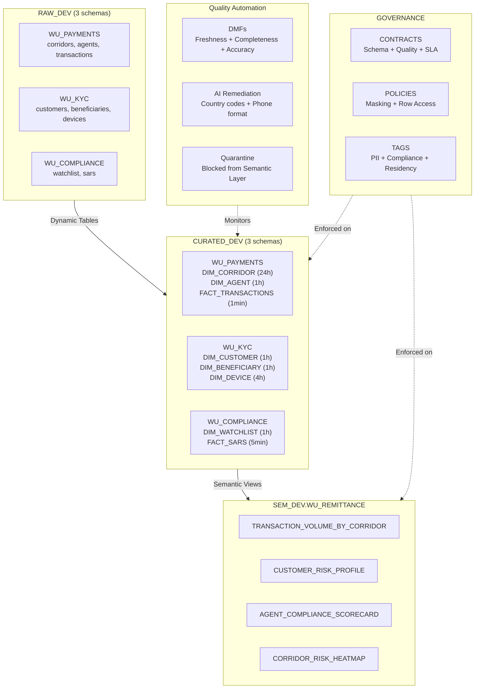

# Western Union -- CDO Engagement Demo

> **Breaking the tradeoff between speed and trust.** Semantic contracts + quality automation + pipeline generation for Surekha Durvasula, Chief Data Officer.

## Company Context

**Western Union** operates the world's largest cross-border money transfer network: $4.2B revenue, 200+ countries, 500,000+ agent locations. The company is in an aggressive digital pivot -- mobile/digital transactions now exceed retail in key corridors. Snowflake customer since 2019, currently running Matillion ETL with multi-region deployment.

**CDO**: Surekha Durvasula. Built the Azure data platform at Walgreens, holds a patent on configurable functions to harmonize data from disparate sources, sits on the Monte Carlo Advisory Board. She does not need Snowflake 101.

## The CDO's Questions

**Question A**: "How do I automate data engineering pipelines end to end using code skills, projects and prompts?"

**Question B**: "How do I automate data quality / data fidelity remediation pipelines if all the reference, source and target semantic schema definitions are available to Snowflake?"

**The real ask**: I need to accelerate the usage of data while not losing stakeholders due to lack of quality in the data. Speed AND trust, not speed OR trust.

## How This Demo Answers Her

| Question | Answer | Demo Artifacts |
|----------|--------|----------------|
| **B** (Quality + Fidelity) | Semantic contracts define "correct." DMFs monitor continuously. Cortex AI remediates automatically. Quarantine prevents bad data from reaching consumers. | `04_wu_semantic_layer.sql`, `05_wu_contracts.sql`, `06_wu_quality_automation.sql`, `07_wu_governance.sql` |
| **A** (Pipeline Automation) | Cortex Code generates pipelines from natural language. Contract gates validate before promotion. SDLC pattern moves artifacts from dev to prod. | Workshop 4 + Cortex Code live session |

## Source Systems

| Source System | Domain | Tables Generated | Records |
|--------------|--------|-----------------|---------|
| **Payment Processing** | WU_PAYMENTS | corridors, agents, transactions | ~55K |
| **KYC / CRM** | WU_KYC | customers, beneficiaries, devices | ~11K |
| **Compliance** | WU_COMPLIANCE | watchlist_entries, sars | ~6K |

## Architecture



## DCA Module Mapping

| DCA Script | WU Application | Workshop |
|-----------|---------------|----------|
| 01_wu_setup.sql | Schemas, roles, stages | 1 |
| 02_wu_load_data.sql | Infer-schema CSV loading | 1 |
| 03_wu_curated_layer.sql | Dynamic Tables (8 DTs, 3 schemas) | 1 |
| 04_wu_semantic_layer.sql | 4 Semantic Views + Cortex Analyst | 2 |
| 05_wu_contracts.sql | 3 Data Contracts + validation SP | 1 |
| 06_wu_quality_automation.sql | 6 DMFs + 2 AI remediation SPs | 3 |
| 07_wu_governance.sql | Masking, RLS, Horizon tags | 1 |
| 08_wu_streamlit.sql | Trust Dashboard deployment | 2 |

## Setup Instructions

```bash
# 1. Generate synthetic WU data
cd customer-demos/western-union/tools
python generate_wu_data.py --output ../data

# 2. Deploy to Snowflake (runs all SQL scripts in order)
cd customer-demos/western-union
bash deploy.sh

# OR run scripts individually:
#   01_wu_setup.sql       -- Schemas, roles, stages
#   02_wu_load_data.sql   -- Stage + COPY INTO
#   03_wu_curated_layer.sql -- 8 Dynamic Tables
#   04_wu_semantic_layer.sql -- 4 Semantic Views
#   05_wu_contracts.sql   -- Data contracts + validation
#   06_wu_quality_automation.sql -- DMFs + AI remediation
#   07_wu_governance.sql  -- Masking, RLS, tags
#   08_wu_streamlit.sql   -- Streamlit deployment

# 3. Run the Trust Dashboard locally
streamlit run customer-demos/western-union/streamlit/app.py
```

## File Structure

```
customer-demos/western-union/
+-- README.md                    # This file
+-- ENGAGEMENT_PLAN.md           # 4-workshop engagement arc
+-- DISCOVERY.md                 # Pre-session discovery questions
+-- WORKSHOP_1.md                # From Chaos to Contract
+-- WORKSHOP_2.md                # Making Data Speak Business
+-- WORKSHOP_3.md                # Automated Quality + Remediation
+-- WORKSHOP_4.md                # Pipeline Automation with Cortex Code
+-- DEMO_SCRIPT.md               # 60-min hands-on demo script
+-- deploy.sh                    # End-to-end deployment
+-- data/                        # Generated CSVs (7 files)
+-- sql/
|   +-- 01_wu_setup.sql
|   +-- 02_wu_load_data.sql
|   +-- 03_wu_curated_layer.sql
|   +-- 04_wu_semantic_layer.sql
|   +-- 05_wu_contracts.sql
|   +-- 06_wu_quality_automation.sql
|   +-- 07_wu_governance.sql
|   +-- 08_wu_streamlit.sql
+-- streamlit/
|   +-- app.py                   # Trust Dashboard
+-- tools/
    +-- generate_wu_data.py      # Synthetic data generator
```
